# ⚡ AI/DSP-Oriented ALU Control with Power-Aware Control-Path Isolation

> **A custom ALU Control block for a 32-bit AI/DSP-oriented processor, with activity-aware isolation of instruction-class and function inputs to reduce unnecessary control-path switching.**


This project implements and evaluates a synthesizable **ALU Control Unit** for a custom 32-bit processor.

Two functionally equivalent implementations are compared:

- **Power-aware:** `alu_control`
- **Baseline:** `alu_control_baseline`

The power-aware implementation introduces `AluEnable`-based isolation of the ALU-control inputs and generates operand-enable signals for downstream ALU datapath isolation.

Both versions were synthesized with the **Nangate Open Cell Library**, verified using **post-synthesis gate-level simulation**, and evaluated with **OpenSTA** for timing and VCD-based power estimation.

---

# 1. 🧠 What the ALU Control Does

The ALU Control receives instruction-class information from the processor's main decoder and translates it into the lower-level controls required by the ALU.

### Inputs

```text
aluop[3:0]
func_r[6:0]
func_i[4:0]
AluEnable          ← power-aware version only
```

### Outputs

```text
mode[1:0]
control[4:0]
alu_enA
alu_enB
alu_enC
```

The baseline implementation produces:

```text
mode
control
```

while the power-aware implementation additionally produces:

```text
alu_enA
alu_enB
alu_enC
```

These operand-enable signals are used by the datapath ALU to prevent unnecessary operand activity.

---

# 2. 🔧 Instruction-Class Decoding

The current ALU-control architecture supports the following `ALUOp` classes:

| `ALUOp` | Instruction class | `mode` |
|---|---|---|
| `0001` | Load / Store address generation | `11` |
| `0010` | R4 | `00` |
| `0011` | R4 MOV | `11` |
| `0100` | R3I | `00` |
| `0101` | R3 + AI/DSP operations | `01` |
| `0110` | R2 + AI operation | `10` |
| `0111` | R2 MOV | `11` |
| `1000` | I-type | `11` |

This allows the control unit to support a wide custom instruction space while keeping the downstream ALU control encoding compact.

---

# 3. 🤖 AI/DSP-Oriented Instruction Support

The ALU Control maps function fields to ALU control codes for custom arithmetic and packed-data operations.

### R3 + AI/DSP operations

| Function | ALU `control` |
|---|---|
| `ADD` | `00000` |
| `SUB` | `00001` |
| `OR` | `00010` |
| `AND` | `00011` |
| `NAND` | `00100` |
| `NOR` | `00101` |
| `XOR` | `00110` |
| `XNOR` | `00111` |
| `INC` | `01001` |
| `DEC` | `01010` |
| `SLL` | `10000` |
| `SLT` | `10001` |
| `SRL` | `10010` |
| `SRA` | `10011` |
| `SGT` | `10100` |
| `MAX` | `01100` |
| `MIN` | `01101` |
| `MUL` | `11111` |
| `VADD8` | `10111` |
| `VMAX8` | `11000` |
| `SDOTP4` | `11101` |

The AI/DSP-oriented operations are intended for packed integer/vector-style processing, especially:

- **VADD8** — four parallel 8-bit additions
- **VMAX8** — four signed 8-bit lane-wise maximum operations
- **SDOTP4** — four-lane signed 8-bit dot product

This control block therefore forms the instruction-to-datapath bridge for the custom AI/DSP extensions.

---

# 4. ⚡ Power-Aware Control Isolation

The major optimization is the introduction of `AluEnable`.

In the power-aware implementation:

```verilog
assign aluop_iso =
    AluEnable ? aluop : 4'b0000;
```

The R-type function field is isolated when the ALU subsystem is inactive:

```verilog
assign func_r_iso =
    (AluEnable &&
     ((aluop == 4'b0010) ||
      (aluop == 4'b0100) ||
      (aluop == 4'b0101) ||
      (aluop == 4'b0110)))
    ? func_r : 7'b0;
```

The I-type function field is isolated when it is not needed:

```verilog
assign func_i_iso =
    (AluEnable && (aluop == 4'b1000))
    ? func_i : 5'b0;
```

The decoder then performs its main decode only while:

```verilog
if (AluEnable)
```

is true.

### Why this matters

When the ALU subsystem is not needed, changes on incoming instruction-control fields do not need to propagate through the complete ALU-control decode network.

The implementation therefore targets **control-path switching activity**, rather than changing the logical function of the processor.

---

# 5. 🔗 Interaction with the ALU

The ALU Control and ALU optimizations work together.

```text
               Main Decoder
                    │
                    ▼
                ALU Control
                    │
          ┌─────────┼─────────┐
          │         │         │
        mode      control   enables
                              │
                       ┌──────┼──────┐
                       ▼      ▼      ▼
                      A      B      C
                       \      |     /
                        \     |    /
                           ALU
```

The power-aware ALU Control determines which operands are required and produces:

```text
alu_enA
alu_enB
alu_enC
```

The downstream ALU can then isolate unused operands.

This makes the control unit an important part of the broader **processor-level activity-isolation strategy**.

---

# 6. 🧪 Verification Methodology

Both versions were verified after synthesis using gate-level Verilog simulation.

### Power-aware version

The testbench explicitly checks:

- `AluEnable = 0` isolation
- Load / Store
- R4
- R3I
- R3
- R2
- I-type
- MOV cases
- invalid function codes
- invalid `ALUOp`
- operand-enable outputs

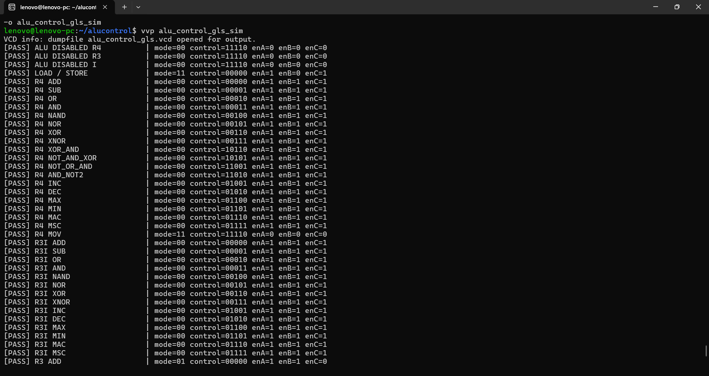

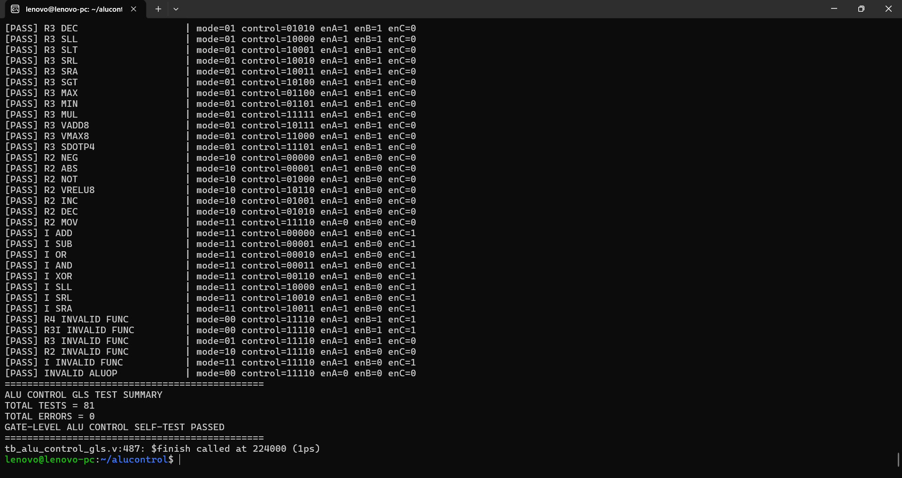

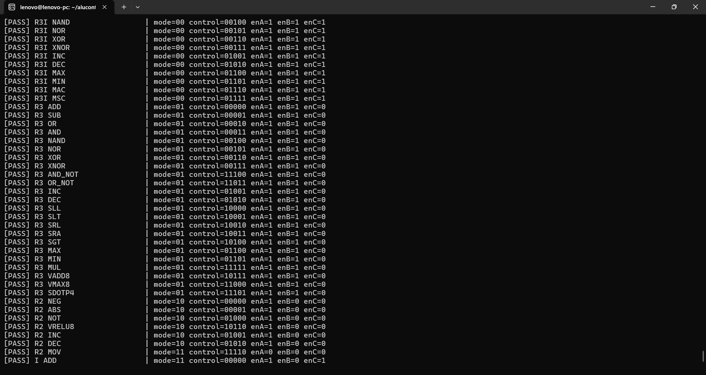

Final result:

```text
TOTAL TESTS  = 81
TOTAL ERRORS = 0
GATE-LEVEL ALU CONTROL SELF-TEST PASSED
```

### Baseline version

The baseline has no `AluEnable`, so it does not attempt to test a nonexistent disabled state.

It checks the same functional control mappings:

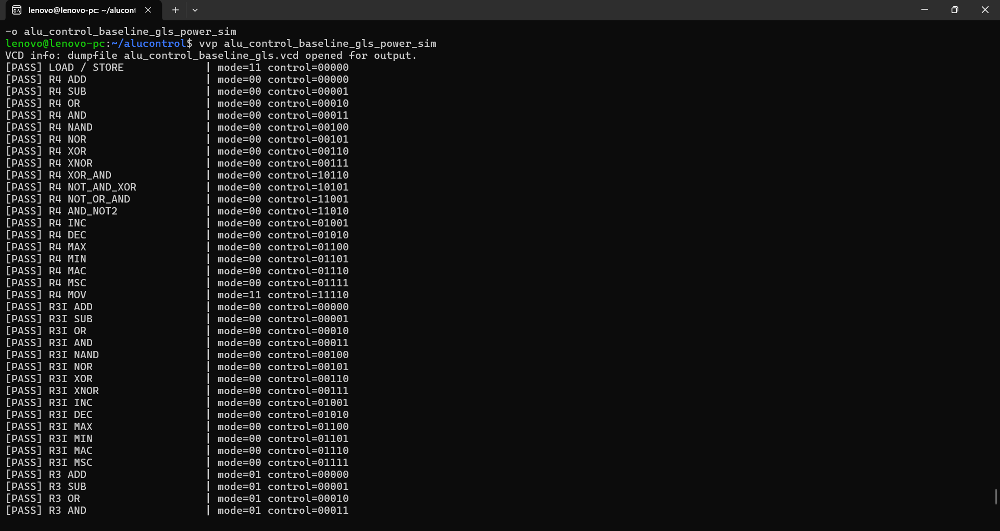

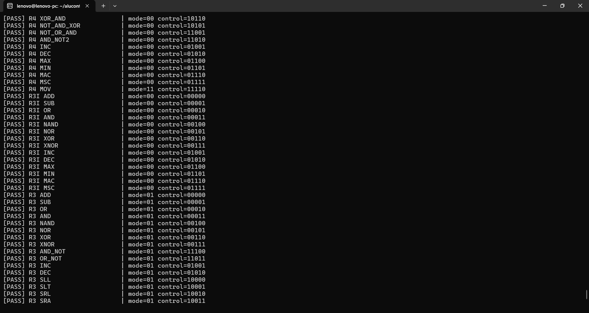

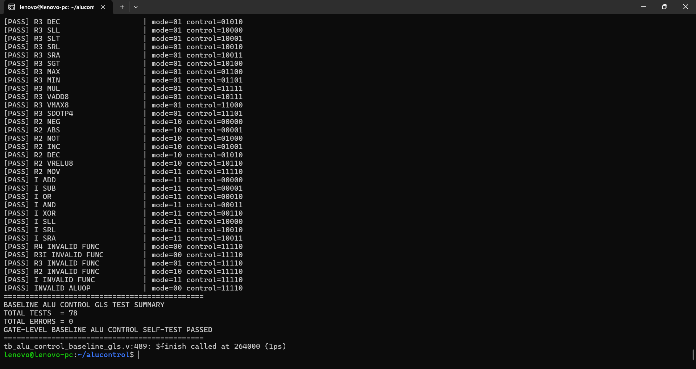

Final result:

```text
TOTAL TESTS  = 78
TOTAL ERRORS = 0
GATE-LEVEL BASELINE ALU CONTROL SELF-TEST PASSED
```

The three additional tests in the power-aware implementation are the explicit `AluEnable = 0` isolation checks.

---

# 7. 📐 Area Comparison

### Baseline

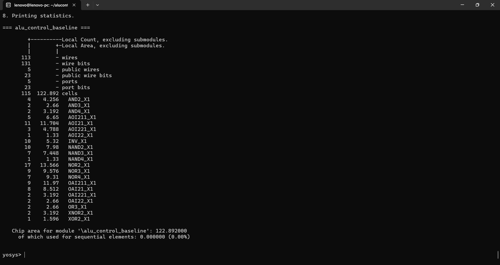

```text
Area = 122.892 µm²
```

### Power-aware

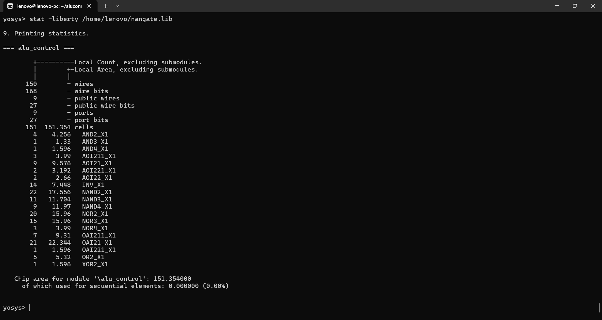

```text
Area = 151.354 µm²
```

### Area overhead

```text
(151.354 - 122.892) / 122.892 × 100
= 23.16%
```

The area increase comes from the additional isolation and operand-enable logic.

---

# 8. ⏱️ Static Timing Analysis

A **10 ns virtual clock** was used for standalone combinational timing comparison:

```tcl
create_clock -name virtual_clk -period 10.0
set_input_delay 0.0 -clock virtual_clk [all_inputs]
set_output_delay 0.0 -clock virtual_clk [all_outputs]
```

## Baseline

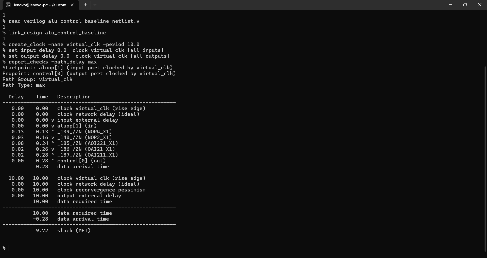

The worst path reported:

```text
Startpoint: aluop[1]
Endpoint: control[0]
Data arrival time: 0.28 ns
Slack: 9.72 ns
Status: MET
```


Minimum slack:

```text
0.01 ns
```

## Power-aware

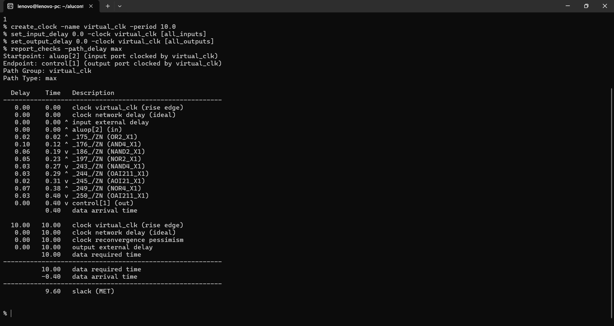

The worst path reported:

```text
Startpoint: aluop[2]
Endpoint: control[1]
Data arrival time: 0.40 ns
Slack: 9.60 ns
Status: MET
```

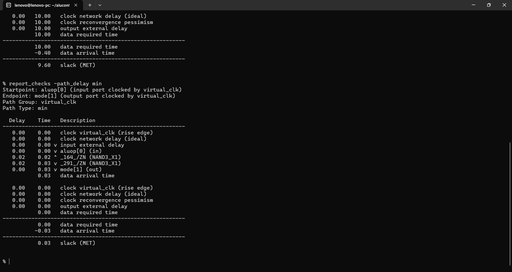

Minimum slack:

```text
0.03 ns
```

### Timing comparison

| Metric | Baseline | Power-Aware | Change |
|---|---:|---:|---:|
| Worst delay | 0.28 ns | 0.40 ns | **+42.86%** |
| Worst slack | 9.72 ns | 9.60 ns | **-0.12 ns** |
| Minimum slack | 0.01 ns | 0.03 ns | +0.02 ns |
| Timing @ 10 ns | MET | MET | Pass |

The percentage increase in delay looks large because the absolute baseline delay is very small. The practical result remains comfortable timing margin under the chosen 10 ns block constraint.

---

# 9. 🔋 Power Analysis

Power was estimated from **post-synthesis gate-level VCD activity** using OpenSTA.

Both runs report:

```text
VCD unannotated = 0
```

## Baseline

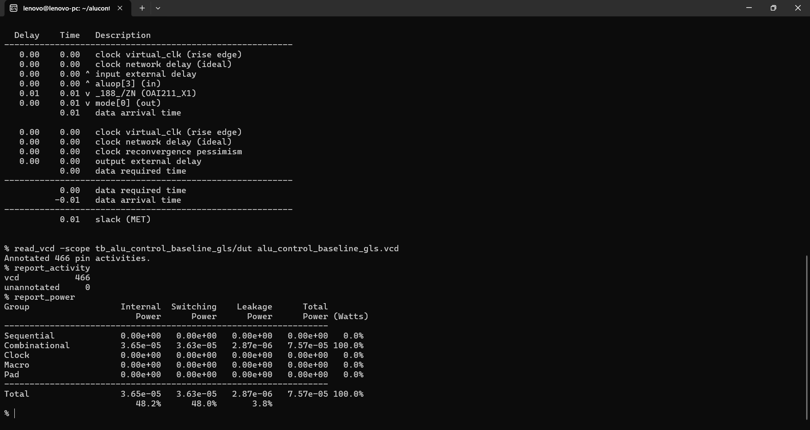

| Component | Baseline |
|---|---:|
| Internal | **36.5 µW** |
| Switching | **36.3 µW** |
| Leakage | **2.87 µW** |
| **Total** | **75.7 µW** |

VCD:

```text
Annotated pin activities = 466
Unannotated = 0
```

## Power-aware

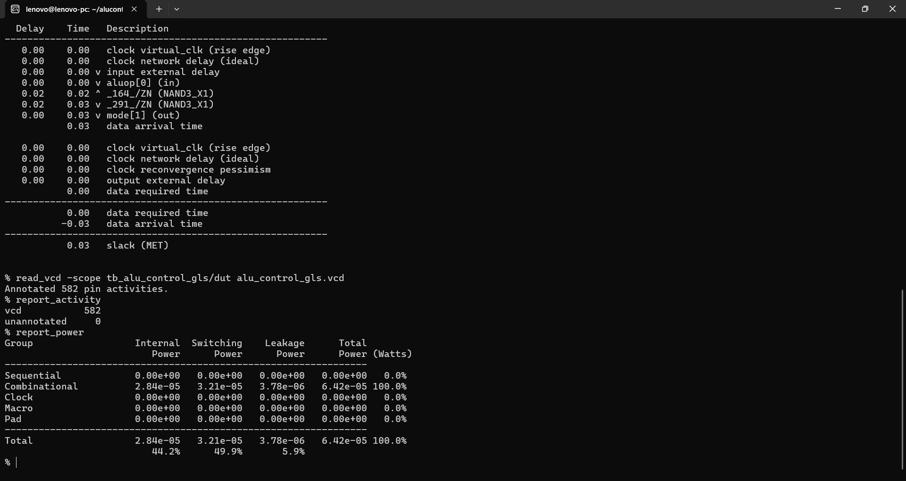

| Component | Power-aware |
|---|---:|
| Internal | **28.4 µW** |
| Switching | **32.1 µW** |
| Leakage | **3.78 µW** |
| **Total** | **64.2 µW** |

VCD:

```text
Annotated pin activities = 582
Unannotated = 0
```

---

# 10. 📊 PPA Results

| Metric | Baseline | Power-Aware | Change |
|---|---:|---:|---:|
| **Area** | 122.892 µm² | 151.354 µm² | **+23.16%** |
| **Internal power** | 36.5 µW | 28.4 µW | **↓ 22.19%** |
| **Switching power** | 36.3 µW | 32.1 µW | **↓ 11.57%** |
| **Leakage power** | 2.87 µW | 3.78 µW | **↑ 31.71%** |
| **Total power** | 75.7 µW | 64.2 µW | **↓ 15.19%** |
| **Worst delay** | 0.28 ns | 0.40 ns | **+42.86%** |
| **Worst slack** | 9.72 ns | 9.60 ns | Both **MET** |

### Calculated improvements

#### Total power

```text
(75.7 - 64.2) / 75.7 × 100
= 15.19%
```

#### Switching power

```text
(36.3 - 32.1) / 36.3 × 100
= 11.57%
```

#### Internal power

```text
(36.5 - 28.4) / 36.5 × 100
= 22.19%
```

#### Leakage

```text
(3.78 - 2.87) / 2.87 × 100
= 31.71% increase
```

---

# 11. ✅ Benefits

### Lower control-path dynamic power

The main benefit is reduced internal and switching activity in the control logic when the ALU subsystem is inactive or when a particular function field is not relevant.

Measured on the same experimental workload:

- **22.19% lower internal power**
- **11.57% lower switching power**
- **15.19% lower total power**

### Operand-enable generation

The design generates independent `alu_enA`, `alu_enB`, and `alu_enC` signals, allowing the downstream ALU to avoid activating unnecessary operand paths.

### Supports custom AI/DSP operations

The control unit directly supports the custom vector and dot-product operations required by the processor's AI/DSP-oriented datapath.

### Modular architecture

Separating instruction decoding from ALU execution makes the processor easier to extend with additional function codes and instruction classes.

### Gate-level validation

The reported power and timing results are based on synthesized standard-cell logic and gate-level VCD activity rather than only RTL simulation.

---

# 12. ⚠️ Disadvantages and Trade-offs

### Area overhead

The power-aware implementation increases area by:

**23.16%**

For this small control block, the absolute area is low, but the relative overhead is significant.

### Timing overhead

Worst-case delay increases:

```text
0.28 ns → 0.40 ns
```

The block remains well within the 10 ns constraint, but the additional isolation logic does consume timing margin.

### Leakage increase

Leakage increases:

```text
2.87 µW → 3.78 µW
```

or:

**31.71%**

This demonstrates that reducing dynamic power can come with a leakage penalty when additional cells are introduced.

### Control complexity

`AluEnable` must be generated correctly by the main decoder and propagated into the ALU-control block.

### Workload dependence

The power benefit is dependent on:

- activity patterns
- fraction of time the ALU is inactive
- instruction mix
- input toggling
- synthesized implementation

A different workload can produce different power savings.

### Standalone block limitation

The ALU Control is only one small block within the complete processor. Its absolute power reduction is modest compared with larger datapath structures such as the ALU or register file.

---

# 13. 🏭 Potential Industry / Commercial Applications

This type of control architecture can be useful in custom processors and accelerator-oriented designs where **power-aware instruction/datapath control** is important.

### Edge AI / TinyML processors

The ALU Control can be part of a processor supporting low-precision AI operations such as packed INT8 arithmetic and dot products.

Potential products include:

- battery-powered edge-AI processors
- smart sensors
- embedded vision controllers
- IoT compute nodes
- wearable/portable devices

The control-unit optimization can help reduce unnecessary switching around AI/DSP datapaths during inactive periods.

### DSP-oriented embedded processors

A processor containing custom vector and dot-product instructions could target:

- audio processing
- sensor processing
- feature extraction
- communication processing
- real-time embedded DSP workloads

### Custom accelerator SoCs

The architecture could be adapted for domain-specific processors in which the instruction set and datapath are deliberately designed around a target application.

### Low-power microcontrollers

For deeply duty-cycled embedded systems, reducing unnecessary datapath/control transitions can be valuable because the compute hardware may spend substantial time in inactive states.

### Commercial-IP potential

The concept could be incorporated into a larger processor or accelerator IP block as part of a broader **low-power microarchitecture strategy**.

However, this project is a research/prototype implementation. Commercial deployment would require much more than this block-level experiment, including physical design, PVT analysis, verification coverage, DFT, reliability checks, and silicon characterization.

---

# 14. 🎯 When This Optimization Makes Sense

The optimization is most useful when:

```text
Control/input activity
        ↓
continues during ALU-inactive periods
        ↓
and isolation can prevent that activity
        ↓
without violating timing/area constraints
```

It is less attractive when the ALU is almost always active or when the additional logic cannot be justified by the available power budget.

The correct engineering decision therefore depends on the system's **activity profile and PPA priorities**.

---

# 15. 🧪 Tools Used

| Tool | Purpose |
|---|---|
| **Verilog HDL** | RTL design |
| **Icarus Verilog** | Gate-level simulation and VCD generation |
| **Yosys** | Synthesis |
| **OpenSTA** | Static timing and VCD-based power analysis |
| **Nangate Open Cell Library** | Standard-cell implementation |
| **GTKWave** | Waveform inspection |

---

# 16. 🔁 Reproducibility

## Power-aware gate-level simulation

```bash
iverilog -g2012 -s tb_alu_control_gls \
alu_control_netlist.v \
tb_alu_control_gls.v \
~/NangateOpenCellLibrary.v \
-o alu_control_gls_sim

vvp alu_control_gls_sim
```

VCD:

```text
alu_control_gls.vcd
```

## Baseline gate-level simulation

```bash
iverilog -g2012 -s tb_alu_control_baseline_gls \
alu_control_baseline_netlist.v \
tb_alu_control_baseline_gls.v \
~/NangateOpenCellLibrary.v \
-o alu_control_baseline_gls_power_sim

vvp alu_control_baseline_gls_power_sim
```

VCD:

```text
alu_control_baseline_gls.vcd
```

## OpenSTA — Power-Aware

```tcl
read_liberty ~/nangate.lib
read_verilog alu_control_netlist.v
link_design alu_control

read_vcd -scope tb_alu_control_gls/dut alu_control_gls.vcd

report_activity
report_power
```

## OpenSTA — Baseline

```tcl
read_liberty ~/nangate.lib
read_verilog alu_control_baseline_netlist.v
link_design alu_control_baseline

read_vcd -scope tb_alu_control_baseline_gls/dut alu_control_baseline_gls.vcd

report_activity
report_power
```

## Standalone timing

```tcl
create_clock -name virtual_clk -period 10.0
set_input_delay 0.0 -clock virtual_clk [all_inputs]
set_output_delay 0.0 -clock virtual_clk [all_outputs]

check_timing
report_checks -path_delay max -group_count 10
report_checks -path_delay min -group_count 10
report_worst_slack -max
report_worst_slack -min
report_tns
report_design_area
```

---

# 17. 📌 Final Assessment

The power-aware ALU Control demonstrates a measurable control-path power benefit:

> **15.19% lower total estimated power, 11.57% lower switching power, and 22.19% lower internal power, at 23.16% area overhead.**

The design still meets the 10 ns standalone timing constraint.

The trade-off is clear:

```text
             POWER-AWARE ALU CONTROL

        ┌─────────────────────────────┐
        │  ↓ 15.19% total power       │
        │  ↓ 11.57% switching power   │
        │  ↓ 22.19% internal power    │
        │                             │
        │  ↑ 23.16% area             │
        │  ↑ 0.12 ns worst delay     │
        │  ↑ 31.71% leakage          │
        └─────────────────────────────┘
```

This makes the block a useful demonstration of **activity-aware control-path isolation for custom AI/DSP-oriented processor architectures**.

---

# 📁 Repository Contents

```text
AI_DSP_Oriented_ALU_Control_Power_Aware/
├── README.md
├── alu_control.v
├── alu_control_baseline.v
├── tb_alu_control_gls.v
├── tb_alu_control_baseline_gls.v
└── results/
    ├── power_aware/
    │   ├── 01_functional_simulation_1.png
    │   ├── 02_functional_simulation_2.png
    │   ├── 03_functional_simulation_3.png
    │   ├── 04_area.png
    │   ├── 05_sta_max.png
    │   ├── 06_sta_min.png
    │   └── 07_power.png
    └── baseline/
        ├── 01_functional_simulation_1.png
        ├── 02_functional_simulation_2.png
        ├── 03_functional_simulation_3.png
        ├── 04_area.png
        ├── 05_sta_max.png
        ├── 06_sta_min.png
        └── 07_power.png
```
