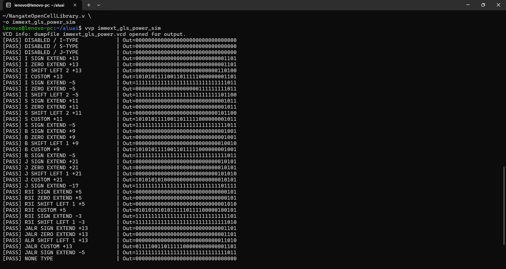
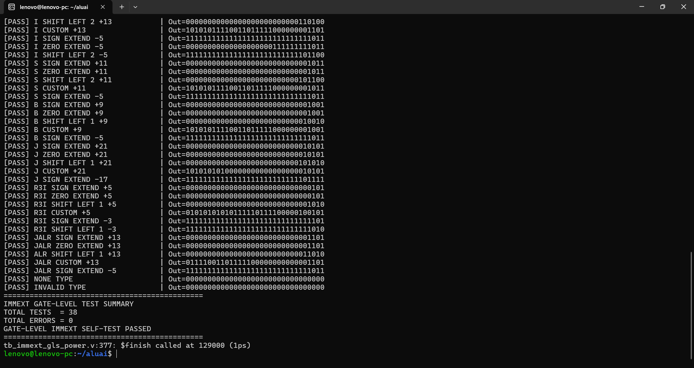
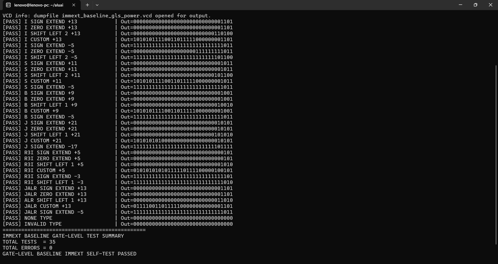
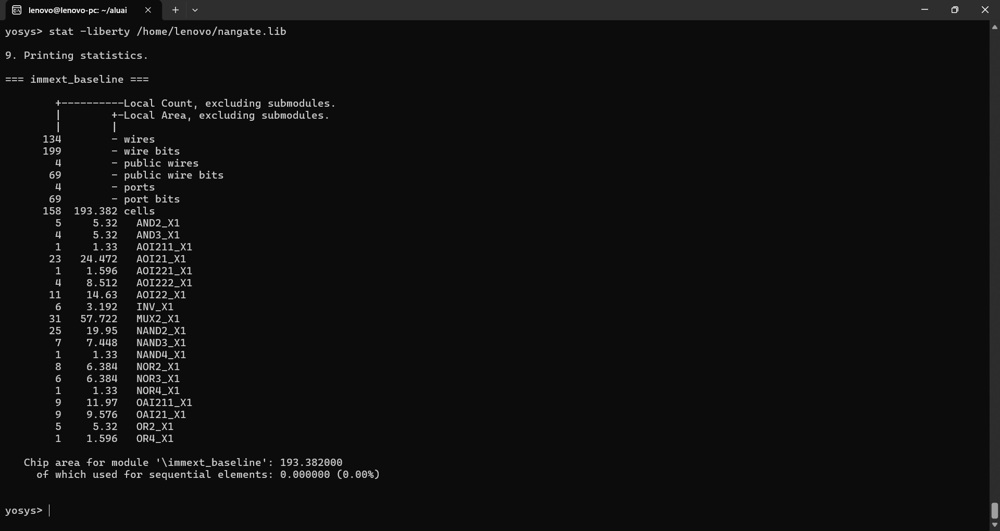
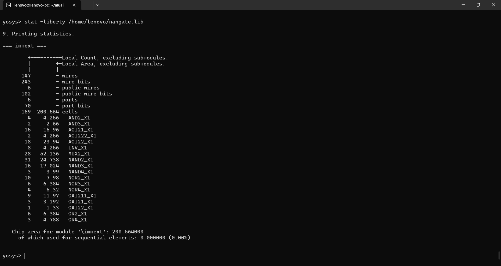
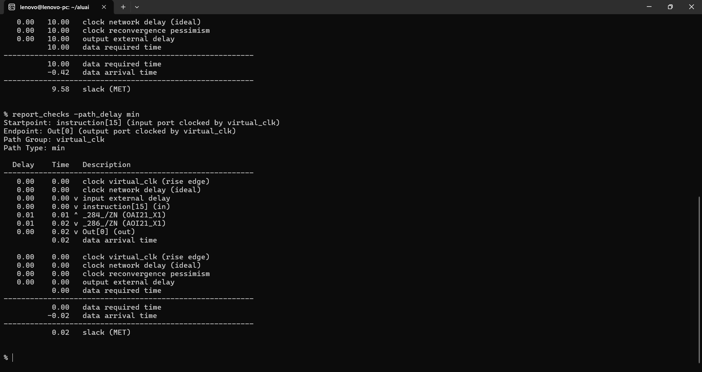
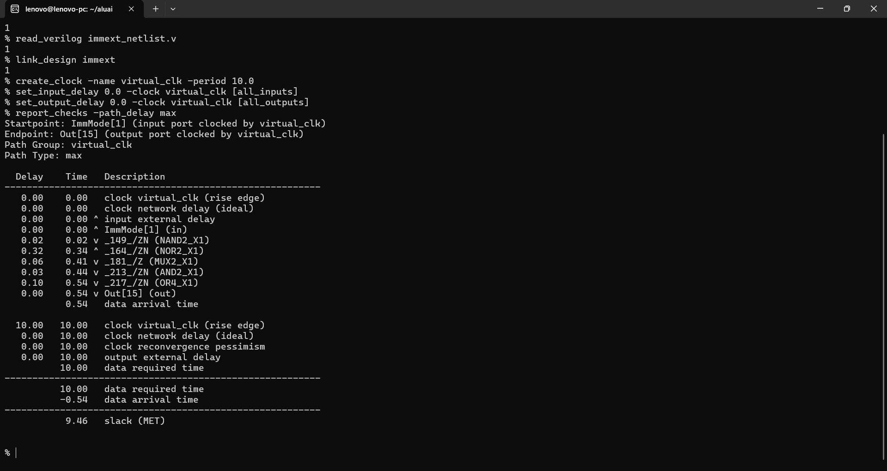
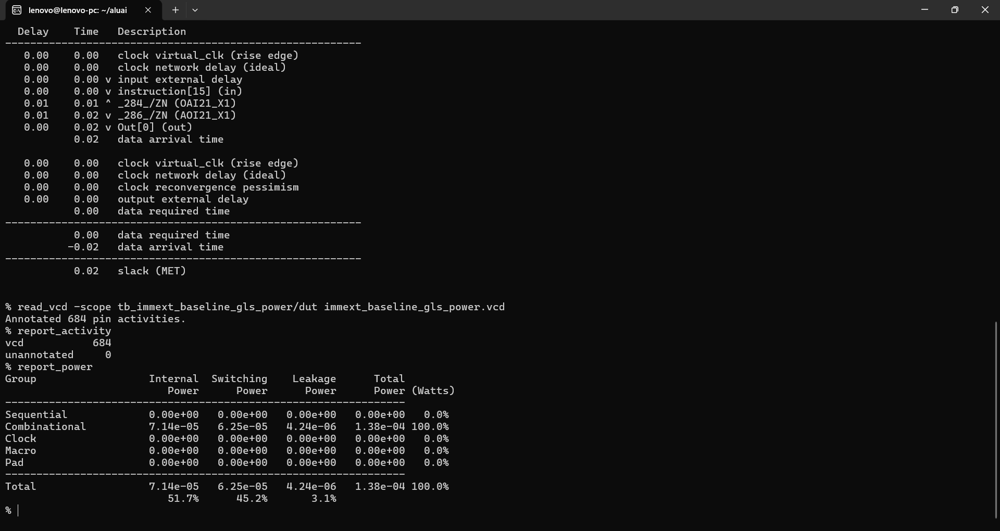

# ⚡ AI/DSP-Oriented Immediate Generator with Power-Aware Input Isolation

> **A custom 32-bit immediate-generation block for a custom ISA, supporting multiple instruction formats and extension modes, with RTL-level input isolation to reduce unnecessary switching activity.**


This project implements and evaluates a synthesizable **32-bit Immediate Generator (`immext`)** used in a custom processor architecture.

Two functionally equivalent implementations are compared:

- **Power-aware:** `immext`
- **Baseline:** `immext_baseline`

The power-aware version adds an `ImmEnable` signal and isolates the instruction, immediate-type, and immediate-mode inputs when immediate generation is not required.

Both versions were synthesized with the **Nangate Open Cell Library**, verified using **post-synthesis gate-level simulation**, and analyzed with **OpenSTA** for timing, area, and VCD-based power estimation.

---

# 1. 🧠 What the Immediate Generator Does

The Immediate Generator extracts an immediate value from the processor's 32-bit instruction and extends/transforms it according to the instruction type and selected immediate mode.

The block supports:

```text
000 → NONE
001 → I-Type
010 → S-Type
011 → B-Type
100 → J-Type
101 → R3I-Type
110 → JALR-Type
```

The main inputs are:

```text
instruction[31:0]
ImmType[2:0]
ImmMode[1:0]
```

The optimized implementation additionally receives:

```text
ImmEnable
```

and generates:

```text
Out[31:0]
```

---

# 2. 🧩 Supported Immediate Formats

## I-Type

The 12-bit immediate is taken from:

```text
instruction[26:15]
```

## S-Type

The immediate is reconstructed from:

```text
instruction[26:20] + instruction[9:5]
```

## B-Type

The immediate uses the same field split in this custom ISA:

```text
instruction[26:20] + instruction[9:5]
```

The shifted mode applies a left shift by 1 for B-type.

## J-Type

The 22-bit immediate is extracted from:

```text
instruction[31:10]
```

## R3I-Type

The 5-bit immediate is extracted from:

```text
instruction[24:20]
```

## JALR-Type

The 17-bit immediate is extracted from:

```text
instruction[31:15]
```

---

# 3. 🔢 Immediate Extension Modes

The current implementation supports four modes:

| `ImmMode` | Function |
|---|---|
| `00` | Sign extension |
| `01` | Zero extension |
| `10` | Sign extension followed by a format-specific left shift |
| `11` | Custom constant/pattern followed by the extracted immediate |

Examples from the implementation include:

- I/S type shifted by 2
- B/J/R3I/JALR shifted according to their respective logic
- Custom upper-bit patterns for experimental/custom-ISA use

---

# 4. ⚡ Power-Aware Input Isolation

The optimized `immext` introduces three isolated signals:

```verilog
wire [31:0] instruction_iso;
wire [2:0]  ImmType_iso;
wire [1:0]  ImmMode_iso;
```

The inputs are isolated when `ImmEnable` is low:

```verilog
assign instruction_iso = ImmEnable ? instruction : 32'b0;
assign ImmType_iso     = ImmEnable ? ImmType : 3'b000;
assign ImmMode_iso     = ImmEnable ? ImmMode : 2'b00;
```

The immediate-generation logic itself is also enabled only when:

```verilog
if (ImmEnable)
```

is active.

### Design objective

The optimization is intended to prevent unnecessary transitions in the immediate-generation datapath during processor cycles where immediate generation is not required.

This is an **RTL-level activity-isolation technique**. It is not a UPF/CPF power-intent implementation.

---

# 5. 🔗 Position in the Processor

The Immediate Generator sits between instruction decoding and datapath/PC-control logic:

```text
              Instruction
                   │
                   ▼
             Main Decoder
                   │
          ┌────────┴────────┐
          │                 │
       ImmType           ImmEnable
          │                 │
          └────────┬────────┘
                   ▼
              Immediate
              Generator
                   │
                   ▼
                Imm[31:0]
              ┌────┴─────┐
              ▼          ▼
           ALU /       PC Control /
          Address       Branch/Jump
          Logic           Logic
```

This makes the block important for:

- immediate ALU operations
- load/store address generation
- branch offsets
- jump offsets
- JALR address calculations
- custom R3I instructions

---

# 6. 🧪 Verification Methodology

Both implementations were verified after synthesis using gate-level Verilog simulation.

The corrected power-aware testbench explicitly checks:

- `ImmEnable = 0` isolation behavior
- I-type immediate generation
- S-type immediate generation
- B-type immediate generation
- J-type immediate generation
- R3I immediate generation
- JALR immediate generation
- sign extension
- zero extension
- shifted extension
- custom patterns
- NONE/invalid type behavior

The testbench was corrected to use **direct instruction bit-slice assignment**, matching the actual RTL field locations.

## Power-aware gate-level verification





Final result:

```text
TOTAL TESTS  = 38
TOTAL ERRORS = 0
GATE-LEVEL IMMEXT SELF-TEST PASSED
```

## Baseline gate-level verification

The baseline contains no `ImmEnable`, so it does not attempt to functionally test a nonexistent disabled state.

Instead, the same instruction/type/mode workload is applied during the corresponding idle periods for power comparison.



Final result:

```text
TOTAL TESTS  = 35
TOTAL ERRORS = 0
GATE-LEVEL BASELINE IMMEXT SELF-TEST PASSED
```

---

# 7. 📐 Area Comparison

## Baseline



```text
Area = 193.382 µm²
```

## Power-aware



```text
Area = 200.564 µm²
```

### Area overhead

```text
(200.564 - 193.382) / 193.382 × 100
= 3.71%
```

The isolation logic therefore introduces only a small area increase.

---

# 8. ⏱️ Static Timing Analysis

A common **10 ns virtual clock** was used for both implementations:

```tcl
create_clock -name virtual_clk -period 10.0
set_input_delay 0.0 -clock virtual_clk [all_inputs]
set_output_delay 0.0 -clock virtual_clk [all_outputs]
```

## Baseline timing


Worst-case path:

```text
Startpoint: instruction[15]
Endpoint: Out[0]
Data arrival time: 0.42 ns
Slack: 9.58 ns
Status: MET
```



Minimum-path result:

```text
Delay = 0.02 ns
Slack = 0.02 ns
Status = MET
```

## Power-aware timing



Worst-case path:

```text
Startpoint: ImmMode[1]
Endpoint: Out[15]
Data arrival time: 0.54 ns
Slack: 9.46 ns
Status: MET
```


Minimum-path result:

```text
Delay = 0.02 ns
Slack = 0.02 ns
Status = MET
```

### Timing comparison

| Metric | Baseline | Power-Aware | Change |
|---|---:|---:|---:|
| **Worst delay** | 0.42 ns | 0.54 ns | **+28.57%** |
| **Worst slack @ 10 ns** | 9.58 ns | 9.46 ns | **-0.12 ns** |
| **Minimum delay** | 0.02 ns | 0.02 ns | 0 |
| **Minimum slack** | 0.02 ns | 0.02 ns | 0 |
| **Timing status** | MET | MET | Pass |

The absolute timing penalty is **0.12 ns**, while the block retains more than 9 ns of slack under the selected 10 ns constraint.

---

# 9. 🔋 VCD-Based Power Analysis

Power was estimated from post-synthesis gate-level VCD activity using OpenSTA.

Both implementations use the same corrected functional workload, including corresponding idle/inactive input windows.

## Baseline power



OpenSTA result:

| Component | Baseline |
|---|---:|
| Internal | **71.4 µW** |
| Switching | **62.5 µW** |
| Leakage | **4.24 µW** |
| **Total** | **138 µW** |

VCD activity:

```text
Annotated pin activities = 684
Unannotated = 0
```

## Power-aware power


OpenSTA result:

| Component | Power-aware |
|---|---:|
| Internal | **41.0 µW** |
| Switching | **32.3 µW** |
| Leakage | **4.49 µW** |
| **Total** | **77.8 µW** |

VCD activity:

```text
Annotated pin activities = 723
Unannotated = 0
```

The activity counts differ because the synthesized implementations contain different internal nets/cells. The workload applied to the externally controlled inputs was kept matched.

---

# 10. 📊 PPA Comparison

| Metric | Baseline | Power-Aware | Change |
|---|---:|---:|---:|
| **Area** | 193.382 µm² | 200.564 µm² | **+3.71%** |
| **Internal power** | 71.4 µW | 41.0 µW | **↓ 42.58%** |
| **Switching power** | 62.5 µW | 32.3 µW | **↓ 48.32%** |
| **Leakage power** | 4.24 µW | 4.49 µW | **↑ 5.90%** |
| **Total power** | 138 µW | 77.8 µW | **↓ 43.62%** |
| **Worst delay** | 0.42 ns | 0.54 ns | **+28.57%** |
| **Worst slack** | 9.58 ns | 9.46 ns | Both **MET** |

### Primary result

The `ImmEnable` isolation reduces:

**48.32% switching power**

while total estimated power decreases by:

**43.62%**

with only:

**3.71% area overhead**.

---

# 11. 📈 Calculated Improvements

### Switching power

```text
(62.5 - 32.3) / 62.5 × 100
= 48.32%
```

### Internal power

```text
(71.4 - 41.0) / 71.4 × 100
= 42.58%
```

### Total power

```text
(138.0 - 77.8) / 138.0 × 100
= 43.62%
```

### Leakage

```text
(4.49 - 4.24) / 4.24 × 100
= 5.90% increase
```

### Area

```text
(200.564 - 193.382) / 193.382 × 100
= 3.71% increase
```

---

# 12. ✅ Benefits

### Strong dynamic-power reduction

The strongest measured result is a:

**48.32% reduction in switching power**

for the immediate-generator workload.

This directly supports the purpose of input/activity isolation.

### Small area cost

Only:

**3.71% area overhead**

is introduced.

This is a favorable PPA trade-off for a small combinational control/datapath block.

### Large total-power reduction

The measured total estimated power falls by:

**43.62%**

under the tested workload.

### Clean timing

Both versions comfortably meet the 10 ns timing requirement.

### Reusable custom-ISA block

The generator supports multiple immediate formats and can therefore serve several different processor instruction classes.

### Clear RTL optimization

The technique is easy to understand and trace in RTL:

```text
ImmEnable
   ↓
input isolation
   ↓
less unnecessary internal activity
   ↓
lower dynamic/internal power
```

---

# 13. ⚠️ Disadvantages and Trade-offs

### Additional logic

The isolation muxes and control logic introduce:

**3.71% area overhead**

### Timing penalty

Worst-case delay increases:

```text
0.42 ns → 0.54 ns
```

or:

**+0.12 ns**

### Leakage increase

The additional logic raises leakage from:

```text
4.24 µW → 4.49 µW
```

or approximately:

**+5.90%**

### Workload dependence

The reported power reduction depends on the applied instruction/type/mode activity.

A different instruction mix or activity rate can change the result significantly.

### No power-intent methodology

The optimization is implemented directly in RTL and does not model:

- UPF
- CPF
- power domains
- retention cells
- level shifters
- physical isolation cells

Therefore, it should be described as **RTL activity/input isolation**, not as a complete low-power implementation methodology.

### No physical implementation

The measurements are based on synthesized standard-cell logic and gate-level VCD activity. They do not include placement/routing parasitics or silicon characterization.

---

# 14. 🏭 Potential Industry / Commercial Applications

This block is most naturally useful inside custom processors, embedded controllers, and accelerator-oriented architectures.

## Low-power embedded processors

Immediate generation is active across arithmetic, address, branch, and control instructions. Input isolation can be useful when instruction-level control indicates that immediate generation is not required.

Potential examples:

- IoT controllers
- battery-powered embedded processors
- smart sensors
- portable electronics

## Edge AI / TinyML processors

In a custom AI/DSP processor, the immediate generator supports instruction encoding for custom arithmetic and vector-style operations.

The optimization can complement broader datapath activity-reduction techniques.

## Custom RISC-style CPUs

The block is particularly appropriate for application-specific instruction sets where immediate formats are customized rather than fixed to a standard ISA.

## DSP / accelerator control paths

Immediate values may be used for:

- address offsets
- loop/control parameters
- vector operation parameters
- branch/jump offsets
- custom accelerator configuration

### Commercial qualification

This implementation is a **research/prototype RTL block**, not production-qualified IP. Commercial use would require broader verification and implementation work, including PVT analysis, DFT, physical design, signoff, reliability analysis, and silicon validation.

---

# 15. 🎯 When the Optimization Makes Sense

The isolation approach is most attractive when:

```text
ImmType / ImmMode / instruction
             ↓
would otherwise keep switching
             ↓
during cycles where immediate generation is unused
             ↓
ImmEnable isolates the block
             ↓
dynamic/internal activity is reduced
```

It is less useful when the immediate generator is active nearly every cycle or when the added isolation logic creates an unacceptable timing/area cost.

For this experiment, the measured trade-off is favorable:

```text
Power-aware:
↓ 48.32% switching power
↓ 43.62% total power
↑ 3.71% area
↑ 0.12 ns worst delay
```

---

# 16. 🛠️ Tools Used

| Tool | Purpose |
|---|---|
| **Verilog HDL** | RTL implementation |
| **Icarus Verilog** | Gate-level simulation / VCD generation |
| **Yosys** | Logic synthesis |
| **OpenSTA** | Static timing and VCD-based power analysis |
| **Nangate Open Cell Library** | Standard-cell implementation |
| **GTKWave** | Waveform inspection |

---

# 17. 🔁 Reproducibility

## Power-aware GLS

```bash
iverilog -g2012 -s tb_immext_gls_power \
immext_netlist.v \
tb_immext_gls_power.v \
~/NangateOpenCellLibrary.v \
-o immext_gls_power_sim

vvp immext_gls_power_sim
```

VCD:

```text
immext_gls_power.vcd
```

## Baseline GLS

```bash
iverilog -g2012 -s tb_immext_baseline_gls_power \
immext_baseline_netlist.v \
tb_immext_baseline_gls_power.v \
~/NangateOpenCellLibrary.v \
-o immext_baseline_gls_power_sim

vvp immext_baseline_gls_power_sim
```

VCD:

```text
immext_baseline_gls_power.vcd
```

## OpenSTA — power-aware power

```tcl
read_liberty ~/nangate.lib
read_verilog immext_netlist.v
link_design immext

read_vcd -scope tb_immext_gls_power/dut immext_gls_power.vcd

report_activity
report_power
```

## OpenSTA — baseline power

```tcl
read_liberty ~/nangate.lib
read_verilog immext_baseline_netlist.v
link_design immext_baseline

read_vcd -scope tb_immext_baseline_gls_power/dut immext_baseline_gls_power.vcd

report_activity
report_power
```

## Standalone timing

```tcl
create_clock -name virtual_clk -period 10.0
set_input_delay 0.0 -clock virtual_clk [all_inputs]
set_output_delay 0.0 -clock virtual_clk [all_outputs]

check_timing
report_checks -path_delay max -group_count 10
report_checks -path_delay min -group_count 10
report_worst_slack -max
report_worst_slack -min
report_tns
report_design_area
```

---

# 18. 📌 Final Assessment

The power-aware Immediate Generator demonstrates a strong RTL-level activity-isolation result:

> **48.32% lower switching power and 43.62% lower total estimated power, at only 3.71% area overhead, while maintaining timing closure under the 10 ns constraint.**

This makes `immext` a particularly clear example in the processor project of how **targeted RTL activity isolation can improve PPA without changing the functional instruction semantics**.

---

# 📁 Repository Contents

```text
AI_DSP_Oriented_Immediate_Generator_Power_Aware/
├── README.md
├── tb_immext_gls_power.v
├── tb_immext_baseline_gls_power.v
└── results/
    ├── power_aware/
    │   ├── 01_functional_simulation_1.png
    │   ├── 02_functional_simulation_2.png
    │   ├── 03_area.png
    │   ├── 04_sta_max.png
    │   ├── 05_sta_min.png
    │   └── 06_power.png
    └── baseline/
        ├── 01_functional_simulation.png
        ├── 02_area.png
        ├── 03_sta_max.png
        ├── 04_sta_min.png
        └── 05_power.png
```
