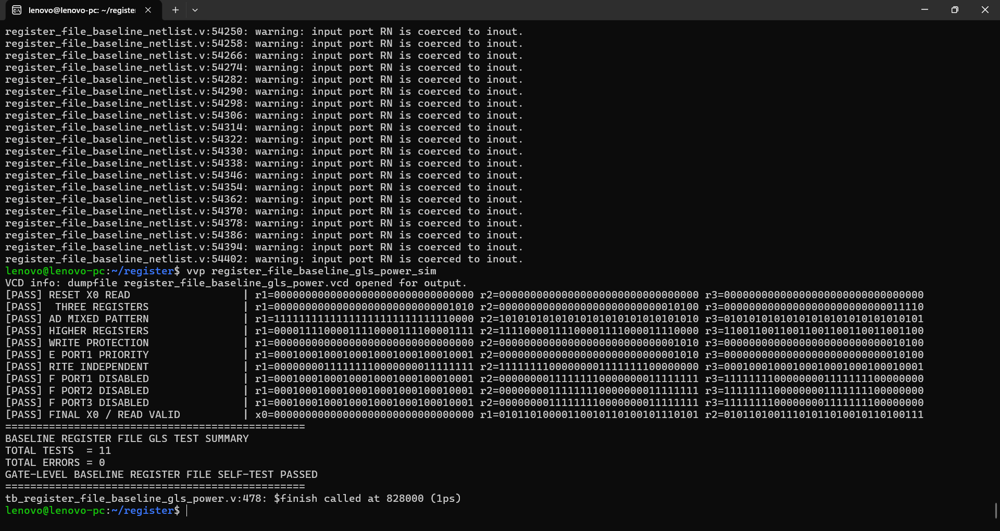
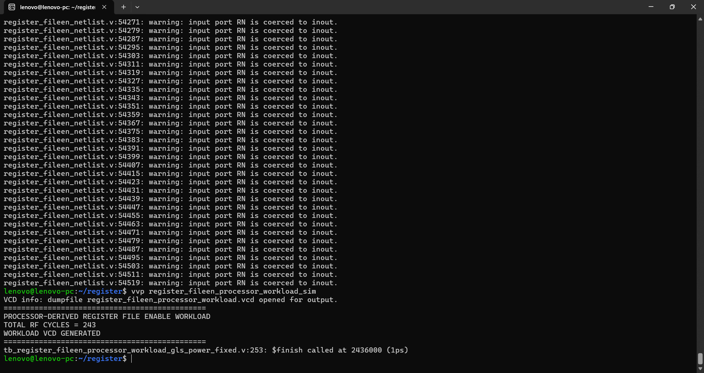
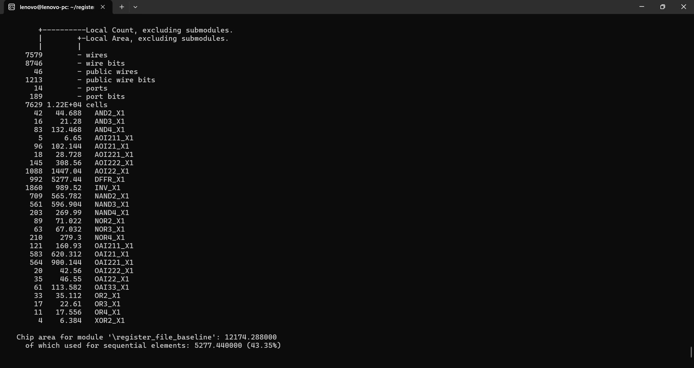
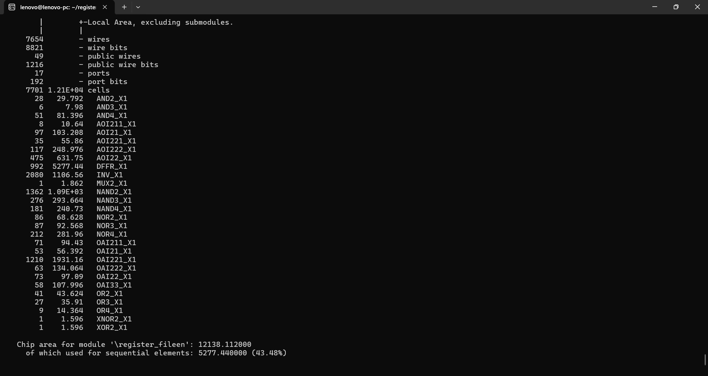
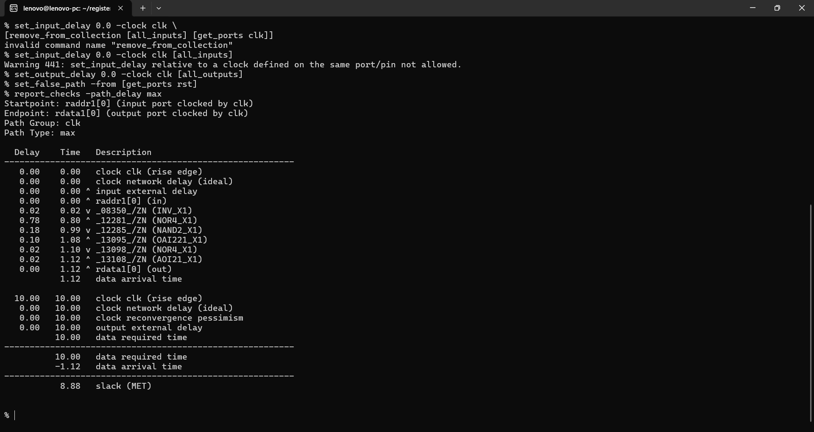
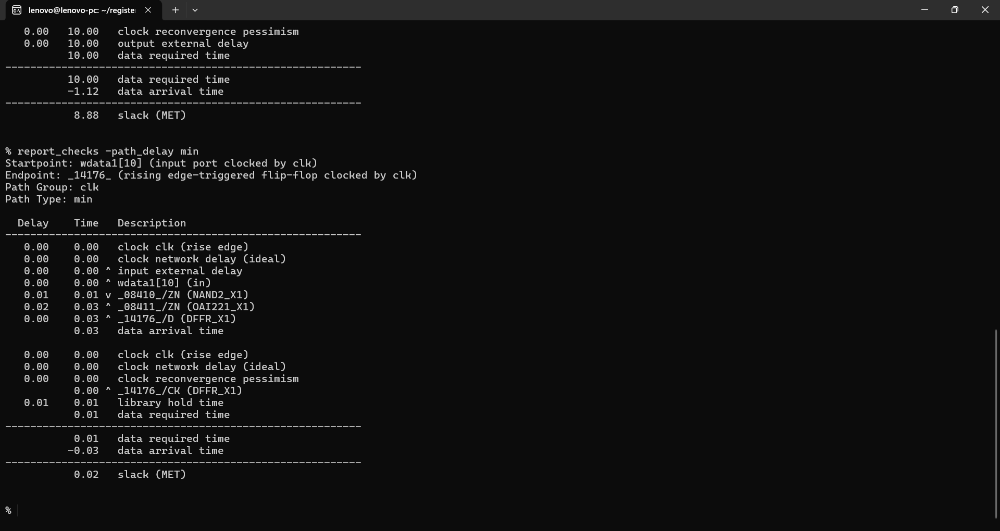
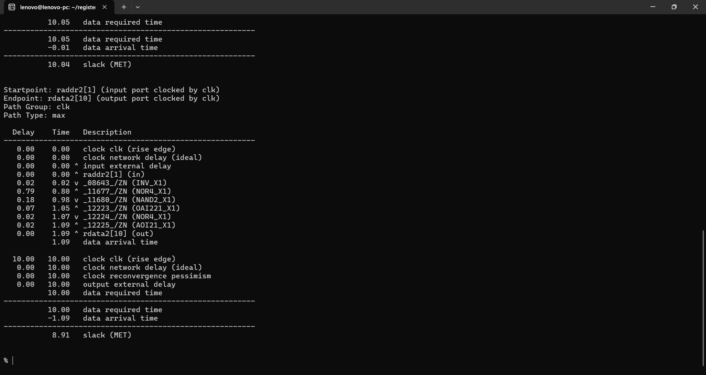
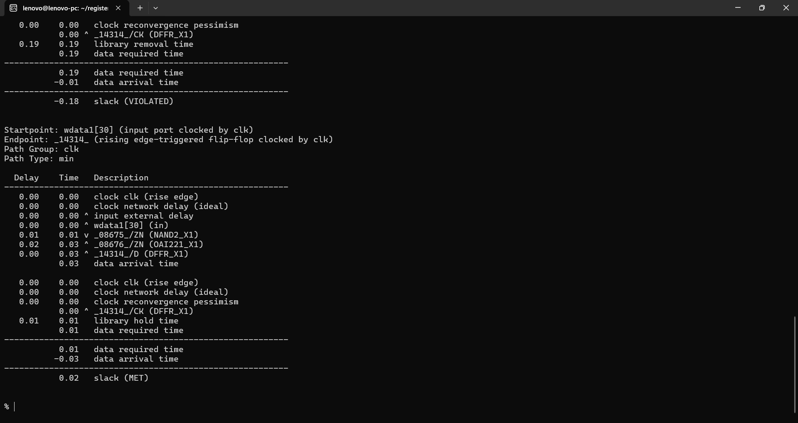
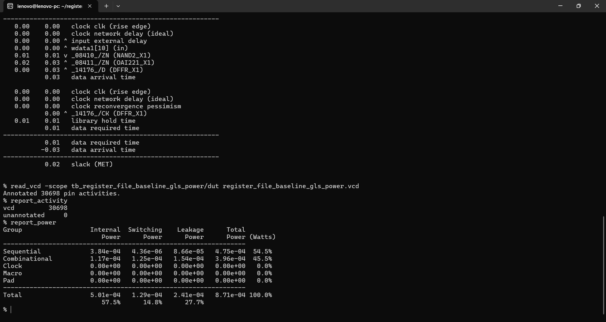
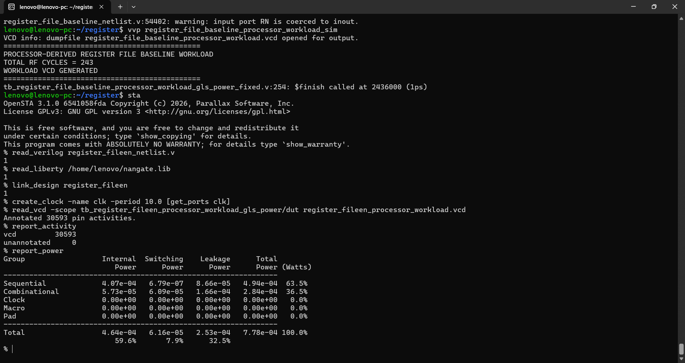

# ⚡ 32-bit Multi-Port Register File with Read-Port Activity Isolation

> **A 32-bit, 3-read/2-write register file for a custom single-cycle processor, enhanced with instruction-dependent read-port isolation to prevent unnecessary register data from propagating into downstream datapath logic.**


This project compares two functionally equivalent implementations of the same register file:

- **Baseline:** `register_file_baseline`
- **Read-isolated:** `register_fileen`

The read-isolated version adds **three independent read-enable controls**:

```verilog
regread1
regread2
regread3
```

When a read port is not required by an instruction, its output is forced to zero instead of allowing register contents to propagate further into the processor datapath.

Both versions were synthesized with the **Nangate Open Cell Library**, verified at gate level, and evaluated using OpenSTA with a **processor-derived 243-cycle workload**.

---

## 🚀 Headline Results

| Metric | Baseline | Read-Isolated | Improvement / Cost |
|---|---:|---:|---:|
| **Area** | 12,174.288 µm² | 12,138.112 µm² | **↓ 0.30%** |
| **Total Power** | 0.772 mW | 0.778 mW | **↑ 0.78%** |
| **Switching Power** | 0.0673 mW | 0.0616 mW | **↓ 8.47%** |
| **Internal Power** | 0.464 mW | 0.464 mW | **~0%** |
| **Leakage Power** | 0.240 mW | 0.253 mW | **↑ 5.42%** |
| **Worst Delay** | 1.12 ns | 1.09 ns | **↓ 2.68%** |
| **Worst Slack @ 10 ns** | 8.88 ns | 8.91 ns | **MET** |
| **Minimum Slack** | 0.02 ns | 0.02 ns | **MET** |

### Key takeaway

The read-isolated register file **does reduce switching power by 8.47%** while maintaining essentially the same area and slightly improving the measured functional data-path delay.

However, the additional isolation logic increases leakage enough that the **total estimated power is slightly worse by 0.78%** under the processor-derived workload.

This is therefore best treated as a **functional/activity-isolation optimization with a small PPA trade-off**, rather than a block that demonstrably reduces total power by itself.

The result is **post-synthesis, gate-level, workload-dependent estimation**, not a silicon measurement.

---

# 1. 🧠 Register File Architecture

The register file is a core datapath block in the custom 32-bit single-cycle processor.

### Organization

```text
32 registers
×
32 bits
```

with:

```text
3 asynchronous read ports
2 synchronous write ports
```

### Read ports

```text
raddr1 → rdata1
raddr2 → rdata2
raddr3 → rdata3
```

### Write ports

```text
waddr1 / wdata1 / regwrite1
waddr2 / wdata2 / regwrite2
```

### Register x0

Register `x0` is protected and always reads as zero.

### Write priority

When both write ports target the same nonzero register in the same cycle, **write port 1 has priority**.

---

# 2. ⚡ Why Read-Port Isolation Was Added

The register file is used by many different instruction classes, but **not every instruction needs all three read ports**.

Without isolation, an unused read port can still produce register data that then propagates into downstream datapath logic.

The read-isolated implementation explicitly controls whether each read port is active:

```verilog
if (regread1)
    rdata1 = (raddr1 == 5'd0) ? 32'd0 : regis[raddr1];
else
    rdata1 = 32'd0;

if (regread2)
    rdata2 = (raddr2 == 5'd0) ? 32'd0 : regis[raddr2];
else
    rdata2 = 32'd0;

if (regread3)
    rdata3 = (raddr3 == 5'd0) ? 32'd0 : regis[raddr3];
else
    rdata3 = 32'd0;
```

The objective is not to shut down the register storage itself. Instead, it is to **isolate unused read outputs and stop unwanted register data from being forwarded into the surrounding processor datapath**.

That is useful even when the total block power reduction is small.

---

# 3. 🧩 Read-Port Usage Across the Custom ISA

The processor's decoder generates the read-enable signals according to the instruction class.

| Instruction Type | Opcode | `regread1` | `regread2` | `regread3` | Reason |
|---|---|---:|---:|---:|---|
| **R4** | `00001` | 1 | 1 | 1 | Three source operands |
| **R3** | `00010` | 1 | 1 | 0 | Two source operands |
| **R3I** | `00011` | 1 | 1 | 0 | Two registers + immediate |
| **R4 MOVE** | `01000` | 1 | 0 | 1 | Source mapping used by custom move datapath |
| **R2** | `01011` | 1 | 0 | 0 | One register source |
| **I-type** | `00100` | 1 | 0 | 0 | One register + immediate |
| **LW** | `00111` | 1 | 0 | 0 | Base register only |
| **SW** | `00101` | 1 | 1 | 0 | Base + store-data registers |
| **2-register Branch** | `00110` | 1 | 1 | 0 | Compare RS1 and RS2 |
| **1-register Branch** | `00110` | 1 | 0 | 0 | Compare RS1 against zero |
| **JALR** | `01111` | 1 | 0 | 0 | Base register + immediate |
| **JAL** | `11110` | 0 | 0 | 0 | No register source required |
| **Default / invalid** | — | 0 | 0 | 0 | No register operation |

For branch instructions, `regread2` is enabled only for the two-register comparison types; single-register branch types use only `regread1`.

This instruction-dependent gating is the main reason for having three independent read controls instead of one global register-file enable.

---

# 4. 🔌 Read-Isolation Behavior

### R4 instruction

All three source operands are required:

```text
regread1 = 1
regread2 = 1
regread3 = 1
```

All three read ports remain active.

### R3 / R3I / Store / Two-register Branch

Two register operands are required:

```text
regread1 = 1
regread2 = 1
regread3 = 0
```

The third read path is isolated.

### R2 / I-type / LW / JALR

Only one register source is needed:

```text
regread1 = 1
regread2 = 0
regread3 = 0
```

Two read outputs are isolated.

### JAL

No register operand is required:

```text
regread1 = 0
regread2 = 0
regread3 = 0
```

All three register-file read outputs are isolated.

### Why this matters

For operations that use fewer operands, the inactive read ports do not continuously forward register contents into the surrounding datapath.

That makes the interface cleaner and can reduce downstream unnecessary activity even when the register-file block itself does not show a large total-power improvement.

---

# 5. 🧪 Experimental Methodology

## Synthesis

- HDL: **Verilog**
- Synthesis: **Yosys**
- Standard-cell library: **Nangate Open Cell Library**
- Netlist: post-synthesis gate-level Verilog

## Gate-level verification

Both implementations were compiled using **Icarus Verilog** with the Nangate standard-cell model.

For the processor-derived workload, both versions execute:

**243 register-file cycles**

with the same:

- clock
- reset
- register addresses
- write addresses
- write data
- write enables
- instruction-derived read-port usage pattern

The baseline has no `regread1/2/3` ports, so those controls are represented only as reference signals and are not connected to the baseline DUT.

## Power analysis

The flow is:

```text
RTL
 ↓
Yosys synthesis
 ↓
Gate-level netlist
 ↓
Icarus gate-level simulation
 ↓
VCD generation
 ↓
OpenSTA activity annotation
 ↓
report_power
```

Both power runs reported:

```text
Unannotated activity = 0
```

which means the power calculation was fully annotated for the analyzed netlist signals.

---

# 6. ✅ Gate-Level Verification

## Baseline



The baseline register file was verified successfully in the earlier dedicated GLS test and the processor-derived workload generated its VCD successfully.

## Read-isolated version



The processor-derived workload completed successfully:

```text
PROCESSOR-DERIVED REGISTER FILE ENABLE WORKLOAD
TOTAL RF CYCLES = 243
WORKLOAD VCD GENERATED
```

No hierarchical access to the synthesized register array is required by the corrected workload testbench.

---

# 7. 📐 Area Comparison

## Baseline



**Area = 12,174.288 µm²**

Sequential area:

**5,277.440 µm² (43.35%)**

## Read-isolated



**Area = 12,138.112 µm²**

Sequential area:

**5,277.440 µm² (43.48%)**

### Area change

```text
(12,138.112 - 12,174.288) / 12,174.288 × 100
≈ -0.30%
```

The measured mapped area is therefore essentially unchanged, with a small **0.30% decrease** in this synthesis result.

---

# 8. ⏱️ Timing Comparison

## Baseline



**Worst-case delay = 1.12 ns**

**Worst slack @ 10 ns = 8.88 ns — MET**



**Minimum slack = 0.02 ns — MET**

## Read-isolated



**Worst-case delay = 1.09 ns**

**Worst slack @ 10 ns = 8.91 ns — MET**



**Minimum functional-path slack = 0.02 ns — MET**

### Timing change

```text
1.12 ns → 1.09 ns
```

This is approximately a **2.68% reduction in worst-case delay**.

### Asynchronous reset timing

The register file contains an asynchronous reset. Reset recovery/removal checks should be considered separately from the normal functional datapath timing result.

The asynchronous reset path is therefore **not used as the headline register-file data-path timing metric**.

---

# 9. 🔋 Power Comparison — Processor-Derived Workload

## Baseline



OpenSTA reported:

| Component | Power |
|---|---:|
| Internal | **0.464 mW** |
| Switching | **0.0673 mW** |
| Leakage | **0.240 mW** |
| **Total** | **0.772 mW** |

Activity:

```text
VCD annotated   = 30,698
Unannotated     = 0
```

## Read-isolated



OpenSTA reported:

| Component | Power |
|---|---:|
| Internal | **0.464 mW** |
| Switching | **0.0616 mW** |
| Leakage | **0.253 mW** |
| **Total** | **0.778 mW** |

Activity:

```text
VCD annotated   = 30,593
Unannotated     = 0
```

---

# 10. 📊 PPA Analysis

### Switching power reduction

```text
(0.0673 - 0.0616) / 0.0673 × 100
≈ 8.47%
```

The isolation therefore produces a measurable reduction in switching power.

### Leakage increase

```text
(0.253 - 0.240) / 0.240 × 100
≈ 5.42%
```

The additional isolation logic introduces extra leakage.

### Total power change

```text
(0.778 - 0.772) / 0.772 × 100
≈ 0.78% increase
```

The switching-power saving is not large enough to overcome the leakage overhead in this workload.

### Overall engineering conclusion

The register-file isolation is **not a net total-power optimization under this measured workload**.

Instead, it provides:

- **8.47% lower switching power**
- essentially unchanged area
- slightly better measured functional delay
- explicit isolation of unused register read outputs
- controlled data propagation into downstream datapath blocks

The total-power result is slightly worse because the added logic carries a leakage cost.

---

# 11. 🎯 Why Keep It in the Processor?

The isolation can still be useful at the **processor architecture/interface level**, even though it does not produce a standalone total-power reduction.

Consider a JAL instruction:

```text
regread1 = 0
regread2 = 0
regread3 = 0
```

The processor does not need any register operands. Without isolation, the three read outputs can still expose register contents. With isolation, all three outputs are forced to zero.

Similarly, an R2 or I-type instruction may only require:

```text
regread1 = 1
regread2 = 0
regread3 = 0
```

so the unused ports are explicitly blocked.

This is useful because the register file becomes more explicit about **which data is valid for the current instruction**, rather than continuously presenting unrelated register contents.

So even with the measured **0.78% total-power penalty**, the mechanism remains useful as an **activity/data-propagation isolation technique** inside the processor.

---

# 12. 🏭 Potential Applications

A multi-port register file with instruction-dependent read isolation can be useful in custom processors where different instruction classes consume different numbers of operands.

Potential applications include:

### Custom embedded processors

A processor with mixed instruction formats can benefit from explicit control of unused datapath outputs.

### Edge AI / DSP controllers

AI/DSP instructions often have varying operand counts. A register file that can selectively activate read ports naturally matches this behavior.

### Low-power embedded datapaths

In power-sensitive designs, reducing unnecessary switching at block boundaries can be useful even when the isolated block itself does not always show a lower total-power number.

### Domain-specific processors

A custom ISA makes it possible to generate very specific read-enable patterns for each instruction, as demonstrated here.

These are **potential application areas**, not claims that this exact register file is production-qualified.

---

# 13. ✅ Benefits

### Explicit operand usage

Each read port has its own enable:

```text
regread1
regread2
regread3
```

so the register file reflects the actual operand requirements of each instruction.

### Reduced switching activity

The measured processor workload shows:

**8.47% lower switching power**

### Data-propagation isolation

Unused read outputs are forced to zero, preventing unrelated register values from being forwarded into downstream datapath logic.

### Small area impact

The synthesized area changed by only:

**−0.30%**

in this experiment.

### Custom-ISA friendly

The technique fits naturally with a custom instruction decoder because operand usage is already known from the instruction type.

### Better interface discipline

Inactive register outputs become deterministic zeros instead of arbitrary register contents.

---

# 14. ⚠️ Disadvantages and Trade-offs

### Total power is slightly worse

The measured total power changed:

```text
0.772 mW → 0.778 mW
```

which is a:

**0.78% increase**

### Leakage increase

The additional logic increased leakage by:

**5.42%**

### Additional control signals

Three extra control signals must be generated and routed:

```text
regread1
regread2
regread3
```

### More control-path complexity

The decoder must correctly identify which operands each instruction requires.

### Workload dependence

A different instruction mix or activity pattern can produce a different power result.

Therefore, the **8.47% switching reduction should not be presented as a universal guaranteed number**.

### No physical implementation

The experiment does not include placement/routing parasitics, clock-tree implementation, IR drop, PVT characterization, or silicon measurement.

---

# 15. 🛠️ Tools Used

| Tool | Purpose |
|---|---|
| **Verilog HDL** | RTL design |
| **Icarus Verilog** | Gate-level simulation / VCD generation |
| **Yosys** | Logic synthesis |
| **OpenSTA** | Static timing and power analysis |
| **Nangate Open Cell Library** | Standard-cell implementation |
| **GTKWave** | Waveform inspection |

---

# 16. 🔁 Reproducibility

## Power-aware gate-level simulation

```bash
iverilog -g2012 -s tb_register_fileen_processor_workload_gls_power \
register_fileen_netlist.v \
tb_register_fileen_processor_workload_gls_power.v \
~/NangateOpenCellLibrary.v \
-o register_fileen_processor_workload_sim

vvp register_fileen_processor_workload_sim
```

Generated VCD:

```text
register_fileen_processor_workload.vcd
```

## Baseline gate-level simulation

```bash
iverilog -g2012 -s tb_register_file_baseline_processor_workload_gls_power \
register_file_baseline_netlist.v \
tb_register_file_baseline_processor_workload_gls_power.v \
~/NangateOpenCellLibrary.v \
-o register_file_baseline_processor_workload_sim

vvp register_file_baseline_processor_workload_sim
```

Generated VCD:

```text
register_file_baseline_processor_workload.vcd
```

## OpenSTA — read-isolated power

```tcl
read_liberty ~/nangate.lib
read_verilog register_fileen_netlist.v
link_design register_fileen

create_clock -name clk -period 10.0 [get_ports clk]

read_vcd -scope tb_register_fileen_processor_workload_gls_power/dut \
register_fileen_processor_workload.vcd

report_activity
report_power
```

## OpenSTA — baseline power

```tcl
read_liberty ~/nangate.lib
read_verilog register_file_baseline_netlist.v
link_design register_file_baseline

create_clock -name clk -period 10.0 [get_ports clk]

read_vcd -scope tb_register_file_baseline_processor_workload_gls_power/dut \
register_file_baseline_processor_workload.vcd

report_activity
report_power
```

---

# 17. 📌 Final Assessment

This experiment shows an important hardware-design lesson:

> **Activity isolation does not automatically guarantee lower total power.**

For this register file, the added read-port isolation successfully reduced **switching power by 8.47%**, but increased leakage enough to produce a small **0.78% total-power penalty**.

Nevertheless, the technique remains useful inside the processor because it allows the design to explicitly isolate unused register outputs for different instruction classes.

In other words:

**The register file is not being kept because it is a standalone total-power winner. It is being evaluated as a processor-level isolation mechanism that can prevent unnecessary register data from propagating into downstream datapath logic.**

This is a valid engineering trade-off and should be presented transparently.

---

## 📁 Repository Contents

```text
AI_DSP_Oriented_Register_File_Read_Isolation/
├── README.md
├── register_file_baseline.v
├── register_fileen.v
├── register_file_baseline_netlist.v
├── register_fileen_netlist.v
├── tb_register_file_baseline_processor_workload_gls_power.v
├── tb_register_fileen_processor_workload_gls_power.v
└── results/
    ├── baseline/
    │   ├── 01_gate_level_simulation.png
    │   ├── 02_area.png
    │   ├── 03_sta_max.png
    │   ├── 04_sta_min.png
    │   └── 05_power_processor_workload.png
    └── read_isolation/
        ├── 01_gate_level_simulation.png
        ├── 02_area.png
        ├── 03_sta_max.png
        ├── 04_sta_min.png
        └── 05_power_processor_workload.png
```

---

## ⭐ Project Snapshot

**Architecture:** 32-bit custom-processor register file  
**Organization:** 32 × 32-bit, 3-read / 2-write  
**Optimization:** Instruction-dependent read-port activity isolation  
**Verification:** Gate-level simulation  
**Power analysis:** Processor-derived, 243-cycle VCD workload  
**Technology library:** Nangate Open Cell Library  
**Switching-power result:** **8.47% reduction**  
**Total-power result:** **0.78% increase**  
**Primary benefit:** **Isolation of unused register-read outputs and reduced switching activity**
