# ⚡ AI/DSP-Oriented 32-bit ALU with Power-Aware Operand & Control Isolation

> **A custom 32-bit ALU designed for arithmetic, logic, AI/DSP-oriented packed-data operations, and low-power hardware exploration — with post-synthesis gate-level PPA validation.**


This project compares two functionally equivalent implementations of the same ALU:

- **Baseline:** `alu_ai_baseline`
- **Power-aware:** `alu_ai`

The power-aware version adds **global ALU enable, operand-level isolation, and control-signal isolation** to reduce unnecessary signal activity.

Both versions were synthesized using the **Nangate Open Cell Library**, functionally verified at gate level, and analyzed with **OpenSTA** using the **same A/B/C/mode/alucontrol workload**.

---

## 🚀 Headline Results

| Metric | Baseline | Power-Aware | Improvement / Cost |
|---|---:|---:|---:|
| **Area** | 10,213.602 µm² | 10,468.696 µm² | **+2.50%** |
| **Total Power** | 9.02 mW | 5.50 mW | **↓ 39.02%** |
| **Switching Power** | 4.21 mW | 2.75 mW | **↓ 34.68%** |
| **Internal Power** | 4.57 mW | 2.50 mW | **↓ 45.30%** |
| **Leakage Power** | 0.238 mW | 0.252 mW | **↑ 5.88%** |
| **Worst Delay** | 2.11 ns | 2.67 ns | **↑ 0.56 ns** |
| **Worst Slack @ 10 ns** | 7.89 ns | 7.33 ns | **MET** |

### Key takeaway

The power-aware implementation achieves **39.02% lower total estimated power** and **34.68% lower switching power** at only **2.50% area overhead**, while still meeting the 10 ns standalone timing constraint.

This is a **post-synthesis, gate-level, workload-dependent result**, not a silicon measurement.

---

# 1. 🧠 What the ALU Does

The ALU is part of a custom 32-bit processor architecture and supports conventional arithmetic/logic operations together with custom AI/DSP-oriented operations.

### Conventional / scalar operations

- ADD / SUB
- OR / AND / NAND / NOR
- XOR / XNOR
- Increment / decrement
- Signed MAX / MIN
- Signed comparisons
- Logical and arithmetic shifts
- Multiplication
- Immediate arithmetic and logic operations

### Custom multi-operand operations

The R4-style datapath supports operations using three source operands, including:

- Three-operand ADD / SUB
- Three-operand logic functions
- INC / DEC
- MAX / MIN
- **MAC** — multiply-accumulate
- **MSC** — multiply-subtract

### AI/DSP-oriented operations

The custom datapath also includes packed 8-bit and signed dot-product operations:

- **VADD8** — lane-wise 8-bit addition
- **VMAX8** — signed INT8 lane-wise maximum
- **SDOTP4** — signed 4-lane INT8 dot product
- **VRELU8** — ReLU applied independently to four signed 8-bit lanes

These operations make the ALU useful as a small experimental datapath for **quantized vector arithmetic and DSP-style processing**.

---

# 2. ⚡ Power-Aware Architecture

The optimized `alu_ai` uses multiple levels of activity isolation.

## Global ALU enable

The ALU datapath can be disabled when an ALU operation is not required.

```verilog
if (!ALUEnable)
    Result = 32'b0;
```

This prevents unnecessary downstream logic activity during inactive periods.

## Operand isolation

Each source operand can be isolated independently:

```verilog
assign SrcA = (ALUEnable && alu_enA) ? A : 32'b0;
assign SrcB = (ALUEnable && alu_enB) ? B : 32'b0;
assign SrcC = (ALUEnable && alu_enC) ? C : 32'b0;
```

This is particularly useful for instructions that do not require all three operands.

## Control-signal isolation

The ALU control and mode inputs are also isolated when the ALU is inactive:

```verilog
assign alucontrol_iso = ALUEnable ? alucontrol : 5'b11111;
assign mode_iso        = ALUEnable ? mode       : 2'b00;
```

### Design objective

The goal is to reduce **unnecessary internal switching activity**, rather than simply disabling the final output.

---

# 3. 🧪 Experimental Methodology

## Synthesis

- HDL: **Verilog**
- Synthesis: **Yosys**
- Standard-cell library: **Nangate Open Cell Library**
- Output: post-synthesis gate-level Verilog

## Gate-level verification

Both implementations were simulated using **Icarus Verilog** with the Nangate cell library.

Both self-checking testbenches passed.

## Timing

The ALU is combinational, so standalone block timing was evaluated using a **10 ns virtual clock**:

```tcl
create_clock -name virtual_clk -period 10.0
set_input_delay 0.0 -clock virtual_clk [all_inputs]
set_output_delay 0.0 -clock virtual_clk [all_outputs]
```

Timing analysis was performed using OpenSTA.

## Power

Power was estimated using:

1. Gate-level simulation
2. VCD activity generation
3. OpenSTA activity annotation
4. `report_power`

The **same functional A/B/C/mode/alucontrol workload** was applied to both implementations.

### VCD activity

| Version | Annotated Pin Activities | Unannotated |
|---|---:|---:|
| Power-aware | 32,333 | 0 |
| Baseline | 31,185 | 0 |

The different pin-activity counts reflect differences in the synthesized netlists; they should not be interpreted as different workloads.

---

# 4. ✅ Functional Verification

## Power-aware version

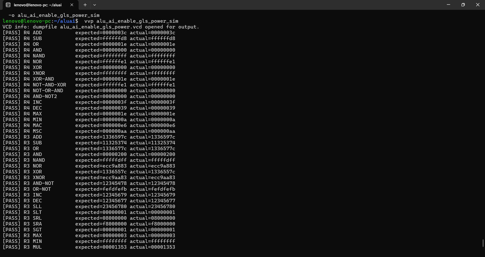

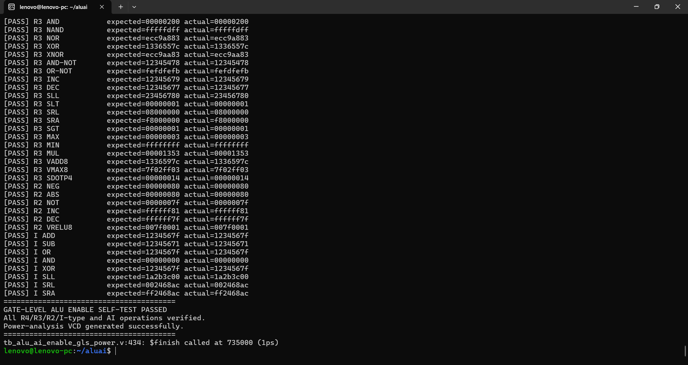

```text
GATE-LEVEL ALU ENABLE SELF-TEST PASSED
All R4/R3/R2/I-type and AI operations verified.
Power-analysis VCD generated successfully.
```

## Baseline version

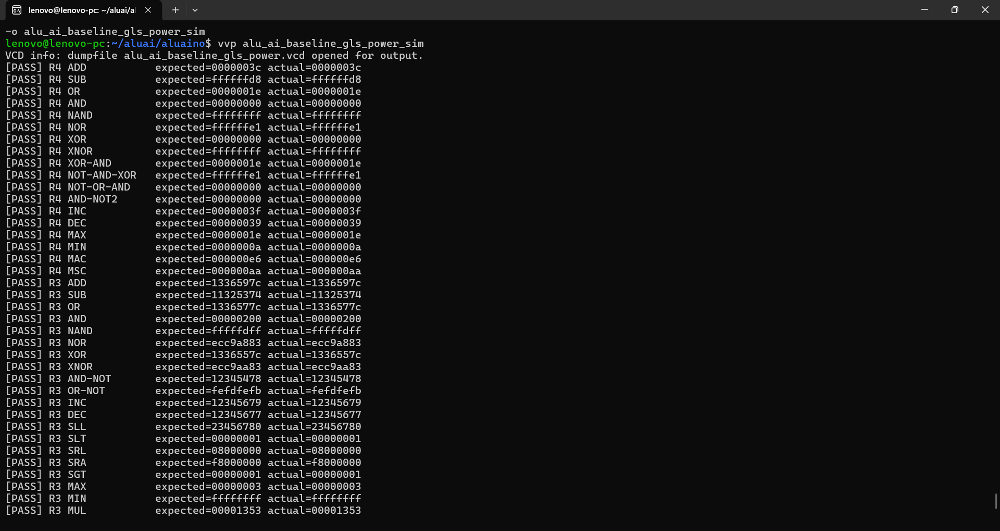

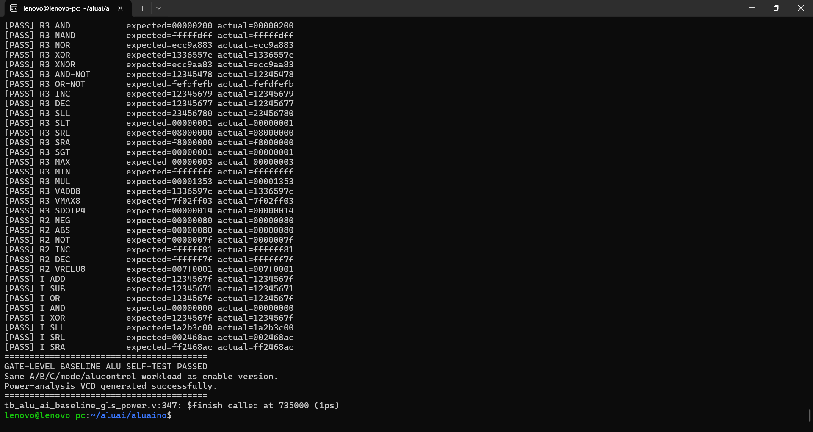

```text
GATE-LEVEL BASELINE ALU SELF-TEST PASSED
Same A/B/C/mode/alucontrol workload as enable version.
Power-analysis VCD generated successfully.
```

This establishes that the two implementations were functionally equivalent for the tested workload.

---

# 5. 📐 Area Comparison

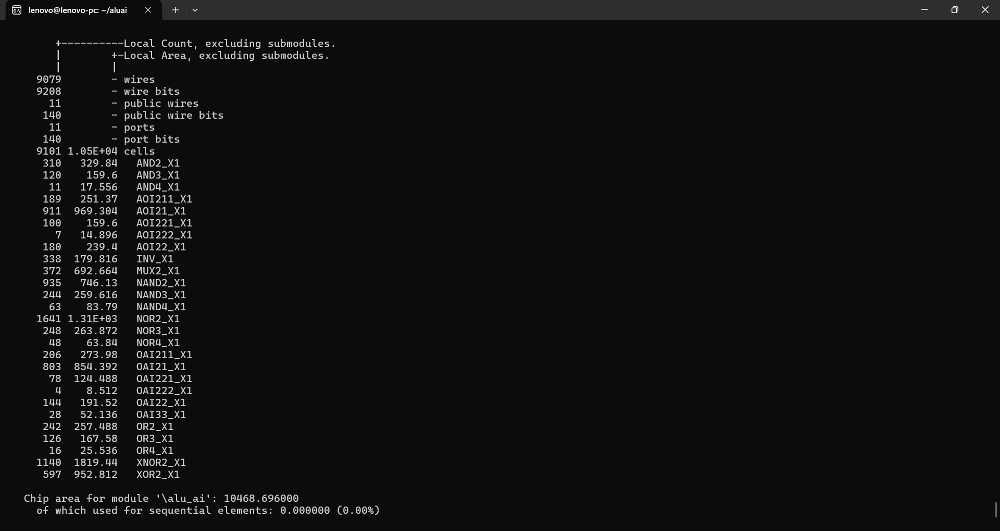

**Power-aware ALU area: 10,468.696 µm²**

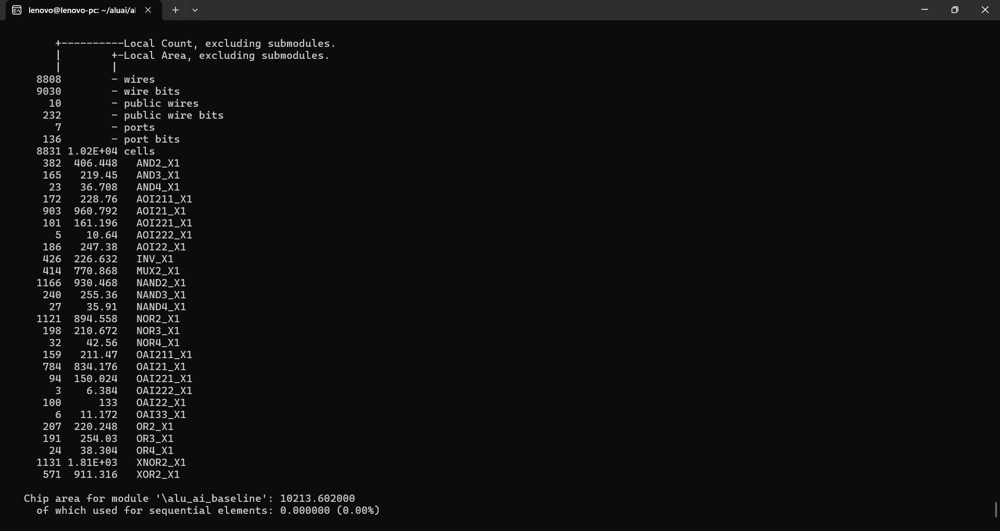

**Baseline ALU area: 10,213.602 µm²**

### Area overhead

```text
(10,468.696 - 10,213.602) / 10,213.602 × 100
= 2.50%
```

The additional area comes from the extra enable/isolation logic.

---

# 6. ⏱️ Timing Comparison

## Power-aware timing

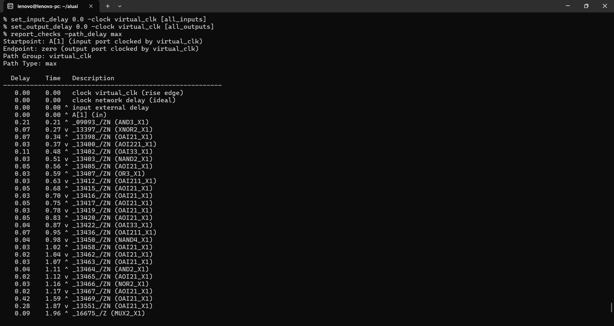

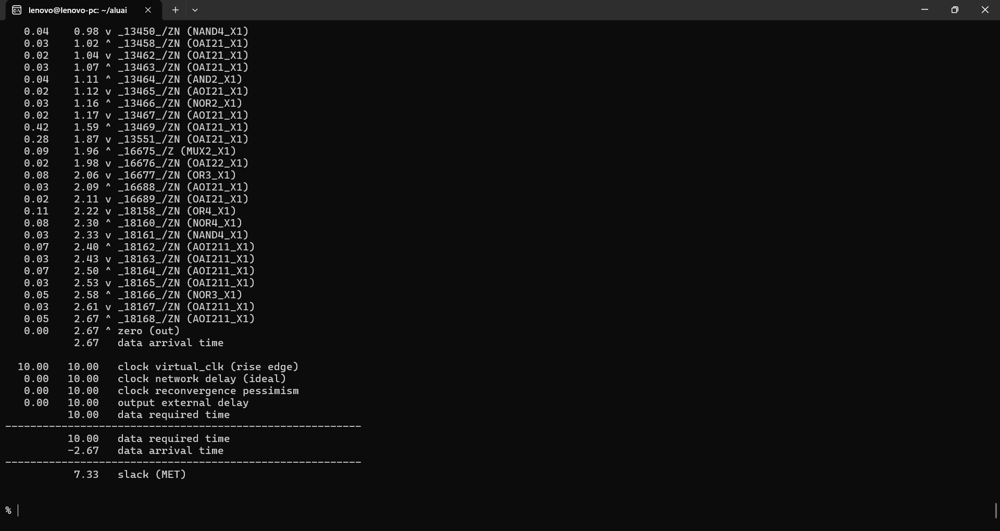

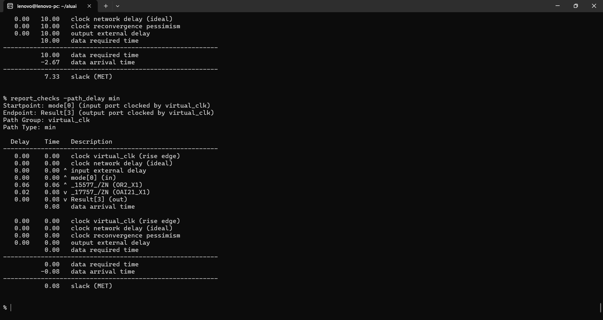

**Worst-case delay: 2.67 ns**  
**Worst slack @ 10 ns: 7.33 ns — MET**

Critical path reported by OpenSTA:

```text
A[1] → zero
```

## Baseline timing

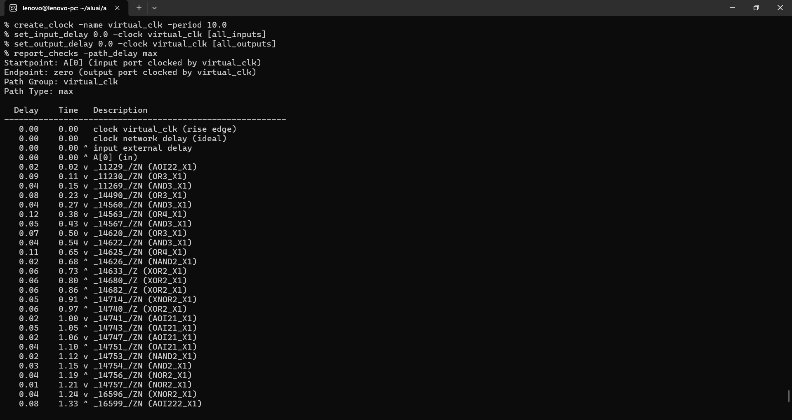

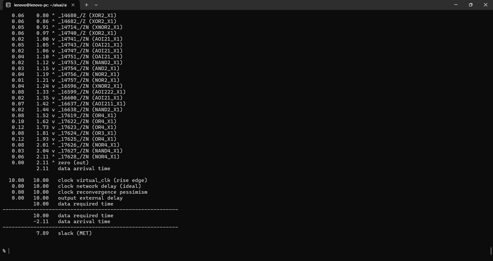

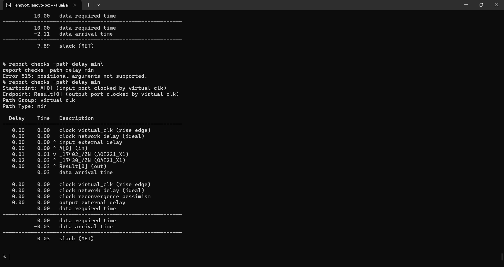

**Worst-case delay: 2.11 ns**  
**Worst slack @ 10 ns: 7.89 ns — MET**

Critical path reported by OpenSTA:

```text
A[0] → zero
```

### Timing trade-off

```text
2.67 ns - 2.11 ns = 0.56 ns
```

The power-aware implementation adds **0.56 ns** to the worst-case path, but the block still meets the 10 ns constraint.

---

# 7. 🔋 Power Comparison

## Power-aware version

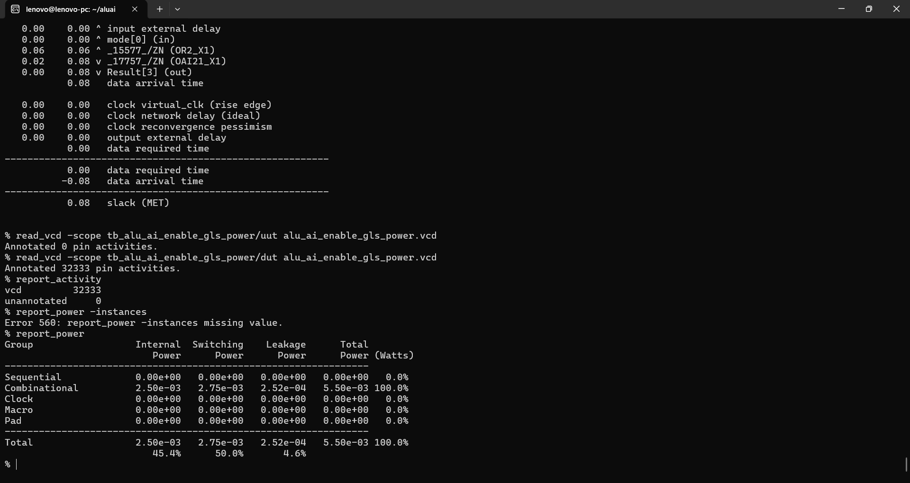

OpenSTA:

| Component | Power |
|---|---:|
| Internal | **2.50 mW** |
| Switching | **2.75 mW** |
| Leakage | **0.252 mW** |
| **Total** | **5.50 mW** |

## Baseline version

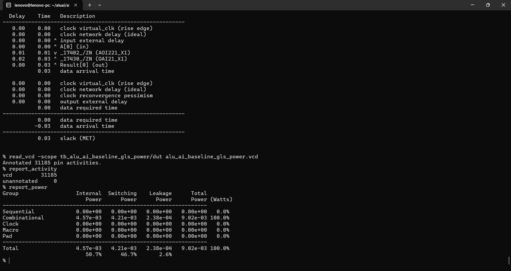

OpenSTA:

| Component | Power |
|---|---:|
| Internal | **4.57 mW** |
| Switching | **4.21 mW** |
| Leakage | **0.238 mW** |
| **Total** | **9.02 mW** |

---

# 8. 📊 PPA Analysis

### Total power reduction

```text
(9.02 - 5.50) / 9.02 × 100
= 39.02%
```

### Switching power reduction

```text
(4.21 - 2.75) / 4.21 × 100
= 34.68%
```

### Internal power reduction

```text
(4.57 - 2.50) / 4.57 × 100
= 45.30%
```

### Leakage change

```text
(0.252 - 0.238) / 0.238 × 100
= 5.88% increase
```

The data shows that the isolation strategy strongly reduces **internal and switching power**, while the added logic introduces a small leakage increase.

---

# 9. 🏭 Potential Commercial / Industry Applications

This design is best viewed as a **custom accelerator-oriented ALU research implementation** rather than a ready-to-license commercial IP block.

The architecture could be relevant to products or SoCs where **low-power integer/vector arithmetic** is useful.

## Edge AI / TinyML accelerators

The INT8-oriented operations such as `VMAX8`, `VADD8`, `SDOTP4`, and `VRELU8` map naturally to workloads involving quantized neural-network arithmetic.

Potential examples:

- Sensor nodes
- Wearable electronics
- Smart cameras
- Industrial edge devices
- Battery-powered embedded AI systems

**Why it fits:** INT8 lane operations can process several small operands within a 32-bit datapath.

## DSP and signal-processing engines

The multi-operand arithmetic and signed dot-product capability can be useful as a building block in DSP-oriented datapaths.

Potential examples:

- Audio processing
- Sensor fusion
- Communication signal processing
- Filtering and feature extraction
- Embedded control systems with mathematical workloads

## Low-power embedded processors

Operand/control isolation is particularly relevant when a processor frequently enters datapath-idle periods.

Potential examples:

- IoT controllers
- Battery-powered embedded processors
- Smart sensors
- Portable electronics

The actual benefit depends on workload activity, clocking strategy, voltage, physical implementation, and how often the ALU is idle.

## Custom RISC-style SoCs

Because these operations are integrated into a custom ISA, a similar approach could be used in an application-specific processor where the instruction set is designed around the target workload.

Examples could include:

- Domain-specific microcontrollers
- Robotics controllers
- Industrial edge-compute SoCs
- Custom DSP/AI controller cores

### Important commercial qualification

These are **potential application areas**, not claims that this exact ALU has been production-qualified for them. Commercial deployment would require considerably more validation, including physical design, PVT analysis, DFT, verification coverage, memory architecture, synthesis constraints, and silicon characterization.

---

# 10. ✅ Benefits

### Lower estimated power

The strongest measured benefit is:

**39.02% lower total estimated power**

with:

**34.68% lower switching power**

This makes the architecture attractive for designs where dynamic power is an important constraint.

### Small area overhead

The area penalty is only:

**2.50%**

This is a favorable trade-off compared with the measured power reduction for this experiment.

### Flexible operand usage

Independent operand isolation allows the design to suppress activity on operands that are not required by a particular operation.

### AI/DSP-oriented datapath

Packed INT8 operations and signed dot-product functionality provide a compact mechanism for experimenting with quantized and DSP-style arithmetic.

### Custom ISA integration

The ALU is not limited to a generic instruction set; the datapath can be tailored to the processor's custom instruction encoding and workload.

### Gate-level evidence

The results are based on:

- post-synthesis gate-level simulation
- VCD activity
- standard-cell timing
- OpenSTA power reporting

This provides stronger evidence than an RTL-only power estimate.

---

# 11. ⚠️ Disadvantages and Trade-offs

### Added logic

Isolation requires extra gates, producing:

**+2.50% area overhead**

### Timing penalty

The worst-case delay increases from:

**2.11 ns → 2.67 ns**

or about **26.54%**.

Although timing still passes the 10 ns constraint, the extra logic reduces timing margin.

### Leakage increase

Leakage changes from:

**0.238 mW → 0.252 mW**

which is a **5.88% increase**.

Thus, power-aware isolation is not a free improvement across every power component.

### Control complexity

The design requires additional control signals:

```text
ALUEnable
alu_enA
alu_enB
alu_enC
```

and control isolation for the ALU inputs.

At processor level, those signals must be generated correctly for every instruction type.

### Workload dependence

The reported power reduction depends on the applied workload and switching activity.

A different instruction mix, operand distribution, toggle rate, clock frequency, or duty cycle can produce different power results.

### No physical implementation yet

The experiment uses standard-cell synthesis and timing/power estimation. It does **not** include:

- placed-and-routed parasitics
- clock-tree implementation
- IR drop
- electromigration
- detailed PVT characterization
- silicon measurements

Therefore, these numbers should not be presented as fabricated-chip results.

### Virtual-clock block STA

The standalone ALU was timed with a **10 ns virtual-clock constraint**. This is useful for block-level comparison, but the final operating frequency of an integrated processor must be determined from the complete processor timing analysis.

---

# 12. 🎯 When the Power-Aware Version Makes Sense

The optimization is most attractive when:

```text
Power reduction
        ↓
is more valuable than
        ↓
small area + timing overhead
```

For a datapath with frequent unused operands or idle periods, operand/control isolation can prevent unnecessary internal transitions.

For a timing-critical ALU where every fraction of a nanosecond matters, the additional isolation delay may make the trade-off less attractive.

Therefore, the right choice is **workload and system dependent**.

---

# 13. 🛠️ Tools Used

| Tool | Purpose |
|---|---|
| **Verilog HDL** | RTL design |
| **Icarus Verilog** | Gate-level simulation / VCD generation |
| **Yosys** | Logic synthesis |
| **OpenSTA** | Static timing and power analysis |
| **Nangate Open Cell Library** | Standard-cell implementation |
| **GTKWave** | Waveform inspection |

---

# 14. 🔁 Reproducibility

## Power-aware gate-level simulation

```bash
iverilog -g2012 -s tb_alu_ai_enable_gls_power \
alu_ai_netlist.v \
tb_alu_ai_enable_gls_power.v \
~/NangateOpenCellLibrary.v \
-o alu_ai_enable_gls_power_sim

vvp alu_ai_enable_gls_power_sim
```

## Baseline gate-level simulation

```bash
iverilog -g2012 -s tb_alu_ai_baseline_gls_power \
alu_ai_baseline_netlist.v \
tb_alu_ai_baseline_gls_power.v \
~/NangateOpenCellLibrary.v \
-o alu_ai_baseline_gls_power_sim

vvp alu_ai_baseline_gls_power_sim
```

## OpenSTA — power-aware power

```tcl
read_liberty ~/nangate.lib
read_verilog alu_ai_netlist.v
link_design alu_ai
read_vcd -scope tb_alu_ai_enable_gls_power/dut alu_ai_enable_gls_power.vcd
report_activity
report_power
```

## OpenSTA — baseline power

```tcl
read_liberty ~/nangate.lib
read_verilog alu_ai_baseline_netlist.v
link_design alu_ai_baseline
read_vcd -scope tb_alu_ai_baseline_gls_power/dut alu_ai_baseline_gls_power.vcd
report_activity
report_power
```

## OpenSTA — standalone ALU timing

```tcl
read_liberty ~/nangate.lib
read_verilog alu_ai_netlist.v
link_design alu_ai

create_clock -name virtual_clk -period 10.0
set_input_delay 0.0 -clock virtual_clk [all_inputs]
set_output_delay 0.0 -clock virtual_clk [all_outputs]

check_timing
report_checks -path_delay max -group_count 10
report_checks -path_delay min -group_count 10
report_worst_slack -max
report_worst_slack -min
report_tns
report_design_area
```

For the baseline, replace `alu_ai_netlist.v` / `alu_ai` with:

```text
alu_ai_baseline_netlist.v
alu_ai_baseline
```

---

# 15. 📌 Final Assessment

This project demonstrates a clear **PPA trade-off** for a custom AI/DSP-oriented ALU:

> **34.68% lower switching power and 39.02% lower total estimated power, at 2.50% area overhead, with timing still meeting the 10 ns constraint.**

The strongest technical story is not simply "more logic saves power." It is that **activity-aware operand and control isolation can substantially reduce unnecessary datapath switching while preserving functional behavior**, with a measurable and explicitly quantified area/timing cost.

---

## 📁 Repository Contents

```text
ALU_PPA_Comparison_Baseline_vs_Power_Aware/
├── README.md
└── results/
    ├── baseline/
    │   ├── 01_functional_simulation_1.png
    │   ├── 02_functional_simulation_2.png
    │   ├── 03_area.png
    │   ├── 04_sta_max_1.png
    │   ├── 05_sta_max_2.png
    │   ├── 06_sta_min.png
    │   └── 07_power.png
    └── enable/
        ├── 01_functional_simulation_1.png
        ├── 02_functional_simulation_2.png
        ├── 03_area.png
        ├── 04_sta_max_1.png
        ├── 05_sta_max_2.png
        ├── 06_sta_min.png
        └── 07_power.png
```

---

## ⭐ Project Snapshot

**Architecture:** Custom 32-bit AI/DSP-oriented ALU  
**Optimization:** Operand + control activity isolation  
**Verification:** Gate-level self-checking simulation  
**Power analysis:** VCD-annotated OpenSTA  
**Technology library:** Nangate Open Cell Library  
**Main measured result:** **39.02% total power reduction**
