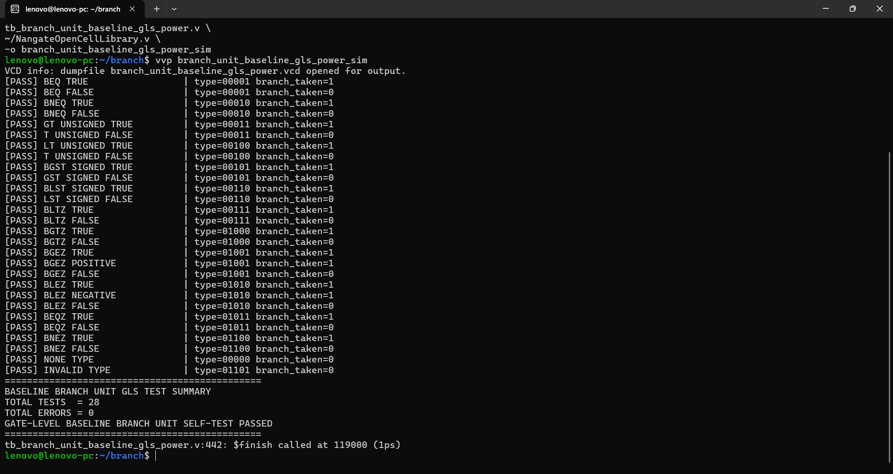
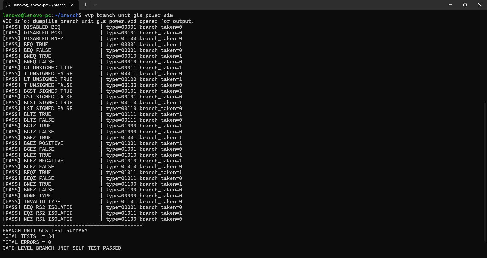
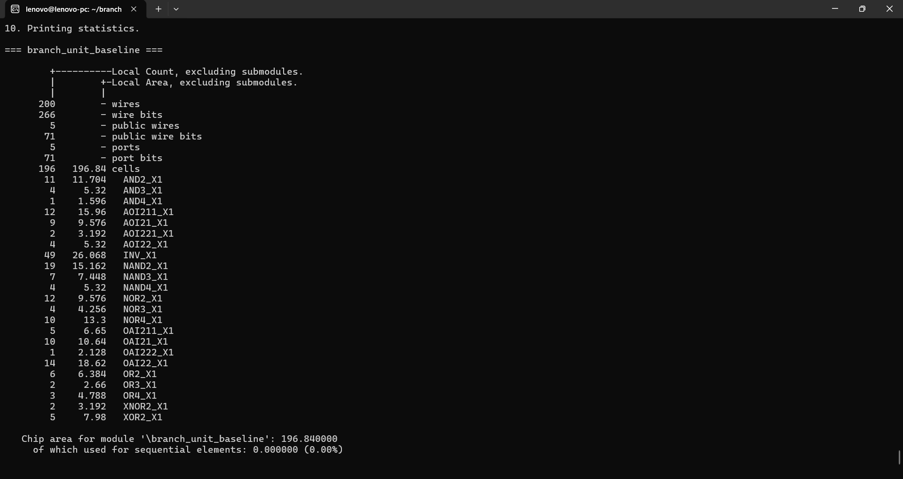
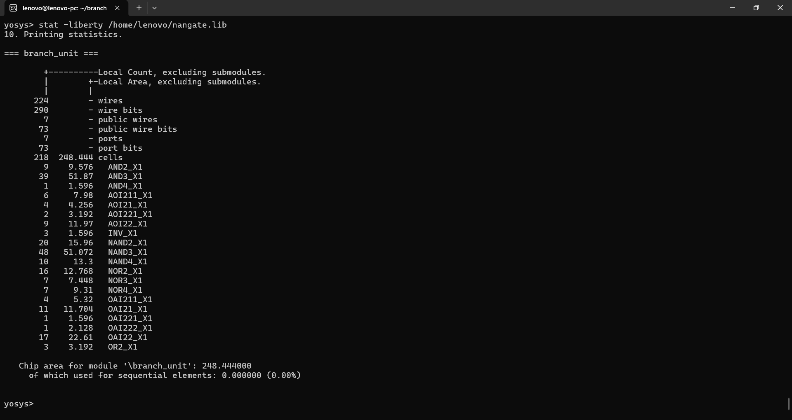
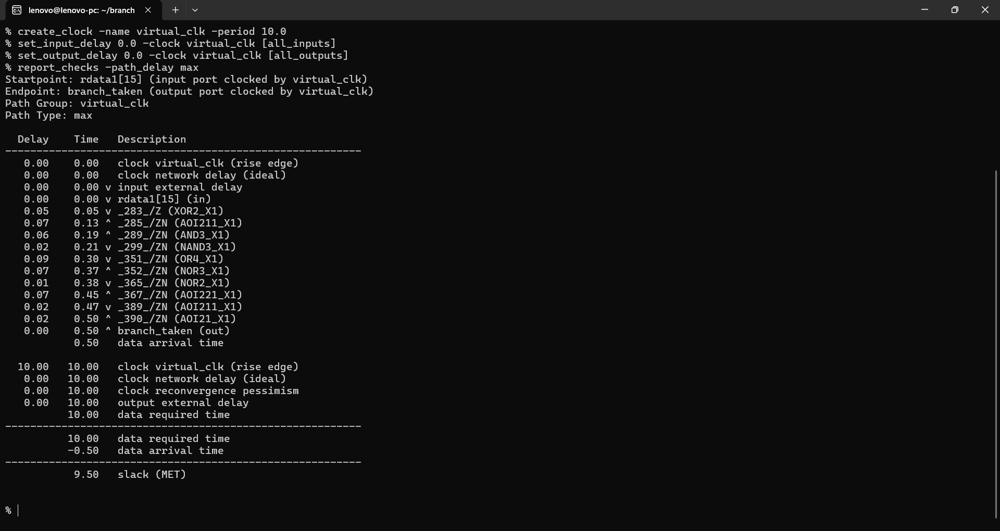
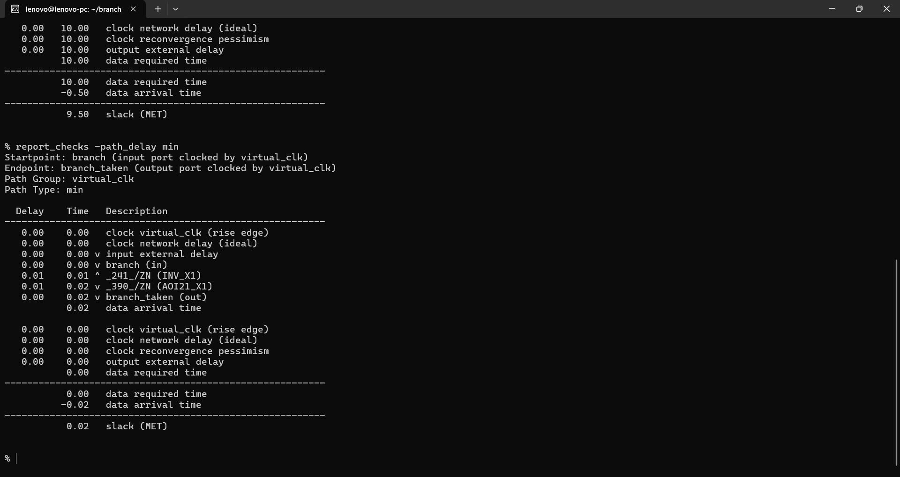
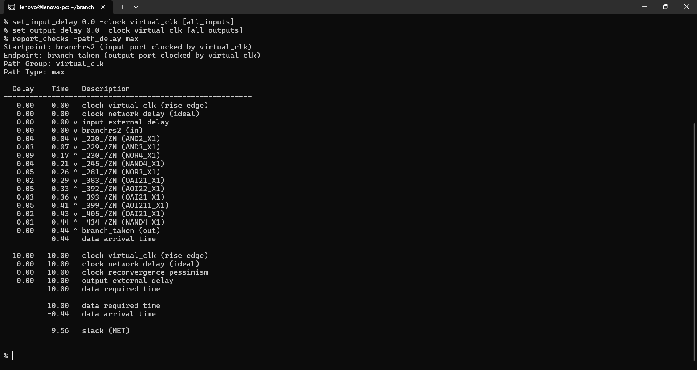
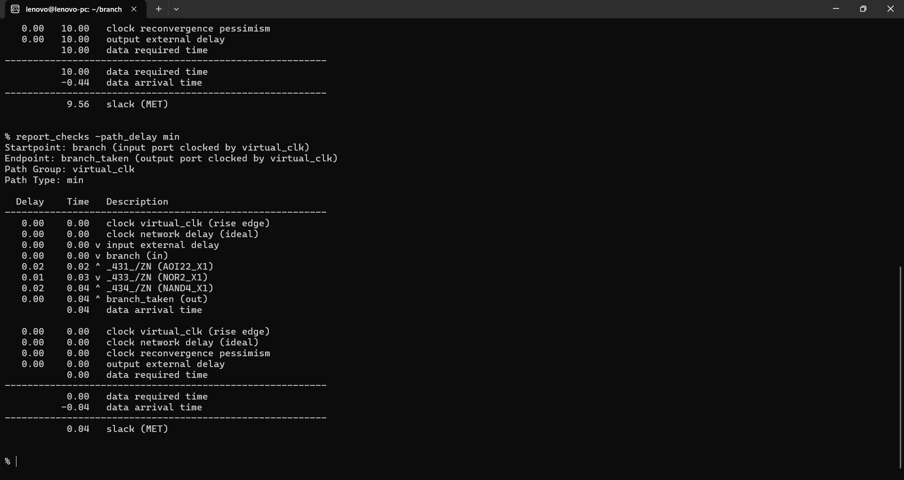
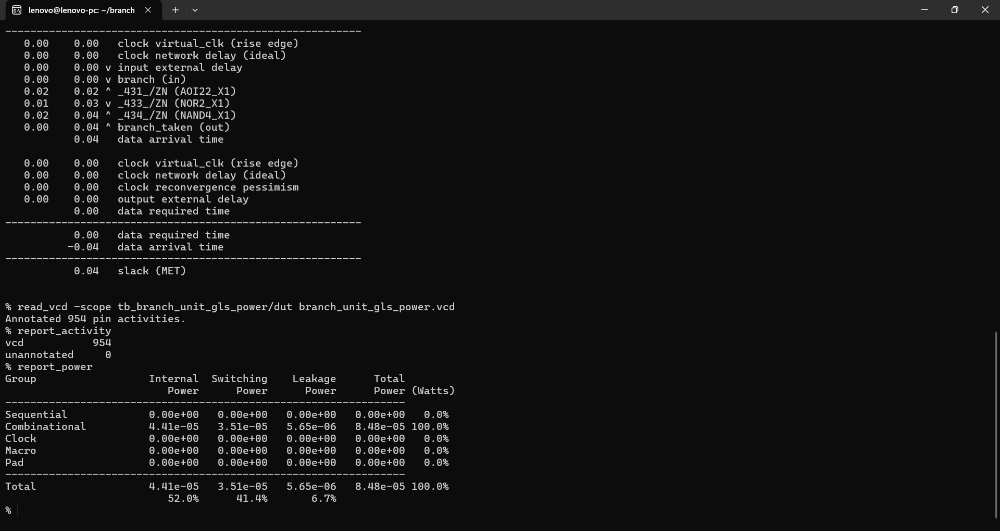

# ⚡ Power-Aware Branch Unit — Baseline vs Optimized Comparison

A 32-bit branch decision unit supporting equality, inequality, signed/unsigned relational comparisons, and zero comparisons.

This repository compares two functionally equivalent implementations:

- **Baseline:** branch unit without operand-isolation enables
- **Power-aware:** branch unit with activity-aware operand isolation using `branchrs1` and `branchrs2`

The comparison uses **post-synthesis gate-level simulation, static timing analysis, synthesized area, and VCD-based power analysis** with the **Nangate Open Cell Library**.

---

## 📌 Project Snapshot

| Item | Details |
|---|---|
| Architecture | 32-bit Branch Decision Unit |
| Optimization | Operand/activity isolation |
| Verification | Gate-level self-checking simulation |
| Power analysis | Gate-level VCD + OpenSTA |
| Synthesis | Yosys |
| STA / Power | OpenSTA |
| Technology | Nangate Open Cell Library |
| Timing constraint | 10 ns virtual clock |
| Sequential elements | None |

---

# 🧠 Branch Unit Functionality

The branch unit produces `branch_taken` based on the branch enable, branch type, and register operands.

Supported branch-type encodings:

| `branchtype` | Operation |
|---|---|
| `00000` | NONE |
| `00001` | BEQ |
| `00010` | BNEQ |
| `00011` | BGT — unsigned |
| `00100` | BLT — unsigned |
| `00101` | BGST — signed |
| `00110` | BLST — signed |
| `00111` | BLTZ |
| `01000` | BGTZ |
| `01001` | BGEZ |
| `01010` | BLEZ |
| `01011` | BEQZ |
| `01100` | BNEZ |

The power-aware implementation additionally receives `branchrs1` and `branchrs2`, which control operand activity isolation.

---

# 🔋 Power-Aware Optimization

The optimized branch unit uses **RTL-level operand activity isolation**.

For branch types that need only one source operand, activity on the unused operand path can be blocked. The `branchrs1` and `branchrs2` signals determine whether each operand is allowed to propagate into the branch decision logic.

This reduces unnecessary internal switching when the branch unit does not require both operands.

> This project demonstrates RTL-level activity isolation. It does not use UPF/CPF power-intent flows.

---

# 🧪 Gate-Level Functional Verification

Both implementations were synthesized to gate-level Verilog and verified with self-checking testbenches.

## Baseline

```text
TOTAL TESTS  = 28
TOTAL ERRORS = 0
GATE-LEVEL BASELINE BRANCH UNIT SELF-TEST PASSED
```



## Power-aware

```text
TOTAL TESTS  = 34
TOTAL ERRORS = 0
GATE-LEVEL BRANCH UNIT SELF-TEST PASSED
```



The optimized testbench also includes explicit operand-isolation checks.

---

# 📐 Area Comparison

## Baseline

```text
Area = 196.840 µm²
```



## Power-aware

```text
Area = 248.444 µm²
```



### Area overhead

```text
(248.444 - 196.840) / 196.840 × 100
= 26.22%
```

The area increase is the implementation cost of the additional operand-isolation/control logic.

---

# ⏱️ Static Timing Analysis

A **10 ns virtual clock** was used for standalone combinational timing analysis.

```tcl
create_clock -name virtual_clk -period 10.0
set_input_delay 0.0 -clock virtual_clk [all_inputs]
set_output_delay 0.0 -clock virtual_clk [all_outputs]
```

## Baseline

Worst maximum-delay path:

```text
Startpoint: rdata1[15]
Endpoint:   branch_taken
Data arrival time: 0.50 ns
Slack: 9.50 ns
Status: MET
```



Minimum-delay path:

```text
Startpoint: branch
Endpoint:   branch_taken
Data arrival time: 0.02 ns
Minimum slack: 0.02 ns
Status: MET
```



## Power-aware

Worst maximum-delay path:

```text
Startpoint: branchrs2
Endpoint:   branch_taken
Data arrival time: 0.44 ns
Slack: 9.56 ns
Status: MET
```



Minimum-delay path:

```text
Startpoint: branch
Endpoint:   branch_taken
Data arrival time: 0.04 ns
Minimum slack: 0.04 ns
Status: MET
```



### Timing comparison

| Metric | Baseline | Power-Aware | Change |
|---|---:|---:|---:|
| Worst delay | 0.50 ns | 0.44 ns | **−12.00%** |
| Worst slack | 9.50 ns | 9.56 ns | **+0.06 ns** |
| Minimum slack | 0.02 ns | 0.04 ns | **+0.02 ns** |
| Timing @ 10 ns | MET | MET | Pass |

The optimized implementation is slightly faster in this synthesis run.

---

# 🔋 Power Analysis

Power was estimated from **post-synthesis gate-level VCD activity** using OpenSTA.

Both runs reported:

```text
Unannotated activity = 0
```

## Baseline


| Power Component | Baseline |
|---|---:|
| Internal | **74.1 µW** |
| Switching | **59.3 µW** |
| Leakage | **4.53 µW** |
| **Total** | **138 µW** |

VCD activity:

```text
Annotated pin activities = 762
Unannotated = 0
```

## Power-aware



| Power Component | Power-Aware |
|---|---:|
| Internal | **44.1 µW** |
| Switching | **35.1 µW** |
| Leakage | **5.65 µW** |
| **Total** | **84.8 µW** |

VCD activity:

```text
Annotated pin activities = 954
Unannotated = 0
```

---

# 📊 Final PPA Comparison

| Metric | Baseline | Power-Aware | Change |
|---|---:|---:|---:|
| Area | 196.840 µm² | 248.444 µm² | **+26.22%** |
| Internal power | 74.1 µW | 44.1 µW | **−40.49%** |
| Switching power | 59.3 µW | 35.1 µW | **−40.81%** |
| Leakage power | 4.53 µW | 5.65 µW | **+24.72%** |
| Total power | 138 µW | 84.8 µW | **−38.55%** |
| Worst delay | 0.50 ns | 0.44 ns | **−12.00%** |
| Worst slack | 9.50 ns | 9.56 ns | **+0.06 ns** |
| Minimum slack | 0.02 ns | 0.04 ns | **+0.02 ns** |

### Primary Result

> **Operand activity isolation reduced branch-unit switching power by 40.81% and total estimated power by 38.55%, with a 26.22% area overhead. The optimized version also improved worst-case delay by 12.00% under the 10 ns timing constraint.**

Leakage increased by **24.72%**, so the result should be presented as a clear PPA trade-off rather than claiming that every power component decreased.

---

# ⚖️ Engineering Trade-Off

```text
                 POWER-AWARE BRANCH UNIT

        ┌─────────────────────────────────┐
        │ ↓ 40.81% switching power       │
        │ ↓ 38.55% total power           │
        │ ↓ 40.49% internal power        │
        │                                 │
        │ ↑ 26.22% area                  │
        │ ↑ 24.72% leakage               │
        │ ↓ 12.00% worst delay           │
        └─────────────────────────────────┘
```

The optimization is most attractive when reducing dynamic power is more important than minimizing area.

---

# 🏭 Potential Applications

The branch unit can form part of:

- Embedded CPU cores
- Microcontrollers
- Custom RISC-style processors
- AI/edge processors
- Low-power control processors
- Custom ASIC processor IP

The isolation approach is particularly useful when operand signals remain active even though a branch operation does not require all operands.

---

# ✅ Benefits

- Reduces unnecessary operand switching
- Significant dynamic-power reduction in the measured workload
- No sequential state in the branch unit
- Preserves branch functionality
- Meets the 10 ns timing constraint
- Demonstrates practical RTL-level low-power optimization

# ⚠️ Limitations

- 26.22% area overhead
- Leakage power increases by 24.72%
- Power savings depend on workload and operand activity
- Additional control/isolation logic must be verified carefully
- Results are post-synthesis estimates, not silicon measurements

---

# 🛠️ Tools Used

| Tool | Purpose |
|---|---|
| **Verilog HDL** | RTL implementation |
| **Icarus Verilog** | Gate-level simulation and VCD generation |
| **Yosys** | RTL synthesis |
| **OpenSTA** | Static timing and VCD-based power analysis |
| **Nangate Open Cell Library** | Standard-cell implementation |
| **GTKWave** | Waveform inspection |

---

# 🔁 Reproducibility

## Baseline Gate-Level Simulation

```bash
iverilog -g2012 -s tb_branch_unit_baseline_gls_power \
branch_unit_baseline.v \
tb_branch_unit_baseline_gls_power.v \
~/NangateOpenCellLibrary.v \
-o branch_unit_baseline_gls_power_sim

vvp branch_unit_baseline_gls_power_sim
```

VCD:

```text
branch_unit_baseline_gls_power.vcd
```

## Power-Aware Gate-Level Simulation

```bash
iverilog -g2012 -s tb_branch_unit_gls_power \
branch_unit.v \
tb_branch_unit_gls_power.v \
~/NangateOpenCellLibrary.v \
-o branch_unit_gls_power_sim

vvp branch_unit_gls_power_sim
```

VCD:

```text
branch_unit_gls_power.vcd
```

---

## OpenSTA — Baseline Power

```tcl
read_liberty ~/nangate.lib
read_verilog branch_unit_baseline.v
link_design branch_unit_baseline

read_vcd -scope tb_branch_unit_baseline_gls_power/dut branch_unit_baseline_gls_power.vcd

report_activity
report_power
```

## OpenSTA — Power-Aware Power

```tcl
read_liberty ~/nangate.lib
read_verilog branch_unit.v
link_design branch_unit

read_vcd -scope tb_branch_unit_gls_power/dut branch_unit_gls_power.vcd

report_activity
report_power
```

---

## OpenSTA — Timing

### Baseline

```tcl
read_liberty ~/nangate.lib
read_verilog branch_unit_baseline.v
link_design branch_unit_baseline

create_clock -name virtual_clk -period 10.0
set_input_delay 0.0 -clock virtual_clk [all_inputs]
set_output_delay 0.0 -clock virtual_clk [all_outputs]

check_timing
report_checks -path_delay max -group_count 10
report_checks -path_delay min -group_count 10
report_worst_slack -max
report_worst_slack -min
report_tns
report_design_area
```

### Power-aware

```tcl
read_liberty ~/nangate.lib
read_verilog branch_unit.v
link_design branch_unit

create_clock -name virtual_clk -period 10.0
set_input_delay 0.0 -clock virtual_clk [all_inputs]
set_output_delay 0.0 -clock virtual_clk [all_outputs]

check_timing
report_checks -path_delay max -group_count 10
report_checks -path_delay min -group_count 10
report_worst_slack -max
report_worst_slack -min
report_tns
report_design_area
```

---

# 📁 Repository Structure

```text
Branch_Unit_PPA_Comparison_Baseline_vs_Power_Aware/
├── README.md
└── results/
    ├── baseline/
    │   ├── 01_functional_simulation.png
    │   ├── 02_area.png
    │   ├── 03_sta_max.png
    │   ├── 04_sta_min.png
    │   └── 05_power.png
    │
    └── power_aware/
        ├── 01_functional_simulation.png
        ├── 02_area.png
        ├── 03_sta_max.png
        ├── 04_sta_min.png
        └── 05_power.png
```

---

# 🎯 Key Takeaway

The branch-unit experiment demonstrates that **targeted RTL operand isolation can reduce dynamic power substantially while preserving functionality and timing closure**.

For the measured workload:

**40.81% lower switching power**  
**38.55% lower total estimated power**  
**26.22% area overhead**  
**12.00% lower worst-case delay**

This provides a concrete block-level example of activity-aware RTL optimization within a larger custom processor architecture.
