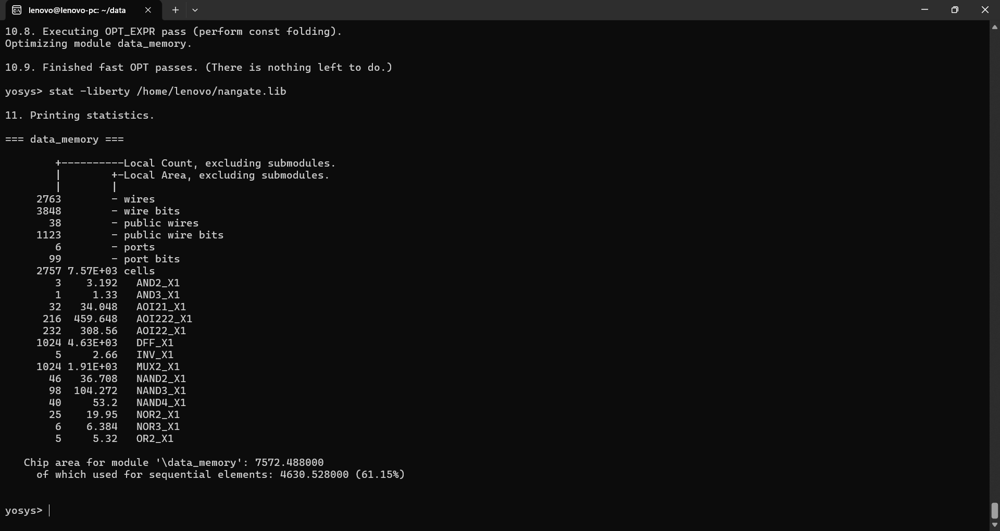
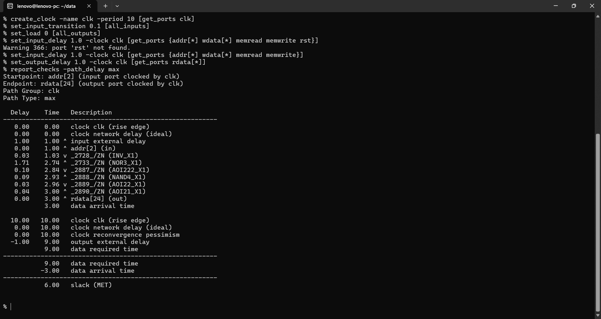
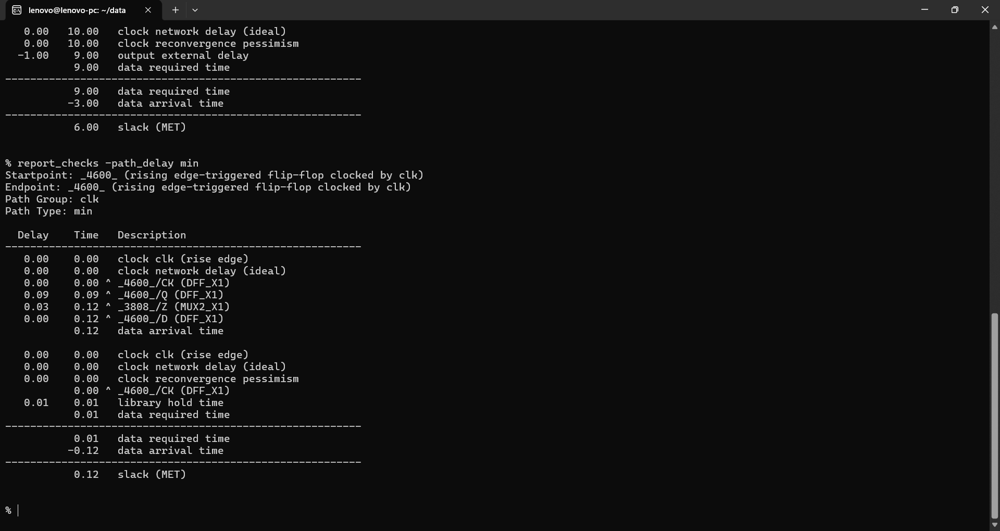
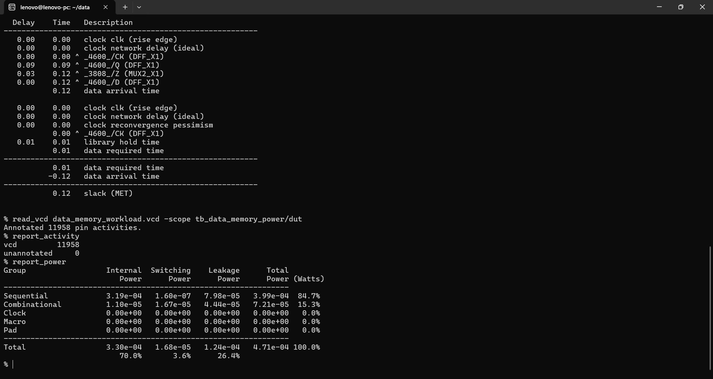

# 💾 32-bit Data Memory — Standard-Cell PPA & Gate-Level Power Analysis

> **A 32-bit Data Memory for a custom RISC-V processor, characterized through post-synthesis area, OpenSTA timing, gate-level workload simulation, and VCD-annotated power analysis — with a standard-cell implementation limitation due to the absence of an SRAM macro.**


This project characterizes the **32-bit Data Memory** used in the custom single-cycle RISC-V processor.

The same Data Memory implementation is used in both the baseline and power-aware processor. Therefore, this block is treated as a **common processor component**, rather than claiming a power-aware improvement that was not introduced in the memory RTL.

The analysis covers:

- Yosys synthesis
- Nangate standard-cell mapping
- Gate-level netlist generation
- OpenSTA static timing analysis
- Gate-level workload simulation
- VCD activity annotation
- Workload-dependent power estimation

---

# 🚀 Headline Results

| Metric | Result |
|---|---:|
| **Memory organization** | **32 × 32-bit** |
| **Stored bits** | **1,024 bits** |
| **Total synthesized cells** | **2,757** |
| **DFF_X1 cells** | **1,024** |
| **MUX2_X1 cells** | **1,024** |
| **Area** | **7,572.488 area units** |
| **Sequential area** | **4,630.528 area units** |
| **Sequential area contribution** | **61.15%** |
| **Worst delay @ 10 ns** | **3.00 ns** |
| **Worst slack @ 10 ns** | **6.00 ns — MET** |
| **Minimum-delay slack** | **0.12 ns — MET** |
| **Total workload power** | **0.471 mW** |
| **SRAM macro** | **Not available** |

### Key takeaway

The Data Memory meets the **100 MHz / 10 ns** standalone timing target with **6.00 ns positive setup slack** and **0.12 ns reported minimum-delay slack**.

The synthesized memory occupies **7,572.488 area units** and consumes approximately **0.471 mW** under the analyzed gate-level workload.

However, the most important implementation limitation is that the Nangate standard-cell library used for this experiment does **not contain a dedicated SRAM macro**. Consequently, the 1,024 stored bits are implemented using **1,024 individual flip-flops**, making the reported PPA substantially different from a production SRAM implementation.

This is a **post-synthesis, gate-level, workload-dependent result**, not a silicon measurement.

---

# 1. 🧠 What the Data Memory Does

The Data Memory is part of the custom 32-bit single-cycle RISC-V processor and provides storage for processor data operations.

### Main functions

- Stores 32-bit processor data
- Provides data for **load operations**
- Accepts data for **store operations**
- Uses a synchronous write interface
- Uses an asynchronous read interface
- Uses `memread` to control read activity
- Uses `memwrite` to control write activity

The current implementation contains:

```text
32 words × 32 bits
        =
1,024 stored bits
```

### Processor role

```text
                  ┌─────────────────┐
 Address ────────►│                 │
                  │   Data Memory   │────► Read Data
 Write Data ────►│                 │
                  │                 │
 memwrite ──────►│                 │
 memread ───────►│                 │
                  └─────────────────┘
```

The Data Memory is accessed by the processor during load/store instructions and forms the storage component of the datapath.

---

# 2. 🏗️ Memory Implementation

The memory is described in synthesizable Verilog and mapped using the **Nangate Open Cell Library**.

The implementation uses:

- 32-bit data width
- 32 memory words
- 1,024 stored bits
- Synchronous write
- Asynchronous read
- Standard-cell decoding and selection logic

## Standard-cell mapping

The synthesized implementation contains:

```text
1,024 × DFF_X1
1,024 × MUX2_X1
+ additional combinational logic
```

The flip-flops provide the actual storage elements, while the multiplexing and logic implement the read-selection and control behavior.

---

# 3. ⚠️ Important SRAM Macro Limitation

The Nangate standard-cell library used in this experiment does **not provide a dedicated SRAM macro**.

In a production ASIC flow, a memory of this type would normally be implemented using an SRAM macro generated by a memory compiler or supplied as a hard macro.

Instead, the current standard-cell-only flow synthesizes the memory into individual flip-flops.

Therefore:

> **The reported Data Memory area and power represent a standard-cell / flip-flop-based memory implementation, not a production SRAM macro.**

This limitation is especially important when interpreting the large sequential-area contribution.

### Why this matters

A real SRAM macro would use specialized structures such as:

- SRAM bit cells
- word-line drivers
- bit lines
- sense amplifiers
- write drivers
- dedicated memory decoding

Those structures are not represented by the Nangate standard-cell implementation used here.

---

# 4. 🧪 Experimental Methodology

## Synthesis

- HDL: **Verilog**
- Synthesis: **Yosys**
- Technology: **Nangate Open Cell Library**
- Output: post-synthesis gate-level Verilog

The synthesis flow maps the Data Memory into standard cells because no SRAM macro is available.

## Gate-level simulation

The synthesized netlist was simulated using a dedicated workload testbench.

```text
Netlist:
data_memory_netlist.v

Testbench:
tb_data_memory_power

VCD:
data_memory_workload.vcd
```

The generated VCD was then used for workload-dependent power estimation.

## Timing

Static timing analysis was performed using **OpenSTA**.

The block was evaluated with:

```text
Clock period = 10 ns
Target frequency = 100 MHz
Input transition = 0.1
Output load = 0
Input delay = 1 ns
Output delay = 1 ns
```

The Data Memory has no reset port, so no reset constraint is applied to this block.

## Power

Power was estimated using:

1. Gate-level simulation
2. VCD activity generation
3. OpenSTA activity annotation
4. `report_power`

The workload VCD contained:

```text
11,958 annotated activities
0 unannotated activities
```

---

# 5. 📐 Synthesis / Area Results



### Synthesized area

**Data Memory area: 7,572.488 area units**

### Sequential area

**Sequential area: 4,630.528 area units**

**Sequential contribution: 61.15%**

### Cell breakdown

| Cell / Metric | Count |
|---|---:|
| Total cells | **2,757** |
| `DFF_X1` | **1,024** |
| `MUX2_X1` | **1,024** |

The high sequential-area percentage is a direct consequence of implementing the 1,024 memory bits with flip-flops.

---

# 6. ⏱️ Static Timing Analysis

## Maximum-delay / setup analysis



The worst reported path is through the memory read-selection logic from an address input to the read-data output.

### Result

```text
Data arrival time  = 3.00 ns
Data required time = 9.00 ns
Slack               = 6.00 ns
```

### Timing status

**PASS / MET**

The implementation therefore meets the 10 ns clock constraint with substantial positive margin.

### Timing summary

| Metric | Result |
|---|---:|
| Clock period | **10 ns** |
| Target frequency | **100 MHz** |
| Worst data arrival | **3.00 ns** |
| Data required time | **9.00 ns** |
| Worst setup slack | **6.00 ns** |
| Status | **MET** |

---

# 7. ⏱️ Minimum-Delay Analysis



The minimum-delay report also shows a positive reported slack.

### Result

```text
Data arrival time  = 0.12 ns
Data required time = 0.01 ns
Slack               = 0.12 ns
```

### Status

**MET**

The result demonstrates that the reported minimum-delay path satisfies the applied constraints.

> This is a block-level OpenSTA experiment using idealized clocking and simplified I/O constraints; it should not be treated as signoff-quality post-layout timing.

---

# 8. 🔋 Gate-Level Workload Power

Power analysis was performed using the synthesized gate-level implementation and the generated workload VCD.

### VCD activity annotation

```tcl
read_vcd data_memory_workload.vcd -scope tb_data_memory_power/dut
report_activity
report_power
```

OpenSTA reported:

```text
Annotated activities: 11,958
Unannotated:          0
```

This provides a workload-dependent activity basis for the power estimate.

---

# 9. ⚡ Power Results



### OpenSTA power report

| Component | Power |
|---|---:|
| **Internal Power** | **3.30 × 10⁻⁴ W** |
| **Switching Power** | **1.68 × 10⁻⁵ W** |
| **Leakage Power** | **1.24 × 10⁻⁴ W** |
| **Total Power** | **4.71 × 10⁻⁴ W** |
| **Total Power** | **0.471 mW** |

### Power contribution

| Component | Contribution |
|---|---:|
| Internal | **70.0%** |
| Switching | **3.6%** |
| Leakage | **26.4%** |

The dominant reported component is internal power, followed by leakage power.

The relatively small switching component is specific to the applied workload and activity profile.

---

# 10. 📊 PPA Interpretation

The current Data Memory has the following measured characteristics:

```text
Area       = 7,572.488
Power      = 0.471 mW
Delay      = 3.00 ns
Slack      = 6.00 ns @ 10 ns
```

The PPA should be interpreted together with the memory implementation technology.

The high sequential area is not an unexpected synthesis problem: it is a direct consequence of using **1,024 flip-flops as storage** because no SRAM macro is available.

---

# 11. 🔁 Baseline vs Power-Aware Processor

Unlike the ALU and other blocks where isolation logic was explicitly introduced, the Data Memory is **the same in both processor versions**.

Both versions use:

```text
Same Data Memory RTL
        ↓
Same memread
        ↓
Same memwrite
        ↓
Same synthesized memory implementation
```

Therefore, there is **no Data Memory isolation-based area or timing improvement to claim**.

The purpose of characterizing this block separately is to determine its contribution to the overall processor PPA.

This also makes the comparison methodologically cleaner: power savings are only attributed to blocks where actual enable/isolation logic was added.

---

# 12. 🏭 Potential Uses

The current Data Memory implementation is primarily useful for:

### Custom RISC-V processor research

It provides the storage required for:

- Load instructions
- Store instructions
- Data-processing workloads
- Processor-level gate simulation

### RTL-to-gate experimentation

The block is useful for studying:

- Standard-cell synthesis
- Memory-depth effects
- Flip-flop-based storage
- Read-selection logic
- Static timing
- Gate-level power

### Power-analysis research

The gate-level VCD flow allows workload-dependent analysis of:

- Internal power
- Switching power
- Leakage power
- Memory access activity

### Educational / prototyping use

The implementation is suitable for digital-design experimentation where a dedicated SRAM macro is not available.

---

# 13. ✅ Benefits

### Simple processor integration

The memory provides the required load/store functionality using a straightforward synthesizable RTL implementation.

### Fully synthesizable

The memory can be mapped into the available standard-cell library and simulated at gate level.

### Gate-level power analysis

The workload VCD enables activity-based power estimation rather than relying only on RTL-level assumptions.

### Timing characterization

OpenSTA provides a measurable implementation-level delay and slack result.

### Useful for memory-depth studies

Because the memory is synthesized from standard cells, its area and timing effects can be directly studied as the memory organization changes.

---

# 14. ⚠️ Disadvantages and Trade-offs

## No dedicated SRAM

The largest limitation is the lack of an SRAM macro.

The memory therefore consumes significantly more standard-cell resources than a practical SRAM implementation would.

## High sequential area

**61.15%** of the synthesized area is sequential.

This is primarily caused by the **1,024 DFF_X1 storage elements**.

## Area inefficiency

A flip-flop-based memory is much less area-efficient than a dedicated SRAM.

## Power inefficiency

The large number of standard cells also affects power, particularly internal and leakage components.

## Limited scalability

Increasing memory depth or word width increases the number of storage elements and selection logic rapidly.

For a larger memory, an SRAM macro would be the preferred ASIC implementation.

## Workload-dependent power

The reported **0.471 mW** is specific to:

```text
data_memory_workload.vcd
```

Different workloads can produce different power numbers.

## No physical-design results

This experiment does not include:

- Placement
- Routing
- Clock-tree synthesis
- Extracted parasitics
- IR drop
- Electromigration
- Post-layout power
- Silicon measurements

Therefore, the results should not be presented as physical-design or silicon results.

---

# 15. 🎯 Engineering Interpretation

The most important result of this Data Memory experiment is not simply the measured area or power.

It demonstrates how strongly **memory implementation technology** affects PPA.

The current standard-cell-only flow creates:

```text
1,024 memory bits
        ↓
1,024 flip-flops
        +
1,024 MUX2 cells
        +
decoder/control logic
```

This produces:

**7,572.488 area units**

and:

**0.471 mW**

under the analyzed workload.

With a real SRAM macro, the storage would be implemented using specialized memory cells instead of general-purpose flip-flops, leading to a fundamentally different PPA profile.

---

# 16. 🛠️ Tools Used

| Tool | Purpose |
|---|---|
| **Verilog HDL** | RTL design |
| **Icarus Verilog** | Gate-level simulation / VCD generation |
| **Yosys** | Logic synthesis |
| **OpenSTA** | Static timing and power analysis |
| **Nangate Open Cell Library** | Standard-cell implementation |
| **GTKWave** | Waveform inspection |

---

# 17. 🔁 Reproducibility

## Synthesis

```tcl
read_verilog data_memory.v
synth -top data_memory
abc -liberty /home/lenovo/nangate.lib
stat
```

## Gate-level simulation

The synthesized netlist:

```text
data_memory_netlist.v
```

was simulated with:

```text
tb_data_memory_power
```

and generated:

```text
data_memory_workload.vcd
```

## OpenSTA — timing

```tcl
read_liberty ~/nangate.lib
read_verilog data_memory_netlist.v
link_design data_memory

create_clock -name clk -period 10 [get_ports clk]

set_input_transition 0.1 [all_inputs]
set_load 0 [all_outputs]

set_input_delay 1.0 -clock clk [get_ports {addr[*] wdata[*] memread memwrite}]
set_output_delay 1.0 -clock clk [get_ports rdata[*]]

check_timing

report_checks -path_delay max -fields {slew cap input_pin} -digits 4
report_checks -path_delay min -fields {slew cap input_pin} -digits 4
```

## OpenSTA — workload power

```tcl
read_liberty ~/nangate.lib
read_verilog data_memory_netlist.v
link_design data_memory

create_clock -name clk -period 10 [get_ports clk]

set_input_transition 0.1 [all_inputs]
set_load 0 [all_outputs]

set_input_delay 1.0 -clock clk [get_ports {addr[*] wdata[*] memread memwrite}]
set_output_delay 1.0 -clock clk [get_ports rdata[*]]

read_vcd data_memory_workload.vcd -scope tb_data_memory_power/dut

report_activity
report_power
```

---

# 18. 📌 Final Assessment

This project demonstrates a complete **RTL-to-gate-level characterization flow** for a processor Data Memory.

The measured implementation achieves:

> **7,572.488 area units, 0.471 mW workload power, and 3.00 ns worst reported data delay while meeting the 10 ns timing constraint with 6.00 ns setup slack.**

The most important engineering limitation is the absence of an SRAM macro in the Nangate standard-cell library.

As a result, the memory is implemented using **1,024 flip-flops and standard-cell read-selection logic**, making the PPA substantially different from a production SRAM implementation.

The Data Memory therefore serves as a useful **standard-cell memory research and processor PPA characterization block**, while the actual power-aware improvements in the overall processor are evaluated separately in blocks where isolation and enable logic were introduced.

---

# 📁 Repository Contents

```text
Data_Memory_PPA_Analysis/
├── README.md
└── results/
    ├── 01_synthesis_area.png
    ├── 02_sta_max.png
    ├── 03_sta_min.png
    └── 04_power.png
```

---

# ⭐ Project Snapshot

**Architecture:** 32-bit Data Memory for custom RISC-V processor  
**Organization:** 32 × 32-bit = 1,024 bits  
**Implementation:** Standard-cell / flip-flop based  
**Optimization status:** Common block in baseline and power-aware processor  
**Verification:** Gate-level workload simulation  
**Power analysis:** VCD-annotated OpenSTA  
**Timing analysis:** OpenSTA  
**Technology library:** Nangate Open Cell Library  
**Main measured result:** **0.471 mW total workload power**  
**Main implementation limitation:** **No dedicated SRAM macro**
