# Instruction Memory — Power-Aware Read Enable (REN) Analysis

[](https://en.wikipedia.org/wiki/Verilog)
[](https://github.com/The-OpenROAD-Project/OpenROAD)
[](https://yosyshq.net/yosys/)
[](https://github.com/The-OpenROAD-Project/OpenSTA)
[](https://steveicarus.github.io/iverilog/)
[](#power-analysis)

---

## Headline Results

A standard-cell PPA comparison was performed between:

- **Baseline Instruction Memory** — no read-enable (`REN`)
- **REN / Enable Instruction Memory** — adds a read-enable control that disables the memory output when instruction fetch is inactive

Both versions were synthesized using the **NangateOpenCellLibrary 45 nm** standard-cell library and analyzed using the **same instruction-fetch workload**.

| Metric | Baseline | REN / Enable | Change |
|---|---:|---:|---:|
| **Area** | 216.258 µm² | 215.726 µm² | **↓ 0.25%** |
| **Total Power** | 0.0212 mW | 0.0205 mW | **↓ 3.30%** |
| Internal Power | 0.00755 mW | 0.00706 mW | **↓ 6.49%** |
| Switching Power | 0.00830 mW | 0.00812 mW | **↓ 2.17%** |
| Leakage Power | 0.00535 mW | 0.00529 mW | **↓ 1.12%** |
| **Worst Delay** | 1.24 ns | 1.26 ns | **↑ 1.61%** |
| **Setup Slack @ 10 ns** | 7.76 ns | 7.74 ns | ↓ 0.02 ns |
| **Min Slack** | 2.00 ns | 2.01 ns | ↑ 0.01 ns |
| Sequential Area | 0 µm² | 0 µm² | — |

### Key takeaway

The REN version achieved a **3.30% total power reduction** with essentially unchanged area and only a **0.02 ns reduction in setup slack**. The timing paths remain comfortably within the 10 ns target.

The area difference is very small (**0.25%**) and should not be interpreted as the REN logic intrinsically reducing area; synthesis optimization and logic restructuring can produce small implementation differences.

---

# Instruction Memory Functionality

The Instruction Memory stores and provides 32-bit instructions indexed by the instruction address.

For this processor, the memory is accessed using word-aligned addresses. The workload exercises:

```text
Address: 0, 4, 8, 12, ... , 508
Word index: 0, 1, 2, 3, ... , 127
```

This corresponds to **128 instruction words × 32 bits = 4,096 stored bits** at the RTL memory level.

### Baseline

```text
addr → instruction data
```

The baseline memory continuously responds to the address input.

### REN / Enable Version

```text
addr + REN → instruction data
```

When `REN = 1`, the instruction is read normally.

When `REN = 0`, the read path is disabled and the output is driven to zero, preventing unnecessary output activity during inactive instruction-fetch periods.

---

# Power-Aware Architecture

The purpose of the REN modification is to reduce unnecessary switching when instruction-memory access is inactive.

> **Memory implementation note:** This read-only Instruction Memory does **not map to flip-flops** in this experiment. The NangateOpenCellLibrary used for synthesis does not provide a dedicated memory/SRAM macro for this read-only memory. Consequently, synthesis implements the memory as a **combinational standard-cell circuit** rather than a flip-flop-based memory array. Therefore, the reported area, timing, and power characterize the synthesized combinational implementation and should not be interpreted as the PPA of a dedicated ROM/ROM macro.

### Baseline

```text
              +-----------------------+
addr -------->|                       |
              |  Instruction Memory   |----> data
              |                       |
              +-----------------------+
```

### REN / Enable

```text
              +-----------------------+
addr -------->|                       |
              |  Instruction Memory   |----> data
              |                       |
REN --------->| Read Enable /         |
              | Output Isolation      |
              +-----------------------+
```

The enable mechanism provides an explicit way for the processor to suppress instruction-memory read activity when the memory is not being used.

---

# Methodology

The same overall flow used for the processor blocks was applied to both implementations.

```text
RTL
 │
 ├── Functional Simulation
 │       └── Instruction Fetch Workload
 │
 ├── Yosys Synthesis
 │       └── NangateOpenCellLibrary 45 nm
 │
 ├── Gate-Level Netlist
 │       └── Icarus Verilog GLS
 │
 ├── VCD Activity
 │       └── Same Workload
 │
 └── OpenSTA
         ├── Area
         ├── Timing
         └── Activity-Based Power
```

### Synthesis

The designs were synthesized with Yosys using the Nangate 45 nm standard-cell library.

### Gate-Level Simulation

The synthesized netlists were simulated with Icarus Verilog using the same workload used for the power characterization.

### Timing

OpenSTA was used with:

- Clock period: **10 ns**
- Target frequency: **100 MHz**
- Input delay: **1 ns**
- Output delay: **1 ns**

### Power

Gate-level VCD activity was read into OpenSTA and used for activity-based power estimation.

---

# Functional Verification

The testbench sequentially fetches the instruction memory contents and displays:

- Simulation time
- `REN` state for the enable version
- Address
- Word index
- Instruction value

The workload traverses all 128 instruction locations and then performs additional accesses.

## Baseline Functional Simulation

### Simulation — Part 1

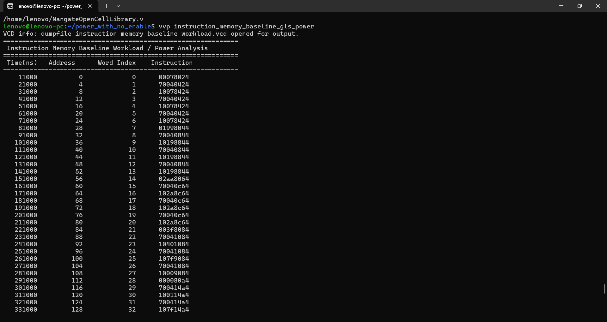

### Simulation — Part 2

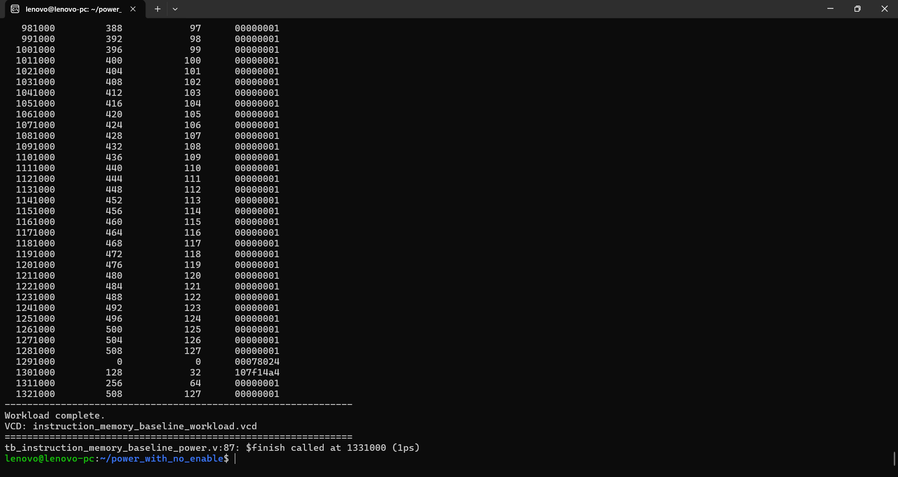

## REN / Enable Functional Simulation

### Simulation — Part 1

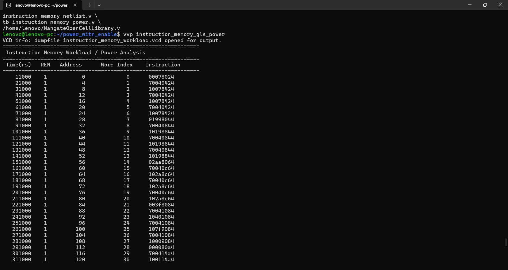

### Simulation — Part 2

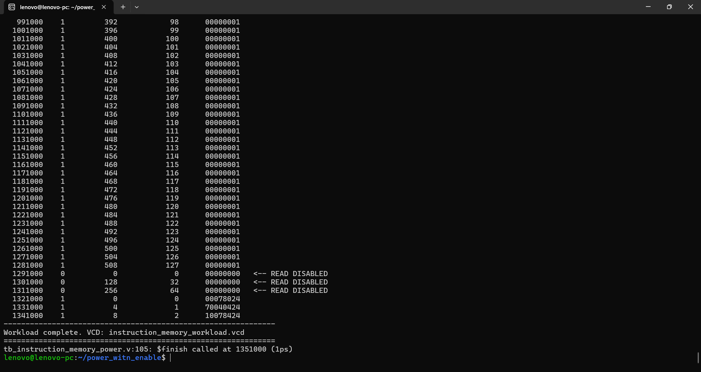

The REN simulation also demonstrates the disabled-read condition:

```text
REN = 0  →  data = 00000000
```

and normal instruction fetching after re-enabling:

```text
REN = 1  →  instruction data
```

---

# Area Analysis

## Baseline

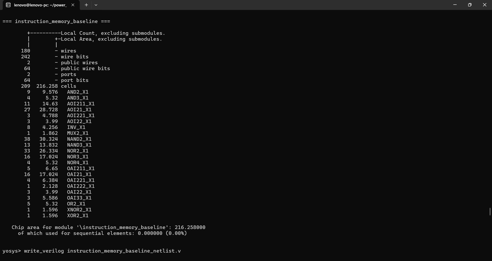

Baseline synthesized area:

```text
216.258 µm²
```

Sequential area:

```text
0 µm²
```

## REN / Enable

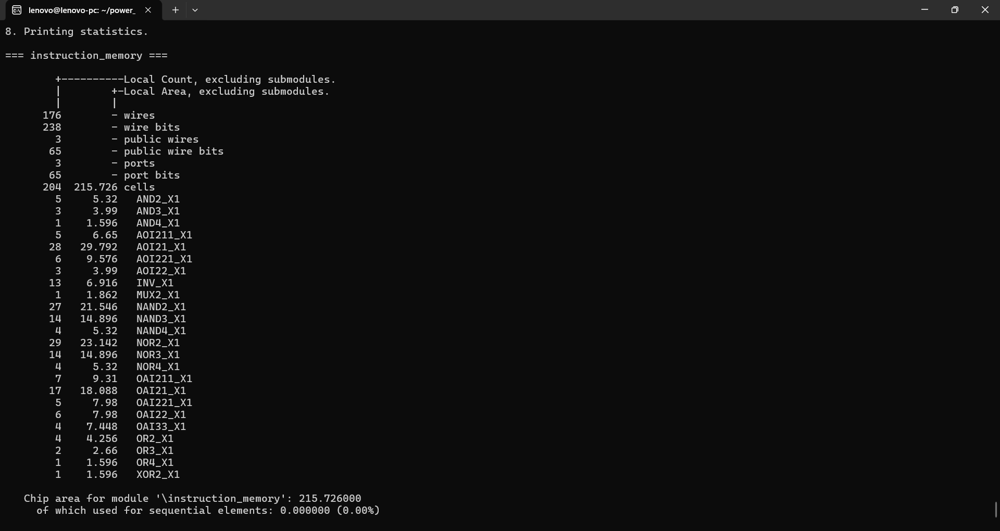

REN synthesized area:

```text
215.726 µm²
```

Sequential area:

```text
0 µm²
```

### Area Comparison

```text
Baseline : 216.258 µm²
REN      : 215.726 µm²
Change   : -0.532 µm²
          = -0.25%
```

The two implementations have almost identical area. The small reduction in the REN implementation is a synthesis result rather than evidence that adding an enable universally reduces hardware area.

Because the target library has **no dedicated memory macro for this read-only memory**, the synthesized design is a **combinational standard-cell implementation**. It therefore has **0 µm² sequential area and does not represent a flip-flop-based memory array**.

---

# Timing Analysis

## Baseline — Maximum Delay

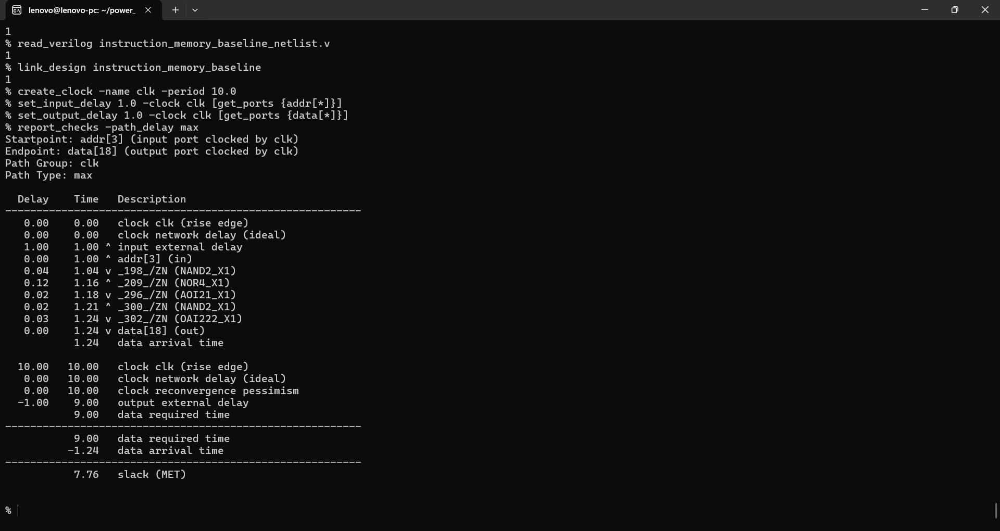

Worst observed data arrival time:

```text
1.24 ns
```

Setup slack at a 10 ns clock:

```text
7.76 ns
```

Status:

```text
MET
```

## Baseline — Minimum Delay

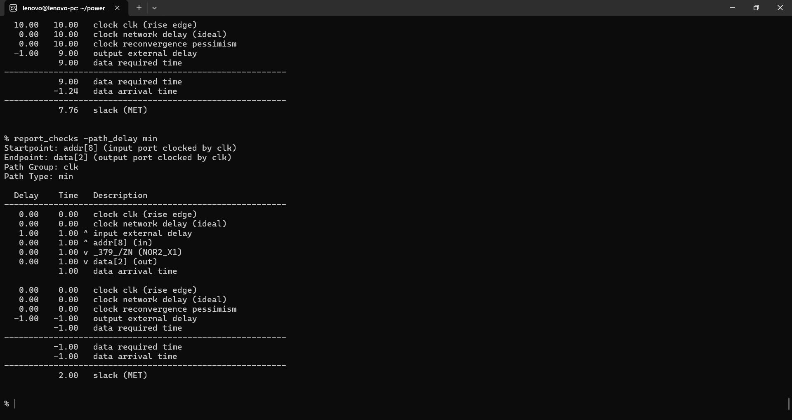

Minimum-delay slack:

```text
2.00 ns
```

Status:

```text
MET
```

---

## REN / Enable — Maximum Delay

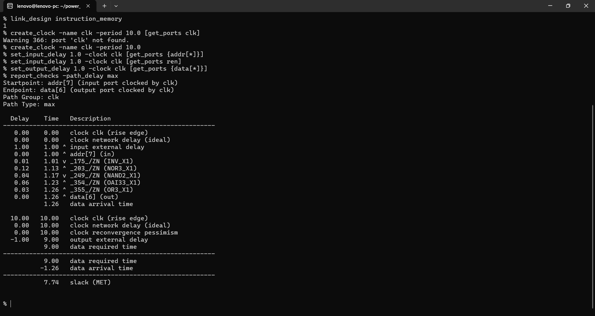

Worst observed data arrival time:

```text
1.26 ns
```

Setup slack:

```text
7.74 ns
```

Status:

```text
MET
```

## REN / Enable — Minimum Delay

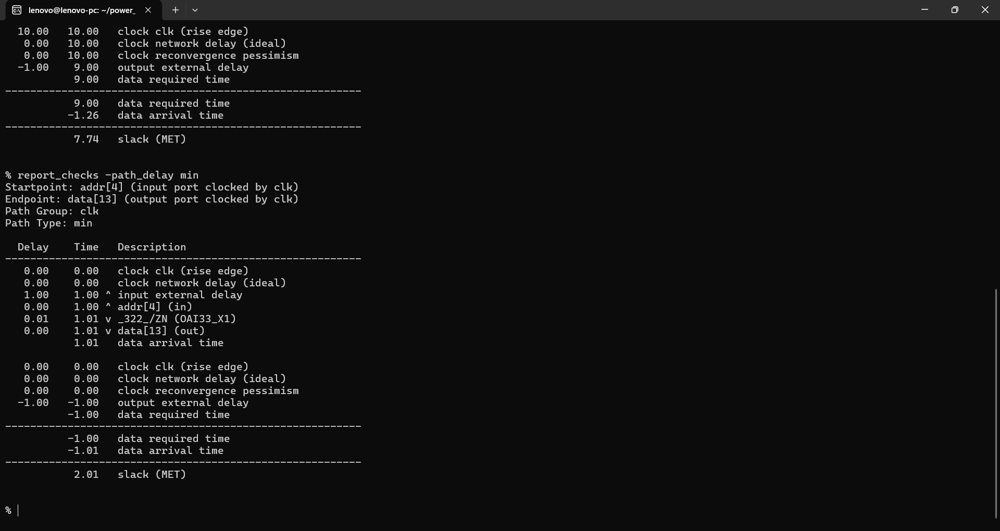

Minimum-delay slack:

```text
2.01 ns
```

Status:

```text
MET
```

### Timing Comparison

| Timing Metric | Baseline | REN / Enable |
|---|---:|---:|
| Worst delay | 1.24 ns | 1.26 ns |
| Setup slack @ 10 ns | 7.76 ns | 7.74 ns |
| Min slack | 2.00 ns | 2.01 ns |

The REN implementation introduces only **0.02 ns** additional worst-case delay, while the design still has substantial timing margin at 100 MHz.

---

# Power Analysis

The power analysis uses the same instruction-fetch workload for both versions.

## Baseline Power

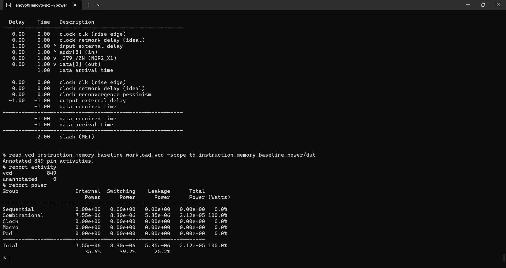

| Component | Power |
|---|---:|
| Internal | 7.55 µW |
| Switching | 8.30 µW |
| Leakage | 5.35 µW |
| **Total** | **21.20 µW** |

Activity annotation:

```text
Annotated pin activities : 849
Unannotated              : 0
```

---

## REN / Enable Power

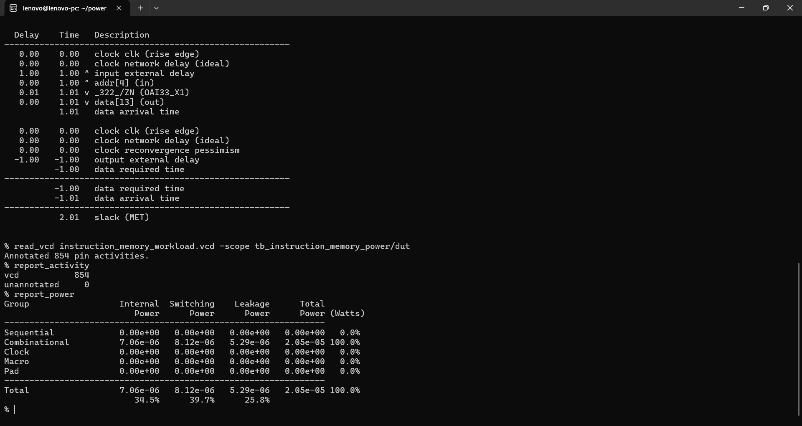

| Component | Power |
|---|---:|
| Internal | 7.06 µW |
| Switching | 8.12 µW |
| Leakage | 5.29 µW |
| **Total** | **20.50 µW** |

Activity annotation:

```text
Annotated pin activities : 854
Unannotated              : 0
```

### Power Comparison

| Component | Baseline | REN / Enable | Reduction |
|---|---:|---:|---:|
| Internal | 7.55 µW | 7.06 µW | **6.49%** |
| Switching | 8.30 µW | 8.12 µW | **2.17%** |
| Leakage | 5.35 µW | 5.29 µW | **1.12%** |
| **Total** | **21.20 µW** | **20.50 µW** | **3.30%** |

The largest improvement is in internal power, while switching power also decreases modestly.

The relatively small total reduction is expected because the workload contains a large amount of active instruction fetching. The benefit of REN becomes more valuable when instruction-memory access is inactive for meaningful periods.

---

# PPA Calculations

## Area × Power

Baseline:

```text
216.258 × 0.0212 = 4.5847 µm²·mW
```

REN:

```text
215.726 × 0.0205 = 4.4224 µm²·mW
```

Change:

```text
↓ 3.54%
```

## Area × Delay

Baseline:

```text
216.258 × 1.24 = 268.1599 µm²·ns
```

REN:

```text
215.726 × 1.26 = 271.8148 µm²·ns
```

Change:

```text
↑ 1.36%
```

The power-area product improves, while the area-delay product becomes slightly worse because of the small delay increase.

---

# Potential Commercial Applications

The REN approach is useful in designs where instruction fetching is not continuous.

### 1. Low-Power Embedded Processors

Instruction-memory read enables can suppress unnecessary activity during idle or low-utilization periods.

### 2. IoT and Edge Devices

Energy-sensitive processors can benefit from reducing switching in instruction-delivery logic.

### 3. Battery-Powered Systems

Reducing dynamic activity can help extend operating time when the processor spends significant time in inactive states.

### 4. Microcontrollers

A read-enable mechanism can be integrated with processor control logic to prevent unnecessary instruction-memory activity during sleep or wait states.

### 5. Low-Power FPGA/ASIC Processor Cores

The concept can be applied to custom processor designs where instruction-fetch activity can be explicitly controlled.

---

# Benefits

### Lower Power

The measured workload shows:

```text
Total power: 21.20 µW → 20.50 µW
Reduction: 3.30%
```

### Minimal Area Impact

The measured area changed by only:

```text
0.25%
```

### Small Timing Cost

Worst delay changed from:

```text
1.24 ns → 1.26 ns
```

while still meeting the 10 ns timing target.

### Explicit Read Control

The processor gains a direct mechanism to indicate when instruction-memory reads are active.

### Simple RTL-Level Optimization

The technique does not require a dedicated power-management IP block or SRAM macro.

---

# Disadvantages

### Limited Power Reduction Under Continuous Fetching

When the processor continuously fetches instructions, REN remains asserted most of the time. Therefore, the opportunity for power reduction is limited.

### Additional Control Logic

The enable mechanism introduces additional logic and control routing.

### Timing Overhead

The measured worst delay increased slightly from 1.24 ns to 1.26 ns.

### Workload Dependence

Power savings depend strongly on how frequently instruction-memory reads are disabled.

### Memory Macro / Technology Limitation

The target NangateOpenCellLibrary does **not contain a dedicated memory/ROM macro for this read-only Instruction Memory**. As a result, synthesis maps the memory contents and address-decoding/read logic into **combinational standard cells**, rather than mapping the memory to flip-flops or a dedicated memory array.

Therefore:

- Sequential area is **0 µm²**.
- The memory is implemented as a **combinational circuit** in this experiment.
- The reported PPA reflects the synthesized standard-cell implementation.
- These numbers should **not** be interpreted as representative PPA for a production ROM/SRAM macro.
- A real ASIC implementation would normally evaluate the appropriate foundry memory/ROM macro separately.

---

# When Does This Optimization Make Sense?

REN is most useful when:

- instruction-memory accesses are frequently disabled,
- the processor has idle/wait/sleep periods,
- instruction-fetch activity is bursty,
- power is more important than a small timing penalty,
- the memory interface already provides a read-enable signal.

It is less attractive when the processor performs continuous instruction fetching because the enable remains active most of the time.

---

# Tools Used

| Tool | Purpose |
|---|---|
| **Verilog** | RTL implementation |
| **Icarus Verilog** | RTL and gate-level simulation |
| **GTKWave** | Waveform inspection |
| **Yosys** | Logic synthesis |
| **NangateOpenCellLibrary 45 nm** | Standard-cell technology |
| **OpenSTA** | Static timing analysis |
| **OpenSTA Power** | Activity-based power estimation |

---

# Reproducibility

## 1. RTL Simulation

Baseline:

```bash
iverilog -g2012 -o instruction_memory_baseline_sim \
instruction_memory_baseline.v \
tb_instruction_memory_baseline_power.v \
/home/lenovo/NangateOpenCellLibrary.v

vvp instruction_memory_baseline_sim
```

REN / Enable:

```bash
iverilog -g2012 -o instruction_memory_gls_power \
instruction_memory_netlist.v \
tb_instruction_memory_power.v \
/home/lenovo/NangateOpenCellLibrary.v

vvp instruction_memory_gls_power
```

---

## 2. Gate-Level Simulation

Baseline:

```bash
iverilog -g2012 -o instruction_memory_baseline_gls_power \
instruction_memory_baseline_netlist.v \
tb_instruction_memory_baseline_power.v \
/home/lenovo/NangateOpenCellLibrary.v
```

```bash
vvp instruction_memory_baseline_gls_power
```

REN / Enable:

```bash
iverilog -g2012 -o instruction_memory_gls_power \
instruction_memory_netlist.v \
tb_instruction_memory_power.v \
/home/lenovo/NangateOpenCellLibrary.v
```

```bash
vvp instruction_memory_gls_power
```

---

## 3. OpenSTA — Baseline

```tcl
read_liberty /home/lenovo/NangateOpenCellLibrary_typical.lib
read_verilog instruction_memory_baseline_netlist.v
link_design instruction_memory_baseline

create_clock -name clk -period 10.0

set_input_delay 1.0 -clock clk [get_ports {addr[*]}]
set_output_delay 1.0 -clock clk [get_ports {data[*]}]

report_design_area
report_checks -path_delay max
report_checks -path_delay min

read_vcd instruction_memory_baseline_workload.vcd \
    -scope tb_instruction_memory_baseline_power/dut

report_activity
report_power
```

---

## 4. OpenSTA — REN / Enable

```tcl
read_liberty /home/lenovo/NangateOpenCellLibrary_typical.lib
read_verilog instruction_memory_netlist.v
link_design instruction_memory

create_clock -name clk -period 10.0

set_input_delay 1.0 -clock clk [get_ports {addr[*]}]
set_input_delay 1.0 -clock clk [get_ports ren]
set_output_delay 1.0 -clock clk [get_ports {data[*]}]

report_design_area
report_checks -path_delay max
report_checks -path_delay min

read_vcd instruction_memory_workload.vcd \
    -scope tb_instruction_memory_power/dut

report_activity
report_power
```

---

# Repository Contents

```text
Instruction_Memory_PPA_Analysis/
│
├── README.md
│
└── results/
    │
    ├── baseline/
    │   ├── 01_synthesis_area.png
    │   ├── 02_functional_simulation_part1.png
    │   ├── 03_functional_simulation_part2.png
    │   ├── 04_sta_max.png
    │   ├── 05_sta_min.png
    │   └── 06_power.png
    │
    └── ren_enable/
        ├── 01_synthesis_area.png
        ├── 02_functional_simulation_part1.png
        ├── 03_functional_simulation_part2.png
        ├── 04_sta_max.png
        ├── 05_sta_min.png
        └── 06_power.png
```

---

# Final Assessment

The Instruction Memory experiment demonstrates a practical read-enable based power optimization.

Under the measured instruction-fetch workload:

- **Total power decreased by 3.30%**
- **Internal power decreased by 6.49%**
- **Area changed by only 0.25%**
- **Worst delay increased by 0.02 ns**
- **Setup timing remained MET with 7.74 ns slack at 100 MHz**
- **Minimum timing remained MET with 2.01 ns slack**

The result is therefore a **small but measurable power improvement with negligible area impact and a very small timing penalty**.

The optimization is most compelling when the processor has meaningful periods where instruction-memory reads can be disabled. For continuous instruction fetching, the measured benefit is naturally smaller.

> **Design conclusion:** REN provides a low-complexity mechanism for reducing unnecessary instruction-memory activity, but its effectiveness is workload-dependent. In this experiment, the read-only memory is synthesized entirely from combinational standard cells because the Nangate library provides no dedicated memory/ROM macro for it; it is therefore not a flip-flop-based memory implementation. In a production ASIC, the final benefit should be re-evaluated using the actual ROM/memory macro available in the target technology, together with realistic processor activity traces.
