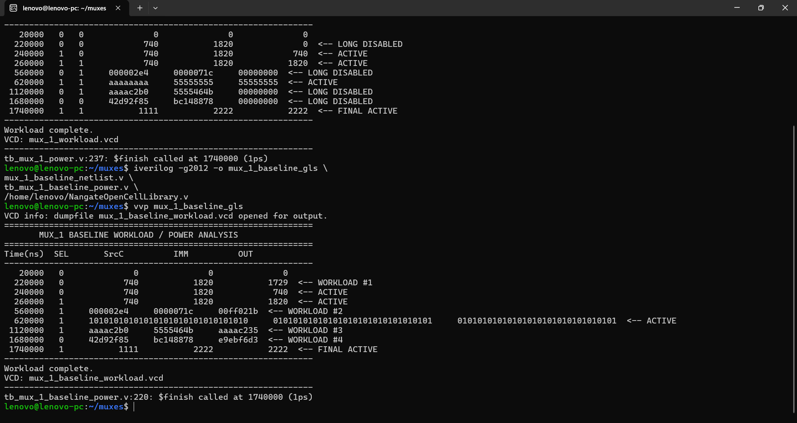
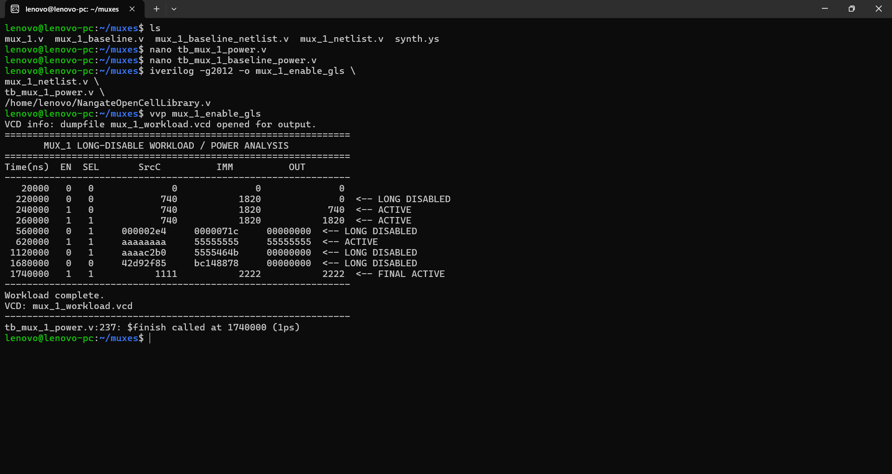
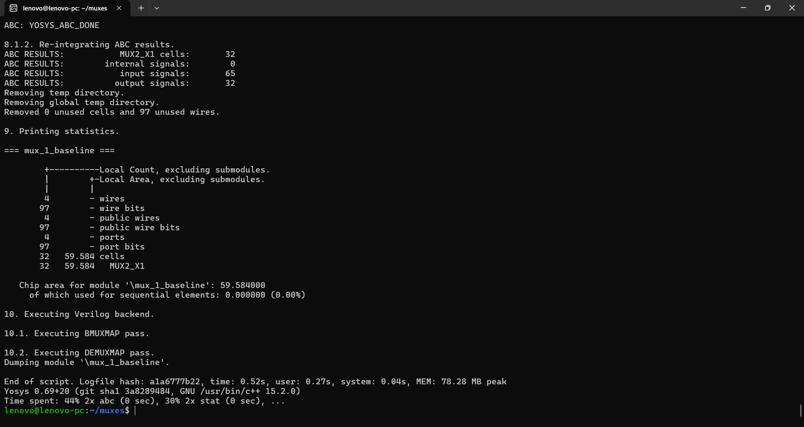
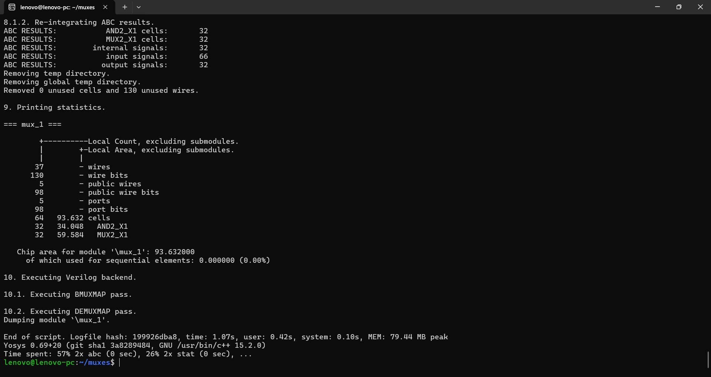
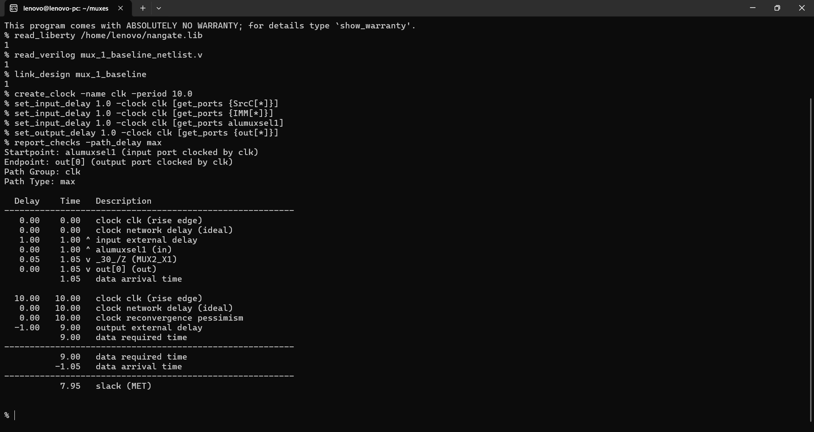
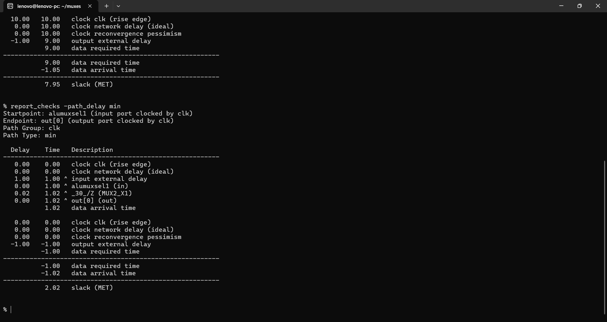
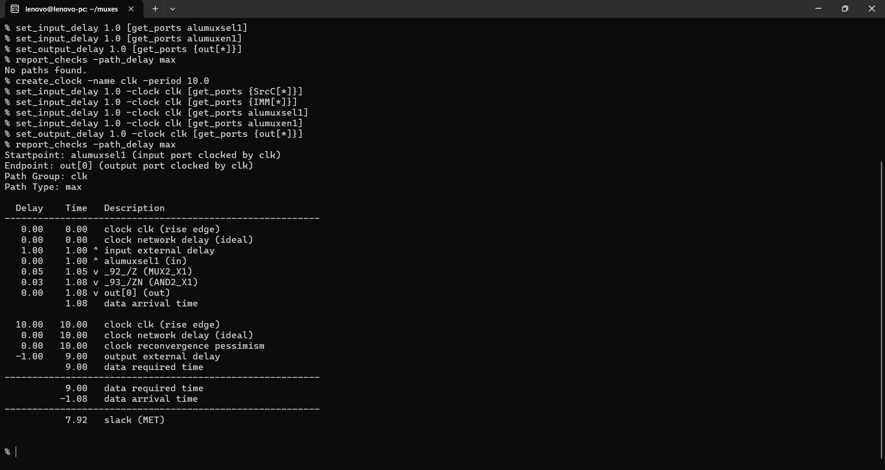
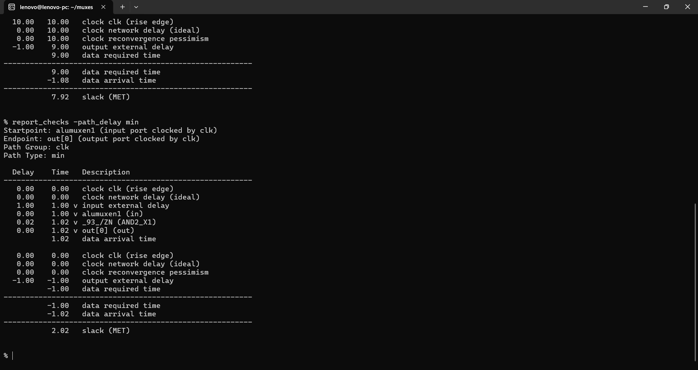
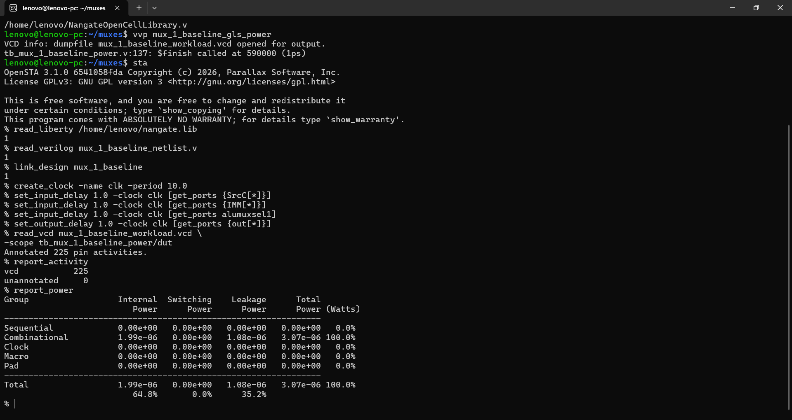
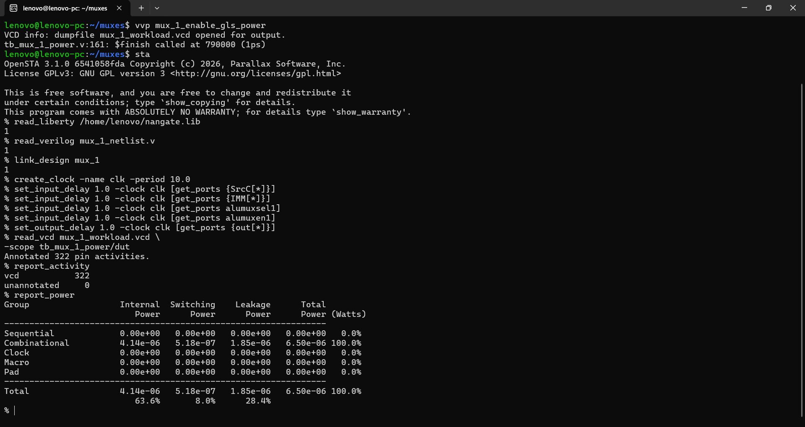

# 32-bit MUX_1 — PPA Analysis & Power-Aware Isolation

[](https://en.wikipedia.org/wiki/Verilog)
[](#)
[](#)
[](#)
[](#)

A 32-bit combinational MUX was evaluated in two implementations:

1. **Baseline MUX** — conventional 2:1 selection between `SrcC` and `IMM`.
2. **Enable-isolated MUX** — adds `alumuxen1` so the output is forced to zero when the MUX is disabled.

The purpose of this experiment is to characterize the **area, timing, and activity-based power trade-off** introduced by adding an enable/isolation mechanism to a small datapath MUX.

> **Important power-analysis limitation:** OpenSTA reported `0 W` switching power for the baseline implementation even though the VCD contained annotated activity (`225` annotated pins, `0` unannotated). Therefore, the baseline switching-power value should **not** be interpreted as physically zero dynamic switching. The standalone baseline MUX has very limited modeled internal/loading capacitance because its MUX outputs directly drive top-level outputs. The enable implementation introduces additional internal logic and loaded nets, producing measurable switching power. Consequently, the baseline-vs-enable switching-power and total-power comparison is **indicative, not fully conclusive**, for this isolated standalone MUX experiment.

---

## 1. Headline Results

| Metric | Baseline | Enable / Isolation | Change |
|---|---:|---:|---:|
| **Area** | **59.584 µm²** | **93.632 µm²** | **+57.14%** |
| Standard cells | 32 MUX2_X1 | 32 MUX2_X1 + 32 AND2_X1 | +32 cells |
| Sequential area | 0 µm² | 0 µm² | — |
| Worst delay | **1.05 ns** | **1.08 ns** | +2.86% |
| Setup slack @ 10 ns | **7.95 ns** | **7.92 ns** | −0.03 ns |
| Min delay | 1.02 ns | 1.02 ns | ~0% |
| Min slack | 2.02 ns | 2.02 ns | ~0% |
| Internal power | **1.99 µW** | **4.14 µW** | +108.0% |
| Switching power | **0 µW*** | **0.518 µW** | Not comparable* |
| Leakage power | **1.08 µW** | **1.85 µW** | +71.3% |
| **Total power** | **3.07 µW*** | **6.50 µW** | **+111.7%*** |

\* The baseline switching-power result is a limitation of this OpenSTA/library/load configuration and should not be treated as a trustworthy physical zero. Percentage comparison against zero is therefore intentionally not reported.

### Overall result

The enable/isolation implementation adds substantial hardware overhead for this very small standalone MUX:

- **57.14% area increase**
- **2.86% increase in worst delay**
- Timing still comfortably meets the **10 ns / 100 MHz** target.
- Internal and leakage power are higher in this experiment.
- The enable version produces measurable switching power because it creates additional internal loaded logic.
- The experiment demonstrates the **trade-off of adding isolation logic**, but the standalone MUX power comparison should not be used as a definitive proof of power savings or degradation.

---

# 2. MUX Functionality

## Baseline

The baseline MUX selects between `SrcC` and `IMM`:

```verilog
assign out = alumuxsel1 ? IMM : SrcC;
```

Functional behavior:

| `alumuxsel1` | Output |
|---:|---|
| 0 | `SrcC` |
| 1 | `IMM` |

## Enable / Isolation Version

The enable version adds an isolation control:

```text
alumuxen1 = 0  →  out = 0
alumuxen1 = 1  →  normal MUX operation
```

Conceptually:

```text
                 ┌──────────────┐
SrcC ───────────►│              │
IMM ────────────►│   2:1 MUX    │───► internal MUX result
SEL ────────────►│              │
                 └──────────────┘
                         │
                         ▼
                    isolation
                         │
                  alumuxen1 = 0
                         │
                         ▼
                       OUT=0
```

The enable implementation is intended to prevent unnecessary downstream activity when this datapath MUX is inactive.

---

# 3. Power-Aware Workload

The same `SrcC`, `IMM`, and `alumuxsel1` workload was used for the baseline and enable versions.

The enable version additionally exercised:

- Active periods with `alumuxen1 = 1`
- Long disabled periods with `alumuxen1 = 0`
- Input activity continuing while disabled
- Reactivation after disabled periods

This was done to test whether isolation can prevent unnecessary output/internal activity while inputs continue to change.

### Workload concept

```text
             Baseline       Enable version
             --------       --------------
SrcC            ↓                ↓
IMM             ↓                ↓
SEL             ↓                ↓
             MUX active       EN=1 → active
                              EN=0 → isolated
```

The 100 MHz clock in the testbench provides a common timing reference for the PPA experiment. The MUX itself remains a combinational block.

---

# 4. Functional Verification

## Baseline Simulation



The simulation demonstrates correct selection of `SrcC` and `IMM` for the applied workload.

## Enable / Isolation Simulation



The enable implementation demonstrates:

- `alumuxen1 = 0` → output isolated to zero
- `alumuxen1 = 1` → normal MUX operation
- Input changes during disabled periods
- Correct output after re-enabling

---

# 5. Synthesis / Area Analysis

## Baseline



Yosys mapped the 32-bit baseline MUX to:

```text
32 × MUX2_X1
```

Total area:

```text
59.584 µm²
```

Sequential area:

```text
0 µm²
```

## Enable / Isolation Version



The enable version mapped to:

```text
32 × MUX2_X1
32 × AND2_X1
```

Total:

```text
64 cells
```

Total area:

```text
93.632 µm²
```

### Area overhead

\[
\frac{93.632-59.584}{59.584}\times100
=57.14\%
\]

The area increase is expected because the isolation mechanism introduces an additional 32-bit logic stage.

---

# 6. Timing Analysis

Timing was evaluated using OpenSTA with:

```text
Clock period = 10 ns
Frequency    = 100 MHz
Input delay  = 1 ns
Output delay = 1 ns
```

## Baseline — Maximum Delay



Worst-case data arrival:

```text
1.05 ns
```

Setup slack:

```text
7.95 ns
```

Status:

```text
MET
```

## Baseline — Minimum Delay



Minimum-path result:

```text
Data arrival = 1.02 ns
Slack        = 2.02 ns
```

Status:

```text
MET
```

## Enable — Maximum Delay



Worst-case data arrival:

```text
1.08 ns
```

Setup slack:

```text
7.92 ns
```

Status:

```text
MET
```

## Enable — Minimum Delay



Minimum-path result:

```text
Data arrival = 1.02 ns
Slack        = 2.02 ns
```

Status:

```text
MET
```

### Timing comparison

The enable logic adds only:

```text
1.08 - 1.05 = 0.03 ns
```

of worst-case delay.

Both implementations comfortably meet the 10 ns target.

---

# 7. Activity-Based Power Analysis

Power was calculated in OpenSTA after annotating switching activity from gate-level VCD simulation.

## Baseline Power



OpenSTA reported:

| Component | Power |
|---|---:|
| Internal | **1.99 µW** |
| Switching | **0.00 µW** |
| Leakage | **1.08 µW** |
| **Total** | **3.07 µW** |

VCD annotation:

```text
Annotated pins   = 225
Unannotated pins = 0
```

### Baseline switching-power limitation

The `0 W` switching-power result is **not evidence that the baseline MUX has no switching activity**.

The functional gate-level simulation clearly shows changing inputs and output values. The issue is the power-model/load configuration of this standalone synthesized block: the baseline MUX outputs directly drive top-level ports, leaving little or no modeled internal net capacitance for OpenSTA's net switching-power calculation.

Therefore:

> **Baseline switching power = 0 W should be treated as a tool/model limitation, not a physical zero.**

---

## Enable / Isolation Power



OpenSTA reported:

| Component | Power |
|---|---:|
| Internal | **4.14 µW** |
| Switching | **0.518 µW** |
| Leakage | **1.85 µW** |
| **Total** | **6.50 µW** |

VCD annotation:

```text
Annotated pins   = 322
Unannotated pins = 0
```

The enable implementation has additional internal logic, so OpenSTA can model switching on internal loaded nets.

---

# 8. Power Comparison and Interpretation

The raw OpenSTA results are:

```text
Baseline total  = 3.07 µW*
Enable total    = 6.50 µW
```

However, this should **not** be presented as a definitive statement that the enable architecture consumes 111.7% more physical power.

The reason is that the baseline has:

```text
Switching power = 0 W
```

while the enable implementation has:

```text
Switching power = 0.518 µW
```

The two values are not directly comparable because the baseline's zero switching component is affected by the standalone output/load modeling.

### What the experiment does establish

The experiment demonstrates that:

1. Isolation adds hardware.
2. The additional logic increases internal and leakage power for this small standalone block.
3. The enable version creates measurable internal switching power.
4. The benefit of isolation depends strongly on **where the MUX is placed in the processor datapath and what downstream capacitance/activity it prevents**.
5. A standalone 32-bit MUX is too small and too lightly loaded for this experiment to provide a fully reliable absolute power comparison.

---

# 9. PPA Summary

| PPA Metric | Baseline | Enable | Observation |
|---|---:|---:|---|
| Area | 59.584 µm² | 93.632 µm² | Enable adds 57.14% area |
| Worst delay | 1.05 ns | 1.08 ns | Small 0.03 ns increase |
| Setup slack | 7.95 ns | 7.92 ns | Both comfortably MET |
| Min slack | 2.02 ns | 2.02 ns | No meaningful change |
| Internal power | 1.99 µW | 4.14 µW | Higher with isolation |
| Switching power | 0 µW* | 0.518 µW | Baseline result not reliable |
| Leakage | 1.08 µW | 1.85 µW | Higher with extra cells |
| Total power | 3.07 µW* | 6.50 µW | Indicative only |

---

# 10. Advantages of Enable-Based Isolation

### 1. Output isolation

When the MUX is inactive:

```text
alumuxen1 = 0
```

the output is forced to zero.

### 2. Activity suppression

The mechanism can prevent unnecessary activity from propagating into downstream datapath logic.

### 3. Useful in larger datapaths

The technique becomes more valuable when the MUX drives:

- Large ALUs
- Wide operand-routing networks
- Address-generation logic
- Large register-file paths
- Multiple downstream combinational stages

### 4. Simple RTL implementation

The isolation mechanism requires relatively small additional control logic.

---

# 11. Disadvantages / Trade-offs

### 1. Area overhead

The 32-bit isolation implementation adds 32 AND gates in this synthesized implementation.

### 2. Additional delay

The extra logic increases the worst-case path from:

```text
1.05 ns → 1.08 ns
```

### 3. Leakage overhead

Additional standard cells increase leakage power.

### 4. Standalone MUX power benefit is unclear

Because the baseline output has insufficient modeled load for a meaningful switching-power calculation, this isolated experiment cannot conclusively demonstrate power savings.

### 5. Benefit depends on downstream load

Isolation is most useful when it prevents switching in **larger downstream logic**, not necessarily when applied to a tiny standalone MUX.

---

# 12. When Does This Optimization Make Sense?

Enable/isolation logic is most useful when:

- The datapath block is frequently idle.
- Its inputs continue switching while it is inactive.
- Its output drives significant downstream capacitance.
- The downstream logic is power-sensitive.
- The control signal can reliably identify inactive periods.

For a tiny standalone MUX with almost no output load, the additional isolation hardware can easily cost more power and area than it saves.

Therefore, the more meaningful experiment is to evaluate the MUX **inside the complete processor datapath**, where its output drives the next stage.

---

# 13. Commercial / Practical Applications

Enable-based datapath isolation is relevant to:

- Low-power CPU datapaths
- Embedded processors
- DSP datapaths
- AI accelerators
- Register-file operand routing
- Address-generation units
- Pipeline operand selection
- Mobile and battery-powered SoCs
- Clock/power-aware digital systems

In a complete processor, the goal is not merely to reduce power inside the MUX itself. The goal is to prevent unnecessary switching from propagating into larger downstream blocks.

---

# 14. Tools Used

| Tool | Purpose |
|---|---|
| **Verilog** | RTL design |
| **Icarus Verilog** | RTL/gate-level simulation |
| **GTKWave** | Waveform inspection |
| **Yosys** | Logic synthesis |
| **OpenSTA** | Timing and power analysis |
| **Nangate Open Cell Library** | 45 nm standard-cell technology |

---

# 15. Reproducibility

## Gate-Level Simulation

### Baseline

```bash
iverilog -g2012 -o mux_1_baseline_gls_power \
mux_1_baseline_netlist.v \
tb_mux_1_baseline_power.v \
/home/lenovo/NangateOpenCellLibrary.v

vvp mux_1_baseline_gls_power
```

### Enable

```bash
iverilog -g2012 -o mux_1_enable_gls_power \
mux_1_netlist.v \
tb_mux_1_power.v \
/home/lenovo/NangateOpenCellLibrary.v

vvp mux_1_enable_gls_power
```

## OpenSTA Power Analysis

### Baseline

```tcl
read_liberty /home/lenovo/nangate.lib
read_verilog mux_1_baseline_netlist.v
link_design mux_1_baseline

create_clock -name clk -period 10.0

set_input_delay 1.0 -clock clk [get_ports {SrcC[*]}]
set_input_delay 1.0 -clock clk [get_ports {IMM[*]}]
set_input_delay 1.0 -clock clk [get_ports alumuxsel1]
set_output_delay 1.0 -clock clk [get_ports {out[*]}]

read_vcd mux_1_baseline_workload.vcd \
-scope tb_mux_1_baseline_power/dut

report_activity
report_power
```

### Enable

```tcl
read_liberty /home/lenovo/nangate.lib
read_verilog mux_1_netlist.v
link_design mux_1

create_clock -name clk -period 10.0

set_input_delay 1.0 -clock clk [get_ports {SrcC[*]}]
set_input_delay 1.0 -clock clk [get_ports {IMM[*]}]
set_input_delay 1.0 -clock clk [get_ports alumuxsel1]
set_input_delay 1.0 -clock clk [get_ports alumuxen1]
set_output_delay 1.0 -clock clk [get_ports {out[*]}]

read_vcd mux_1_workload.vcd \
-scope tb_mux_1_power/dut

report_activity
report_power
```

---

# 16. Repository Contents

```text
MUX_1_PPA_Analysis/
│
├── README.md
├── mux_1.v
├── mux_1_baseline.v
│
└── results/
    │
    ├── baseline/
    │   ├── 01_functional_simulation.png
    │   ├── 02_synthesis_area.png
    │   ├── 03_sta_max.png
    │   ├── 04_sta_min.png
    │   └── 05_power.png
    │
    └── enable/
        ├── 01_functional_simulation.png
        ├── 02_synthesis_area.png
        ├── 03_sta_max.png
        ├── 04_sta_min.png
        └── 05_power.png
```

---

# 17. Final Assessment

The MUX experiment demonstrates a clear **PPA trade-off**.

The enable/isolation implementation increases area from **59.584 µm² to 93.632 µm²** and increases worst-case delay from **1.05 ns to 1.08 ns**, while both versions comfortably meet the 100 MHz timing target.

The power results show higher internal and leakage power for the isolated standalone MUX. However, the baseline OpenSTA switching-power result of `0 W` is a **modeling/load limitation**, not evidence of zero physical switching. Therefore, the power comparison should be treated as **indicative rather than conclusive**.

The main engineering conclusion is:

> **Isolation logic should be evaluated in the context of the larger datapath it protects. For a tiny standalone MUX, the added isolation hardware can dominate the PPA cost. In a larger processor datapath, however, preventing switching from propagating into high-capacitance downstream logic can make the technique worthwhile.**

This experiment therefore provides a useful characterization of the **cost of adding enable-based isolation**, while clearly documenting the limitation of the standalone power model.
