# Main Decoder — PPA Analysis


## Overview

This project characterizes the **main decoder** of the custom 32-bit processor using synthesis, gate-level simulation, static timing analysis, and VCD-based power analysis.

The decoder translates the processor's `opcode` and `func` fields into the control signals required by the datapath, memory interface, immediate-generation logic, branch control, jump control, ALU, result selection, and register-file interface.

The implementation was synthesized using the **NangateOpenCellLibrary 45 nm standard-cell library**.

> **Design decision — no decoder enable/isolation:**  
> No enable-based power gating or output isolation was added to the main decoder. The decoder is required to decode every instruction executed by the processor and therefore remains continuously relevant to the processor control path. Adding a global decoder enable would not provide a useful architectural power-saving opportunity in this design. The decoder is therefore characterized in its normal always-active configuration.

---

# Headline Results

| Metric | Baseline Decoder | Main Decoder | Change |
|---|---:|---:|---:|
| **Cell Count** | 47 | 60 | **+27.66%** |
| **Area** | 46.018 µm² | 60.382 µm² | **+31.21%** |
| **Worst Delay** | 1.21 ns | 1.26 ns | **+4.13%** |
| **Setup Slack @ 10 ns** | 7.79 ns | 7.74 ns | **−0.05 ns** |
| **Min Delay Slack** | 2.00 ns | 2.00 ns | **0%** |
| **Internal Power** | 1.33 µW | 1.92 µW | **+44.36%** |
| **Switching Power** | 1.03 µW | 1.48 µW | **+43.69%** |
| **Leakage Power** | 1.13 µW | 1.54 µW | **+36.28%** |
| **Total Power** | **3.49 µW** | **4.93 µW** | **+41.26%** |
| **VCD Annotated Pins** | 199 | 258 | — |
| **VCD Unannotated Pins** | 0 | 0 | — |

All timing checks shown in the analysis **MET** the 10 ns reference-clock constraint.

---

# Decoder Functionality

The main decoder supports the processor's instruction/control classes including:

- R4 TYPE
- R3 TYPE
- R3I TYPE
- R4 MOVE TYPE
- R2 TYPE
- R2 MOV TYPE
- I TYPE
- LOAD WORD
- STORE WORD
- Branch instructions
- JALR
- JAL
- Invalid/default decoding

The branch decoder supports the defined branch functions:

- BEQ
- BNEQ
- BGT
- BLT
- BGST
- BLST
- BLTZ
- BGTZ
- BGEZ
- BLEZ
- BEQZ
- BNEZ

The gate-level power workload exercises all supported opcode classes, all 12 branch functions, invalid branch functions, invalid opcodes, and a repeated mixed workload.

---

# Why the Main Decoder Is Larger

The increase in area and power is an expected consequence of the **expanded decoder functionality**.

The baseline decoder synthesizes to:

- **47 cells**
- **46.018 µm²**

The main decoder synthesizes to:

- **60 cells**
- **60.382 µm²**

The main decoder exposes additional control signals and therefore requires additional decode logic.

Consequently, the comparison should not be interpreted as an unsuccessful power optimization. It is primarily a characterization of the **PPA penalty associated with adding more processor control functionality**.

The resulting timing is still comfortably within the target:

> **1.26 ns worst delay vs. 10 ns clock period**

which leaves **7.74 ns of setup slack**.

---

# Power Analysis

## Baseline

The baseline decoder reports:

- Internal power: **1.33 µW**
- Switching power: **1.03 µW**
- Leakage power: **1.13 µW**
- **Total power: 3.49 µW**

Power contribution:

- Internal: **38.1%**
- Switching: **29.5%**
- Leakage: **32.4%**

VCD activity:

- Annotated pins: **199**
- Unannotated pins: **0**

## Main Decoder

The main decoder reports:

- Internal power: **1.92 µW**
- Switching power: **1.48 µW**
- Leakage power: **1.54 µW**
- **Total power: 4.93 µW**

Power contribution:

- Internal: **38.9%**
- Switching: **29.9%**
- Leakage: **31.2%**

VCD activity:

- Annotated pins: **258**
- Unannotated pins: **0**

The increased power is consistent with the larger synthesized implementation and the additional decoder functionality.

---

# Timing Analysis

A **10 ns clock period** was used for the STA characterization, corresponding to a 100 MHz reference target.

### Baseline

- Worst delay: **1.21 ns**
- Setup slack: **7.79 ns**
- Minimum-delay slack: **2.00 ns**
- Timing status: **MET**

### Main Decoder

- Worst delay: **1.26 ns**
- Setup slack: **7.74 ns**
- Minimum-delay slack: **2.00 ns**
- Timing status: **MET**

The additional decoder logic increases the worst delay by only **0.05 ns**, while timing remains comfortably within the 100 MHz target.

---

# Gate-Level Verification

The decoder was verified at gate level using **Icarus Verilog** and the synthesized Nangate 45 nm standard-cell netlist.

The power-analysis testbench also prints the decoded control outputs for each workload transaction.

Example workload coverage includes:

```text
OPCODE = 00001  -> R4
OPCODE = 00010  -> R3
OPCODE = 00011  -> R3I
OPCODE = 00100  -> I TYPE
OPCODE = 00101  -> STORE
OPCODE = 00110  -> BRANCH
OPCODE = 00111  -> LOAD
OPCODE = 01000  -> R4 MOVE
OPCODE = 01010  -> R2 MOV
OPCODE = 01011  -> R2
OPCODE = 01111  -> JALR
OPCODE = 11110  -> JAL
```

The VCD generated during this gate-level workload is subsequently used for activity-based OpenSTA power estimation.

---

# Synthesis Results

## Baseline

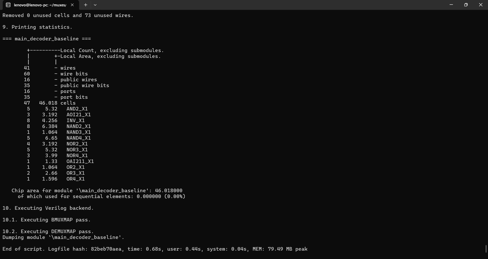

**Area: 46.018 µm²**

- Cells: 47
- Sequential area: 0 µm²
- Sequential logic: 0%

## Main Decoder

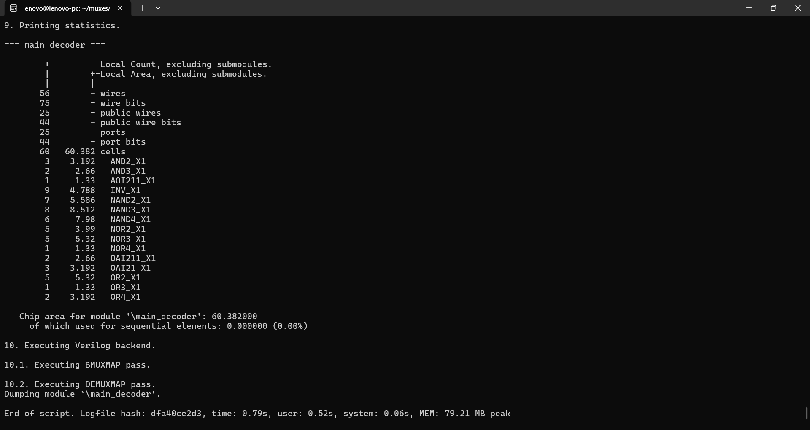

**Area: 60.382 µm²**

- Cells: 60
- Sequential area: 0 µm²
- Sequential logic: 0%

The decoder is purely combinational.

---

# Functional / Gate-Level Simulation

## Baseline

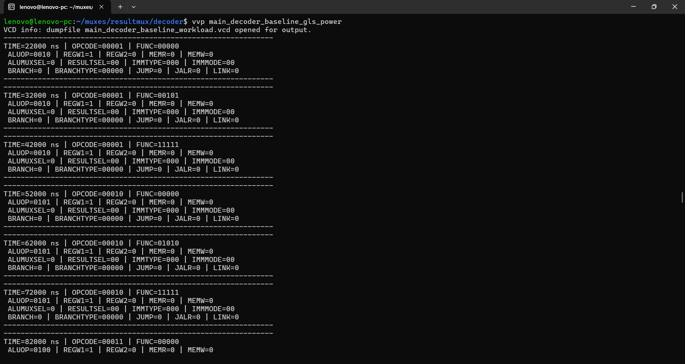

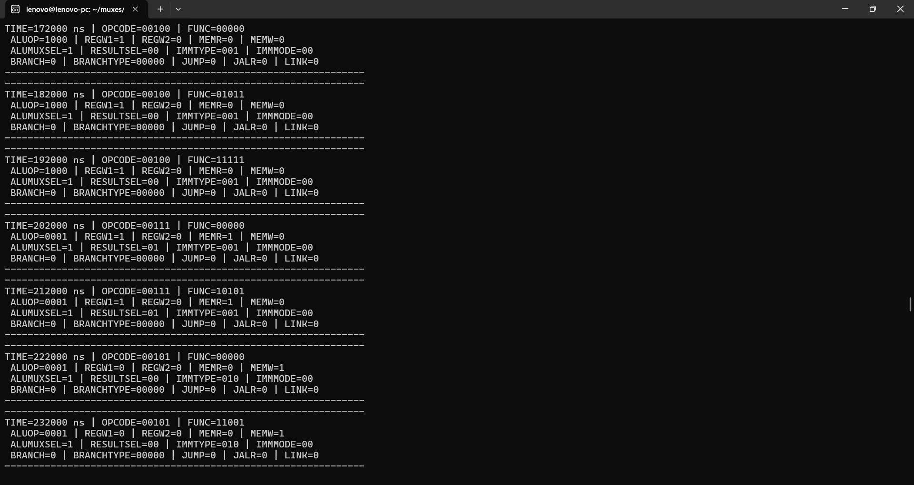

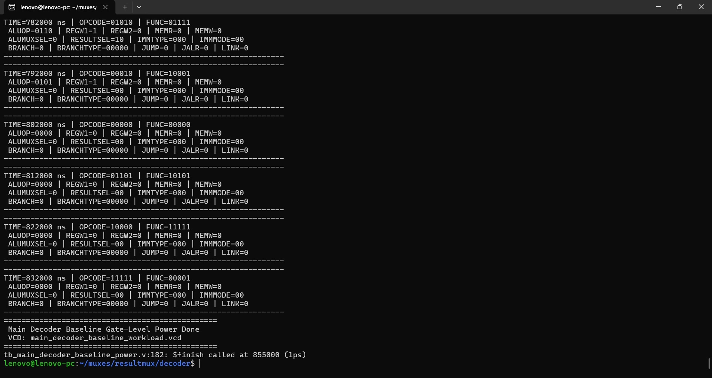

## Main Decoder

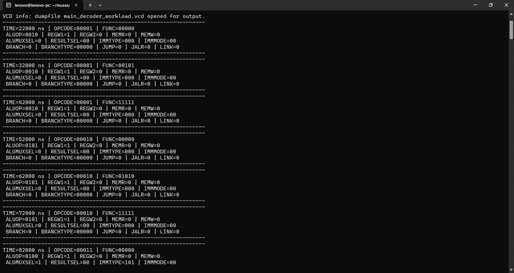

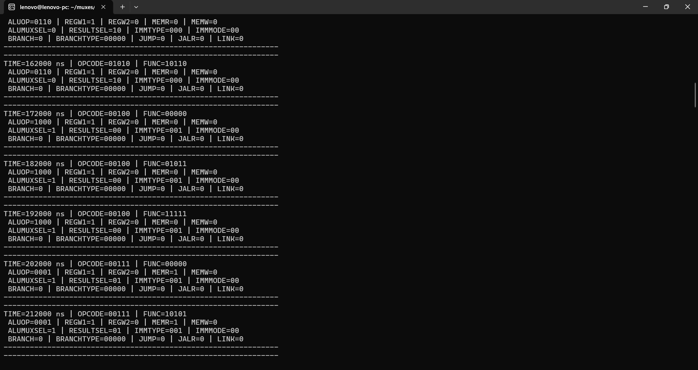

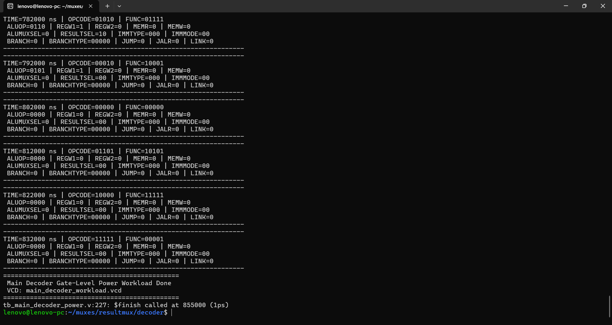

---

# Static Timing Analysis

## Baseline

### Maximum Delay

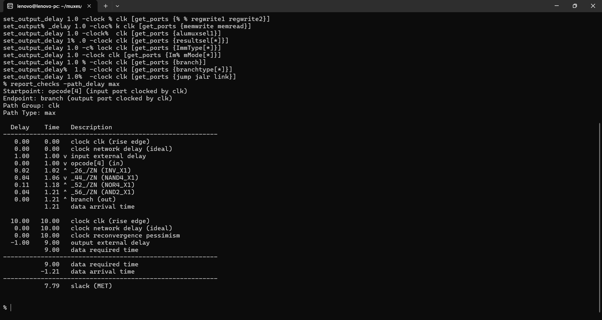

### Minimum Delay

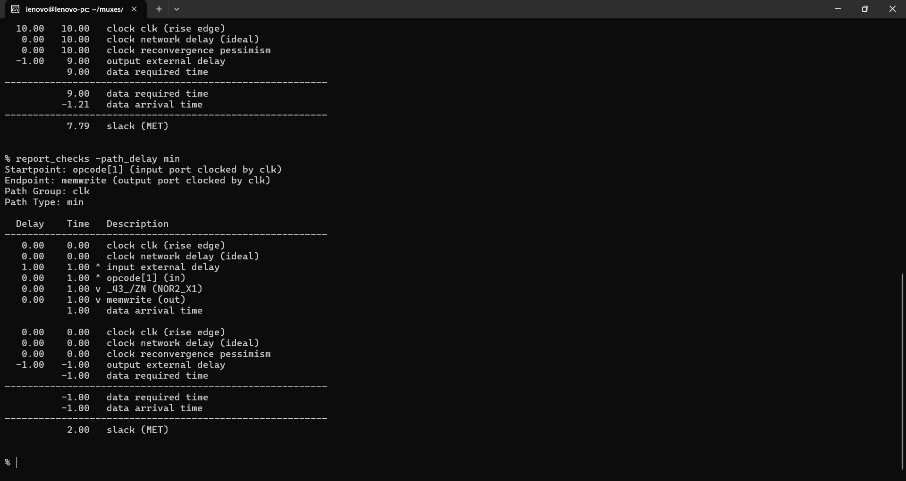

## Main Decoder

### Maximum Delay

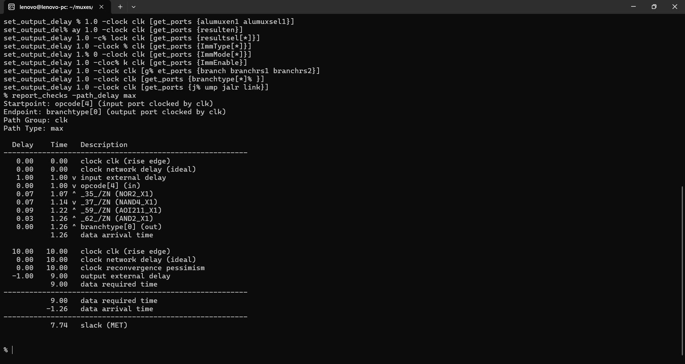

### Minimum Delay


---

# Power Analysis

## Baseline

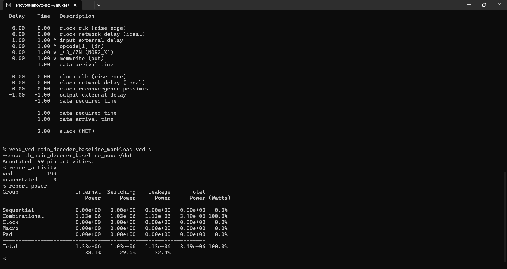

**Total power: 3.49 µW**

## Main Decoder

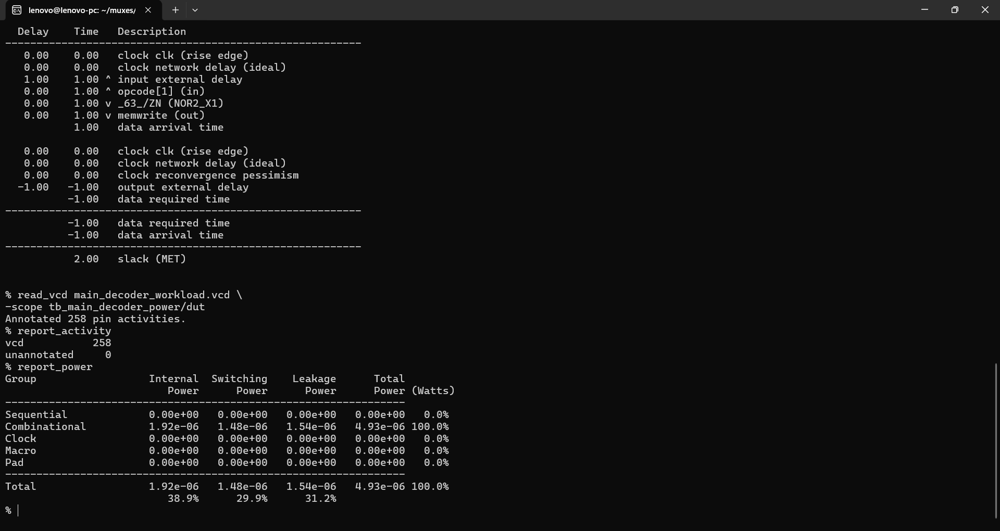

**Total power: 4.93 µW**

---

# PPA Interpretation

The main decoder shows a clear **functionality-versus-PPA tradeoff**.

Adding the additional processor control functionality increases:

- Area by **31.21%**
- Cell count by **27.66%**
- Total power by **41.26%**
- Worst delay by only **4.13%**

The most important observation is that the timing penalty is small compared with the additional functionality obtained.

The decoder still has:

> **7.74 ns setup slack at a 10 ns clock period**

Therefore, the additional control complexity does not create a timing bottleneck at the evaluated 100 MHz target.

---

# Why No Power-Aware Decoder Isolation Was Used

Power gating/isolation was deliberately not applied to this block.

Unlike datapath blocks such as the ALU, operand-routing MUXes, result MUXes, or register-file read paths, the main decoder is required to interpret the current instruction and generate the corresponding control signals during normal processor operation.

Therefore:

```text
Instruction
     ↓
Main Decoder
     ↓
Control Signals
     ↓
Datapath / Memory / Branch / Writeback
```

The decoder cannot simply be disabled during normal instruction execution without also disabling the control generation required by the processor.

For this reason, the project focuses on **characterizing the PPA cost of the richer decoder**, rather than adding an artificial decoder enable that would not correspond to the intended processor architecture.

---

# Industry Relevance

A decoder is a fundamental component of a processor control path. Increasing the number of supported instruction formats and control signals generally requires additional decode logic.

This experiment demonstrates an important RTL-design consideration:

> **Additional ISA and microarchitectural functionality has a measurable PPA cost.**

For this design, the cost is acceptable because the resulting decoder:

- supports more processor operations,
- provides the control signals required by the expanded datapath,
- remains purely combinational,
- meets the evaluated timing target,
- and occupies only a small area relative to the overall processor.

This type of block-level PPA characterization is useful during early RTL/microarchitecture exploration before integration into a larger processor.

---

# Advantages

- Supports a broader processor instruction/control set.
- Provides centralized control-signal generation.
- Purely combinational implementation.
- No sequential storage required.
- Meets the 100 MHz timing target in the evaluated flow.
- Gate-level activity can be directly used for power estimation.
- Provides a measurable characterization of the PPA cost of added functionality.

# Limitations

- The analysis uses the **NangateOpenCellLibrary 45 nm standard-cell library** rather than a commercial foundry PDK.
- The reported area and power therefore represent the selected standard-cell implementation and are not production silicon values.
- The decoder is characterized with a 10 ns reference clock even though the decoder itself is combinational.
- Power is activity-dependent and is based on the supplied gate-level workload/VCD.
- No decoder-level clock/power gating or output isolation was implemented because the decoder is continuously required in the processor control path.
- The comparison is between a simpler baseline decoder and a more feature-rich decoder, so the PPA increase should be interpreted as the cost of expanded functionality rather than as an optimization failure.

---

# Tools Used

- **Verilog HDL**
- **Icarus Verilog** — RTL/gate-level simulation
- **Yosys** — synthesis
- **OpenSTA** — timing and VCD-based power analysis
- **NangateOpenCellLibrary 45 nm** — standard-cell library
- **GTKWave** — waveform inspection

---

# Reproducibility

### Gate-Level Simulation — Baseline

```bash
iverilog -g2012 -o main_decoder_baseline_gls_power main_decoder_baseline_netlist.v tb_main_decoder_baseline_power.v /home/lenovo/NangateOpenCellLibrary.v

vvp main_decoder_baseline_gls_power
```

### Gate-Level Simulation — Main Decoder

```bash
iverilog -g2012 -o main_decoder_gls_power main_decoder_netlist.v tb_main_decoder_power.v /home/lenovo/NangateOpenCellLibrary.v

vvp main_decoder_gls_power
```

### Power Analysis

The generated VCD files are:

```text
main_decoder_baseline_workload.vcd
main_decoder_workload.vcd
```

They are loaded into OpenSTA using:

```tcl
read_vcd main_decoder_baseline_workload.vcd -scope tb_main_decoder_baseline_power/dut

report_activity
report_power
```

and:

```tcl
read_vcd main_decoder_workload.vcd -scope tb_main_decoder_power/dut

report_activity
report_power
```

---

# Final Assessment

The main decoder successfully expands the processor's control functionality at a measurable PPA cost.

Compared with the baseline implementation:

- **Area:** +31.21%
- **Total power:** +41.26%
- **Worst delay:** +4.13%
- **Timing:** still comfortably MET at 100 MHz

The increased PPA is an expected **functionality penalty**, not a design failure. The richer decoder provides the additional control signals and instruction support required by the processor while maintaining substantial timing margin.

Most importantly, the decoder was intentionally kept **always active** because it is required for every instruction. Therefore, unlike the datapath blocks where operand/result isolation can eliminate unnecessary switching, decoder-level isolation was not considered architecturally beneficial for this processor.

---

## Repository Contents

```text
Main_Decoder_PPA_Analysis/
├── README.md
└── results/
    ├── baseline/
    │   ├── 01_functional_simulation_part1.png
    │   ├── 02_functional_simulation_part2.png
    │   ├── 03_functional_simulation_part3.png
    │   ├── 04_synthesis_area.png
    │   ├── 05_sta_max.png
    │   ├── 06_sta_min.png
    │   └── 07_power.png
    │
    └── main_decoder/
        ├── 01_functional_simulation_part1.png
        ├── 02_functional_simulation_part2.png
        ├── 03_functional_simulation_part3.png
        ├── 04_synthesis_area.png
        ├── 05_sta_max.png
        ├── 06_sta_min.png
        └── 07_power.png
```
