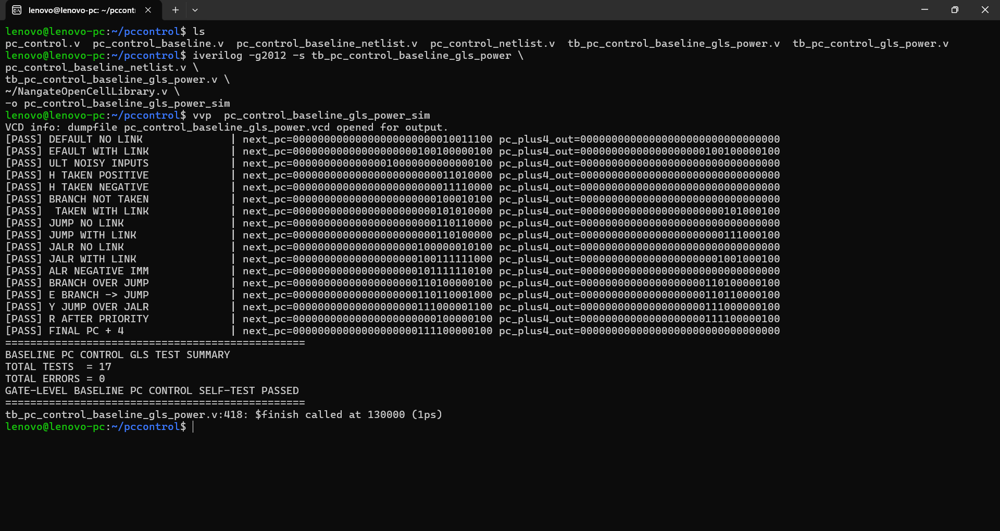
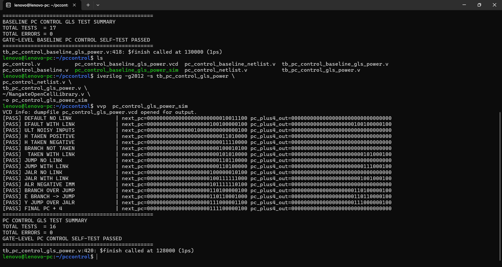
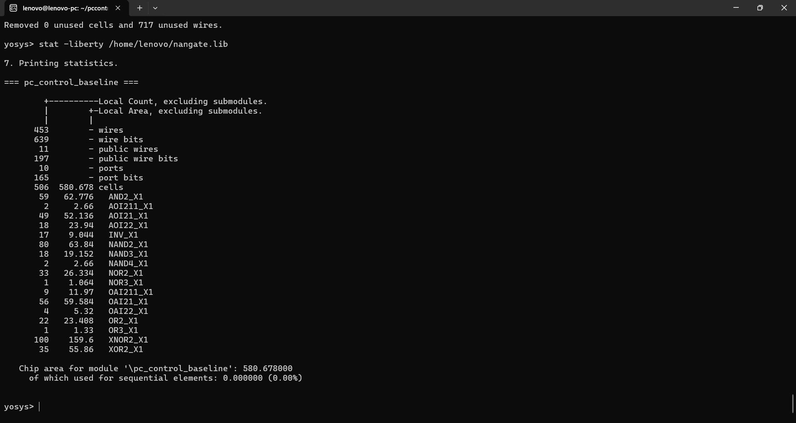
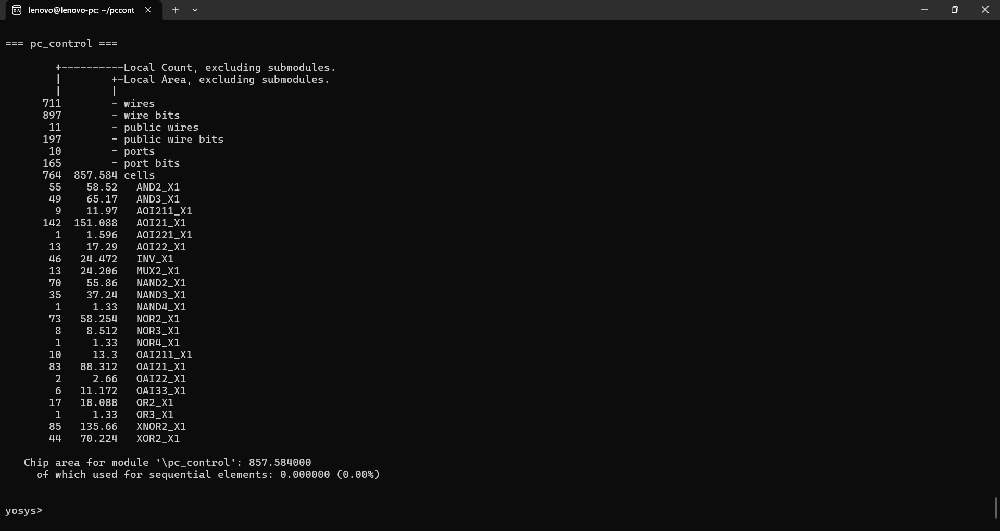
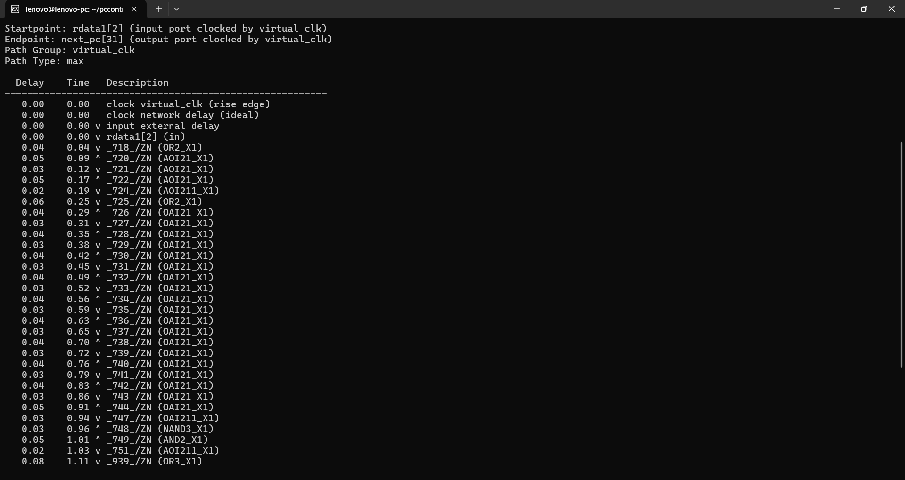
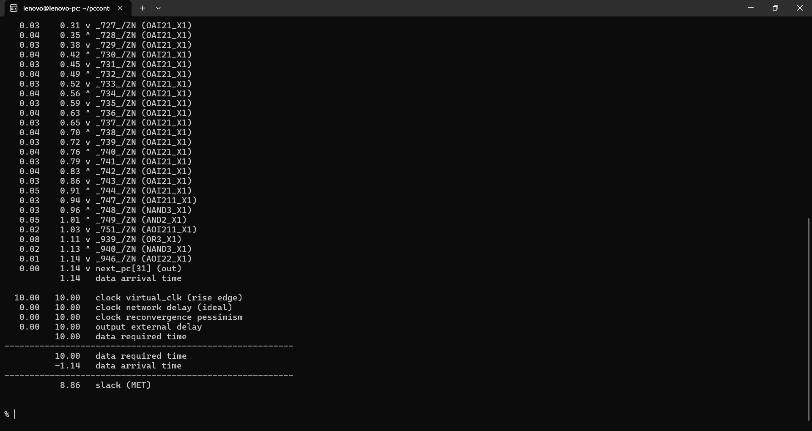
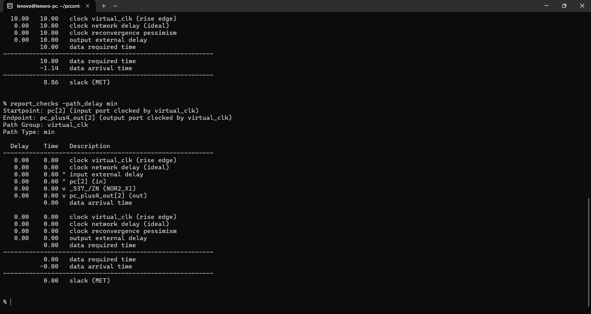
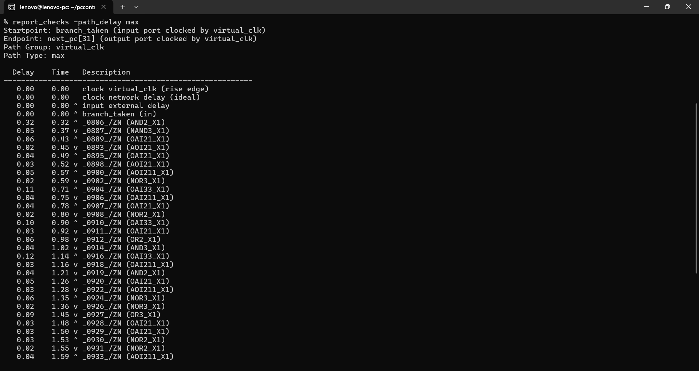
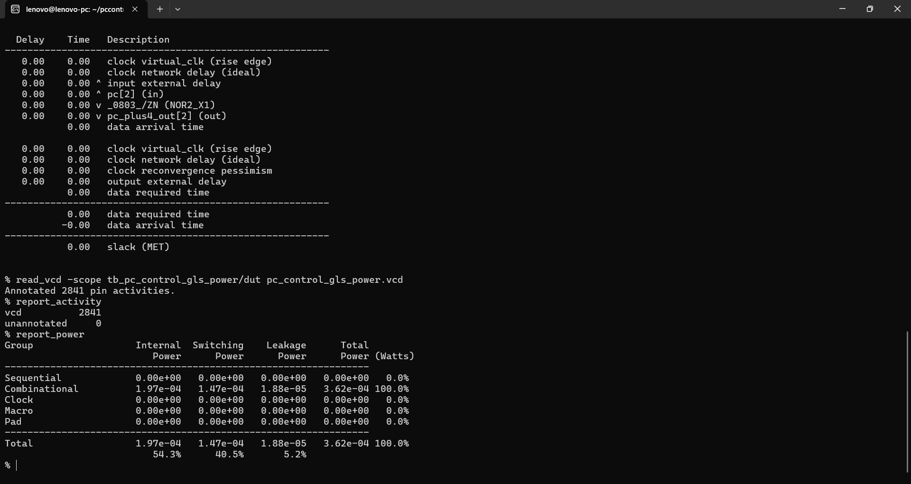
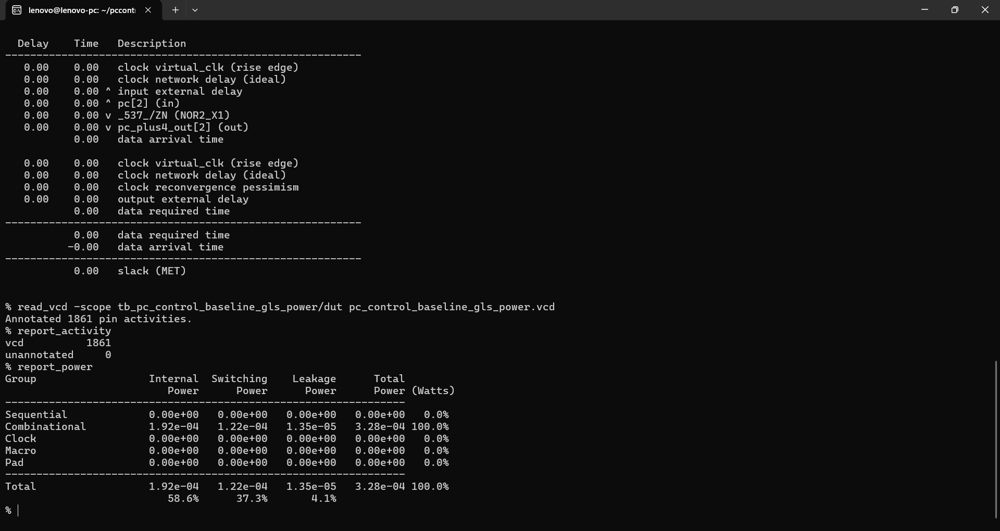

# ⚡ 32-bit PC Control with RTL Activity Isolation — Baseline vs Power-Aware

> **A 32-bit next-PC control block for a custom processor, evaluated through post-synthesis gate-level PPA analysis to study whether RTL input/activity isolation is beneficial for an always-active control datapath.**


This project compares two functionally equivalent implementations of the same PC-control logic:

- **Baseline:** `pc_control_baseline`
- **Power-aware:** `pc_control`

The power-aware version adds **RTL-level input/activity isolation** around the branch immediate, jump immediate, JALR immediate, and JALR register-data paths.

Both versions were synthesized using the **Nangate Open Cell Library**, verified at gate level, and analyzed with **OpenSTA** using matched functional stimulus.

---

## 🚀 Headline Results

| Metric | Baseline | Power-Aware | Improvement / Cost |
|---|---:|---:|---:|
| **Area** | 580.678 µm² | 857.584 µm² | **+47.65%** |
| **Total Power** | 328 µW | 362 µW | **↑ 10.37%** |
| **Switching Power** | 122 µW | 147 µW | **↑ 20.49%** |
| **Internal Power** | 192 µW | 197 µW | **↑ 2.60%** |
| **Leakage Power** | 13.5 µW | 18.8 µW | **↑ 39.26%** |
| **Worst Delay** | 1.14 ns | 1.71 ns | **↑ 0.57 ns** |
| **Worst Slack @ 10 ns** | 8.86 ns | 8.29 ns | **MET** |

### Key takeaway

For this block and workload, **the power-aware implementation does not provide a power-saving benefit**.

The PC-control datapath is effectively **active every instruction cycle** because it must continuously select the next PC. Even when a branch or jump is not taken, the block still computes the default:

```text
next_pc = PC + 4
```

Therefore, there is limited inactive datapath activity for input isolation to exploit. The additional isolation logic introduces its own area, switching, leakage, and delay overhead.

This is an intentional and useful result: **RTL activity isolation should be applied selectively based on block behavior and measured activity, not assumed to improve every block.**

The result is a **post-synthesis, gate-level, workload-dependent measurement**, not a silicon measurement.

---

# 1. 🧠 What the PC Control Block Does

The PC control block determines the next program-counter value for the processor.

Default operation:

```text
next_pc = PC + 4
```

Control-flow operations can override the default:

```text
branch && branch_taken
        ↓
      jump
        ↓
      jalr
        ↓
     PC + 4
```

The block also generates the link value:

```text
pc_plus4_out = PC + 4
```

when `link` is asserted.

### Main inputs

```text
pc
imm
rdata1
branch
branch_taken
jump
jalr
link
```

### Outputs

```text
next_pc
pc_plus4_out
```

This block sits directly on the processor's control-flow path, so it participates in the selection of the next instruction address during normal operation.

---

# 2. ⚡ Power-Aware Architecture

The optimized `pc_control` adds explicit activity-isolation signals:

```verilog
assign branch_imm_iso =
    (branch && branch_taken) ? imm : 32'b0;

assign jump_imm_iso =
    jump ? imm : 32'b0;

assign jalr_imm_iso =
    jalr ? imm : 32'b0;

assign rdata1_iso =
    jalr ? rdata1 : 32'b0;
```

The intended purpose is to prevent unnecessary input transitions from propagating through control-flow datapaths that are not currently selected.

### Isolation behavior

| Signal | Allowed through when |
|---|---|
| `branch_imm_iso` | `branch && branch_taken` |
| `jump_imm_iso` | `jump` |
| `jalr_imm_iso` | `jalr` |
| `rdata1_iso` | `jalr` |

The default `PC + 4` path remains active because sequential instruction flow still needs to determine the next PC every cycle.

> This is an **RTL-level activity-isolation experiment**, not a UPF/CPF power-intent implementation.

---

# 3. 🔎 What the Isolation Provides — and Why the Measured Power Benefit Is Limited

This is the most important interpretation of the experiment.

The PC-control unit is fundamentally part of **continuous instruction sequencing**. Even when:

```text
branch = 0
jump   = 0
jalr   = 0
```

the block still performs:

```text
next_pc = PC + 4
```

Therefore, the core PC-control logic remains active during normal instruction flow, leaving relatively little **block-level idle time** for the isolation logic to exploit.

However, the isolation is still useful from a **signal-integrity / unnecessary-data-propagation perspective**.

The power-aware implementation prevents data that is not currently required by a control path from being forwarded into that path. For example:

```text
Branch not taken
        ↓
branch immediate is isolated
        ↓
branch datapath does not receive that immediate activity

Jump inactive
        ↓
jump immediate is isolated

JALR inactive
        ↓
JALR immediate + rdata1 are isolated
```

So the isolation can provide a meaningful architectural benefit:

> **Unwanted or irrelevant input data is prevented from propagating through inactive control paths.**

This can be useful when:

- a control path does not need a particular operand
- upstream signals continue toggling
- unnecessary propagation could otherwise cause switching inside that path
- the designer wants explicit control over which data is allowed to reach a selected datapath

The limitation is that **preventing unnecessary propagation is not the same as guaranteeing lower total block power**.

In this small, continuously active PC-control block, the added isolation circuitry introduces its own gates and switching activity. The measured result therefore shows that the isolation provides **functional activity containment**, but not enough power savings to outweigh its implementation overhead under this workload.

The measured result confirms:

```text
Total power:
328 µW → 362 µW
= 10.37% increase
```

and:

```text
Switching power:
122 µW → 147 µW
= 20.49% increase
```

Therefore, this experiment demonstrates a useful design principle:

> **Isolation can still be valuable for preventing irrelevant data from propagating, even when it does not produce a net power reduction at the block level.**

The technique becomes more attractive when the isolated datapath is larger, has more exploitable inactive periods, or receives substantial unnecessary switching from upstream logic.

---

# 4. 🧪 Experimental Methodology

## Synthesis

- HDL: **Verilog**
- Synthesis: **Yosys**
- Standard-cell library: **Nangate Open Cell Library**
- Output: post-synthesis gate-level Verilog

## Gate-level verification

Both versions were simulated using **Icarus Verilog** together with the Nangate standard-cell library.

Both self-checking simulations passed without functional errors.

## Timing

The block is combinational, so standalone timing was evaluated using a **10 ns virtual clock**:

```tcl
create_clock -name virtual_clk -period 10.0
set_input_delay 0.0 -clock virtual_clk [all_inputs]
set_output_delay 0.0 -clock virtual_clk [all_outputs]
```

Timing was analyzed with OpenSTA.

## Power

Power was estimated using:

1. Post-synthesis gate-level simulation
2. VCD generation
3. OpenSTA VCD activity annotation
4. `report_power`

The same style of deterministic functional/activity workload was applied to both implementations.

### VCD activity

| Version | Annotated Pin Activities | Unannotated |
|---|---:|---:|
| Baseline | 1,861 | 0 |
| Power-aware | 2,841 | 0 |

The different annotated counts reflect the different synthesized netlists. The **top-level stimulus sequence** was matched for comparison.

---

# 5. ✅ Functional Verification

## Baseline



```text
TOTAL TESTS  = 17
TOTAL ERRORS = 0
GATE-LEVEL BASELINE PC CONTROL SELF-TEST PASSED
```

## Power-aware



```text
TOTAL TESTS  = 16
TOTAL ERRORS = 0
GATE-LEVEL PC CONTROL SELF-TEST PASSED
```

The lower number of explicit checks in the power-aware testbench does not indicate reduced functionality; the implementations exercise the same PC-control operations and matched activity workload.

---

# 6. 📐 Area Comparison

## Baseline



```text
Area = 580.678 µm²
```

## Power-aware



```text
Area = 857.584 µm²
```

### Area overhead

```text
(857.584 - 580.678) / 580.678 × 100
= 47.65%
```

The area increase comes from the additional isolation and control logic.

---

# 7. ⏱️ Timing Comparison

## Baseline timing





```text
Startpoint: rdata1[2]
Endpoint:   next_pc[31]

Worst-case delay = 1.14 ns
Worst slack      = 8.86 ns
Status           = MET
```



Minimum slack:

```text
0.00 ns
```

Because this is a standalone combinational block using a virtual-clock constraint, the zero minimum slack should not be described as a conventional flip-flop hold-time violation.

## Power-aware timing




```text
Startpoint: branch_taken
Endpoint:   next_pc[31]

Worst-case delay = 1.71 ns
Worst slack      = 8.29 ns
Status           = MET
```


Minimum slack:

```text
0.00 ns
```

### Timing trade-off

```text
1.71 ns - 1.14 ns = 0.57 ns
```

The power-aware version increases the worst-case delay by:

```text
0.57 / 1.14 × 100 = 50.00%
```

Both implementations still meet the 10 ns target.

---

# 8. 🔋 Power Comparison

## Power-aware version



OpenSTA:

| Component | Power |
|---|---:|
| Internal | **197 µW** |
| Switching | **147 µW** |
| Leakage | **18.8 µW** |
| **Total** | **362 µW** |

## Baseline version



OpenSTA:

| Component | Power |
|---|---:|
| Internal | **192 µW** |
| Switching | **122 µW** |
| Leakage | **13.5 µW** |
| **Total** | **328 µW** |

---

# 9. 📊 PPA Analysis

### Total power change

```text
(362 - 328) / 328 × 100
= 10.37% increase
```

### Switching power change

```text
(147 - 122) / 122 × 100
= 20.49% increase
```

### Internal power change

```text
(197 - 192) / 192 × 100
= 2.60% increase
```

### Leakage change

```text
(18.8 - 13.5) / 13.5 × 100
= 39.26% increase
```

### Area change

```text
(857.584 - 580.678) / 580.678 × 100
= 47.65% increase
```

### Delay change

```text
(1.71 - 1.14) / 1.14 × 100
= 50.00% increase
```

---

# 10. 🏭 Potential Commercial / Industry Applications

The PC-control block is a fundamental component of:

- Custom CPU cores
- Embedded processors
- Microcontrollers
- RISC-style processor datapaths
- Custom ASIC processor IP
- Low-power processor research

However, the measured isolation result should **not** be presented as a production low-power optimization for PC control.

The experiment instead demonstrates an important architecture-level lesson:

> **A control block that is continuously required may gain little from local input isolation unless it has a substantial amount of genuinely unnecessary switching.**

The technique is more attractive for larger datapaths, optional accelerators, and blocks that spend significant time inactive.

---

# 11. ✅ Benefits of the Experiment

### Demonstrates selective optimization

The experiment shows that low-power RTL techniques should be evaluated block-by-block rather than blindly applied throughout a processor.

### Preserves functionality

Both implementations passed gate-level self-checking verification.

### Provides measurable evidence

The comparison includes:

- synthesized area
- worst-case timing
- VCD-based activity
- internal power
- switching power
- leakage power
- total power

### Useful design lesson

The result clearly identifies the point at which additional isolation logic becomes counterproductive.

---

# 12. ⚠️ Disadvantages / Trade-Offs of the Power-Aware Version

The measured implementation has:

- **+47.65% area**
- **+20.49% switching power**
- **+10.37% total power**
- **+39.26% leakage**
- **+50.00% worst-case delay**

The version still meets the 10 ns timing requirement, but the overall PPA trade-off is unfavorable for this block and workload.

This is why the power-aware version should be treated as an **experimental isolation implementation**, not as a universally superior replacement for the baseline.

---

# 13. 🛠️ Tools Used

| Tool | Purpose |
|---|---|
| **Verilog HDL** | RTL implementation |
| **Icarus Verilog** | Gate-level simulation and VCD generation |
| **Yosys** | Logic synthesis |
| **OpenSTA** | Static timing and VCD-based power analysis |
| **Nangate Open Cell Library** | Standard-cell implementation |
| **GTKWave** | Waveform inspection |

---

# 14. 🔁 Reproducibility

## Power-aware Gate-Level Simulation

```bash
iverilog -g2012 -s tb_pc_control_gls_power \
pc_control_netlist.v \
tb_pc_control_gls_power.v \
~/NangateOpenCellLibrary.v \
-o pc_control_gls_power_sim

vvp pc_control_gls_power_sim
```

VCD:

```text
pc_control_gls_power.vcd
```

## Baseline Gate-Level Simulation

```bash
iverilog -g2012 -s tb_pc_control_baseline_gls_power \
pc_control_baseline_netlist.v \
tb_pc_control_baseline_gls_power.v \
~/NangateOpenCellLibrary.v \
-o pc_control_baseline_gls_power_sim

vvp pc_control_baseline_gls_power_sim
```

VCD:

```text
pc_control_baseline_gls_power.vcd
```

---

## OpenSTA — Power-aware

```tcl
read_liberty ~/nangate.lib
read_verilog pc_control_netlist.v
link_design pc_control

read_vcd -scope tb_pc_control_gls_power/dut pc_control_gls_power.vcd

report_activity
report_power
```

## OpenSTA — Baseline

```tcl
read_liberty ~/nangate.lib
read_verilog pc_control_baseline_netlist.v
link_design pc_control_baseline

read_vcd -scope tb_pc_control_baseline_gls_power/dut pc_control_baseline_gls_power.vcd

report_activity
report_power
```

---

## OpenSTA — Timing

### Power-aware

```tcl
read_liberty ~/nangate.lib
read_verilog pc_control_netlist.v
link_design pc_control

create_clock -name virtual_clk -period 10.0
set_input_delay 0.0 -clock virtual_clk [all_inputs]
set_output_delay 0.0 -clock virtual_clk [all_outputs]

check_timing
report_checks -path_delay max -group_count 10
report_checks -path_delay min -group_count 10
report_worst_slack -max
report_worst_slack -min
report_tns
report_design_area
```

### Baseline

```tcl
read_liberty ~/nangate.lib
read_verilog pc_control_baseline_netlist.v
link_design pc_control_baseline

create_clock -name virtual_clk -period 10.0
set_input_delay 0.0 -clock virtual_clk [all_inputs]
set_output_delay 0.0 -clock virtual_clk [all_outputs]

check_timing
report_checks -path_delay max -group_count 10
report_checks -path_delay min -group_count 10
report_worst_slack -max
report_worst_slack -min
report_tns
report_design_area
```

---

# 15. 📁 Repository Structure

```text
PC_Control_PPA_Comparison_Baseline_vs_Power_Aware/
├── README.md
└── results/
    ├── baseline/
    │   ├── 01_functional_simulation.png
    │   ├── 02_area.png
    │   ├── 03_sta_max_part1.png
    │   ├── 04_sta_max_part2.png
    │   ├── 05_sta_min.png
    │   └── 06_power.png
    │
    └── power_aware/
        ├── 01_functional_simulation.png
        ├── 02_area.png
        ├── 03_sta_max_part1.png
        ├── 04_sta_max_part2.png
        ├── 05_sta_min.png
        └── 06_power.png
```

---

# 16. 🎯 Final Assessment

This experiment provides a useful counterexample to the assumption that adding isolation logic always saves power.

The PC-control unit is continuously involved in next-PC generation, including the default sequential path:

```text
PC + 4
```

As a result, the optimization has limited inactive logic to exploit. For the measured workload, the added isolation network costs more than the activity it suppresses.

### Final measured result

> **The power-aware PC-control implementation increased total estimated power by 10.37% and switching power by 20.49%, at a 47.65% area overhead and 50.00% worst-case delay increase, while still meeting the 10 ns timing constraint.**

That makes the result valuable as a practical PPA study:

**Use activity isolation where genuine inactivity exists; avoid adding isolation to small, always-active control logic without a measured justification.**

The experiment is based on **post-synthesis gate-level VCD/OpenSTA analysis**, not RTL-only estimation or silicon characterization.
