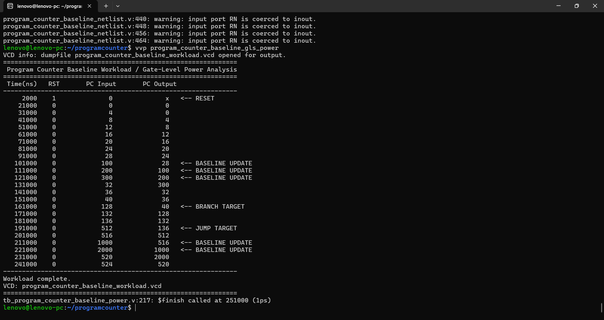
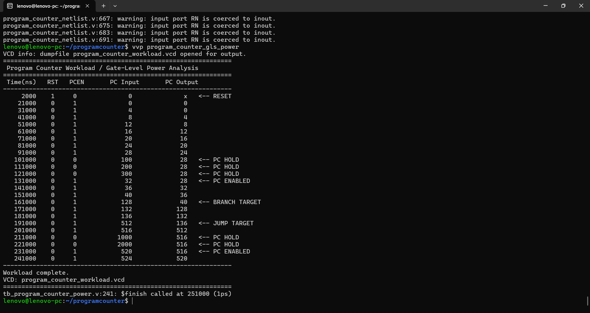
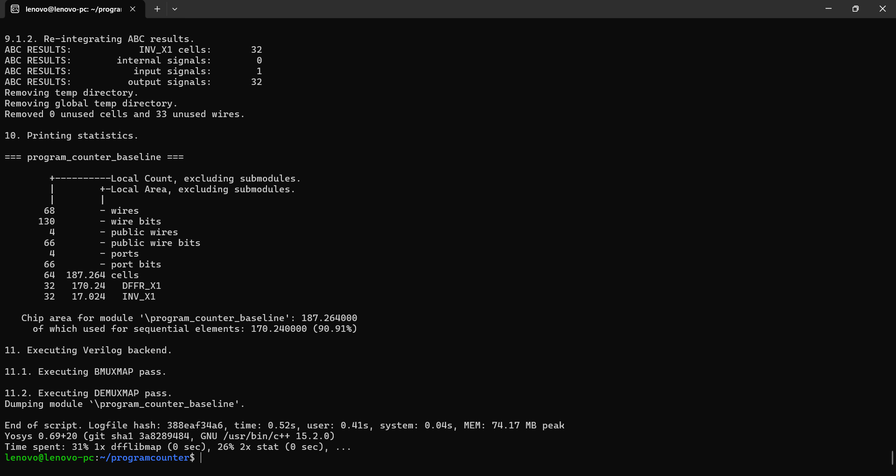
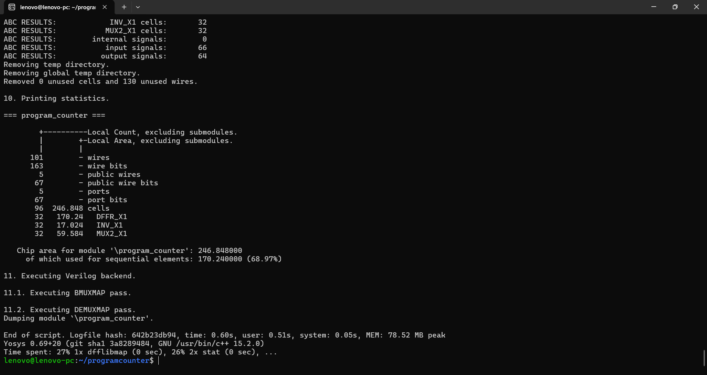
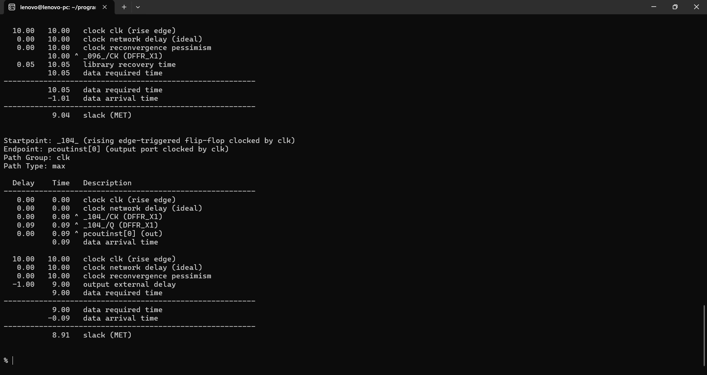
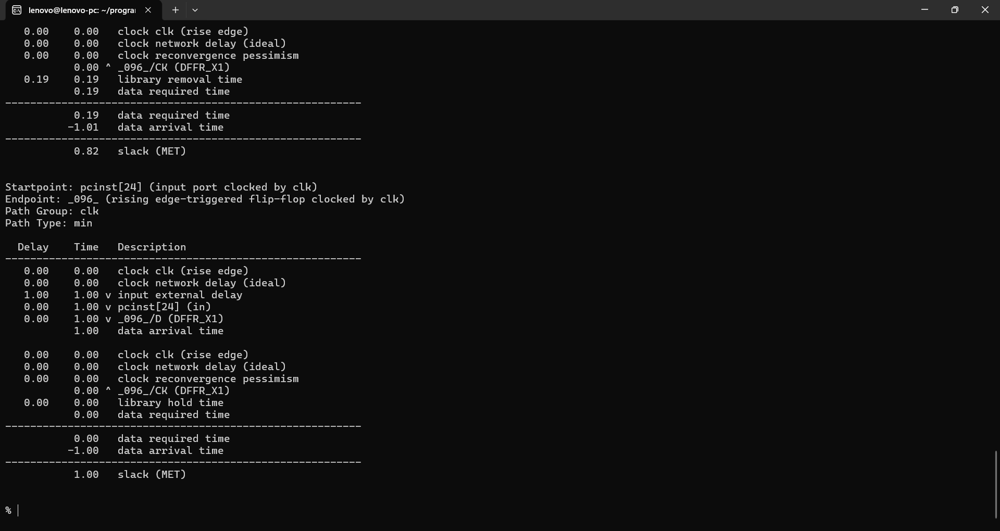
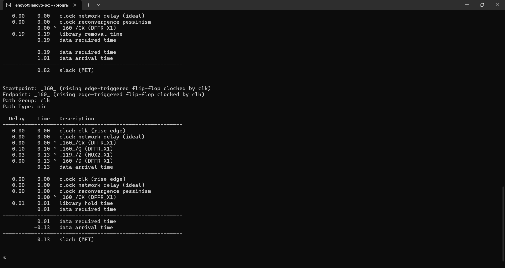
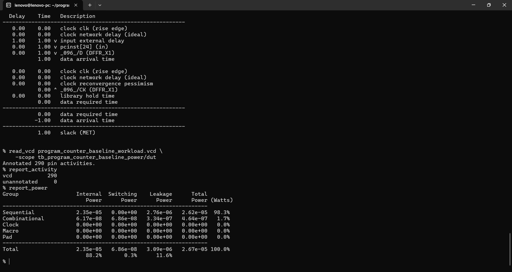
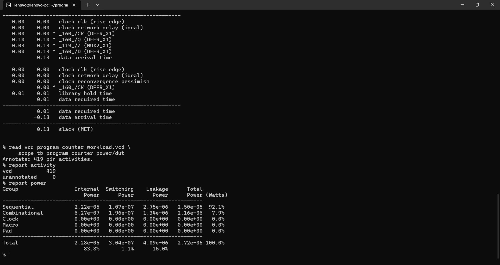

# ⚡ 32-bit Program Counter with Enable-Based Power Optimization

> **A 32-bit synchronous Program Counter evaluated with and without an update-enable mechanism, using post-synthesis gate-level PPA analysis.**


This project compares two implementations of a 32-bit Program Counter:

- **Baseline:** `program_counter_baseline`
- **Enable version:** `program_counter`

The enable version adds a **`pcen` update-enable control** so that the Program Counter retains its previous value when an update is not required.

Both versions were synthesized using the **Nangate Open Cell Library**, verified using **gate-level simulation**, and analyzed using **OpenSTA** and VCD-based power estimation.

---

## 🚀 Headline Results

| Metric | Baseline | With `pcen` | Improvement / Cost |
|---|---:|---:|---:|
| **Area** | 187.264 | 246.848 | **+31.83%** |
| **DFFR_X1** | 32 | 32 | — |
| **INV_X1** | 32 | 32 | — |
| **MUX2_X1** | 0 | 32 | **+32 MUXes** |
| **Sequential Area** | 170.240 | 170.240 | — |
| **Sequential Area %** | 90.91% | 68.97% | — |
| **Total Power** | 26.7 µW | 27.2 µW | **↑ 1.87%** |
| **Internal Power** | 23.5 µW | 22.8 µW | **↓ 2.98%** |
| **Switching Power** | 0.0686 µW | 0.304 µW | **↑ 343%** |
| **Leakage Power** | 3.09 µW | 4.09 µW | **↑ 32.36%** |
| **Worst Max Slack @ 10 ns** | 8.91 ns | 8.90 ns | **MET** |
| **Worst Min Slack** | 0.82 ns | 0.13 ns | **MET** |

### Key takeaway

The `pcen` mechanism successfully prevents the Program Counter from updating when the enable is low. However, in the evaluated workload, the additional **32-bit MUX feedback network** increases area by **31.83%** and increases switching/leakage power enough that total estimated power rises slightly by **1.87%**.

This is an important result: **an enable mechanism does not automatically reduce total power**. Its effectiveness depends on how often the state element can remain inactive and how much overhead is introduced by the implementation.

The results are **post-synthesis, gate-level, workload-dependent estimates**, not silicon measurements.

---

# 1. 🧠 What the Program Counter Does

The Program Counter (PC) stores the current instruction address for the processor.

The baseline implementation updates the stored PC value on every rising clock edge:

```verilog
always @(posedge clk or posedge rst) begin
    if (rst)
        pcoutinst <= 32'd0;
    else
        pcoutinst <= pcinst;
end
```

The enable version adds an update control:

```verilog
always @(posedge clk or posedge rst) begin
    if (rst)
        pcoutinst <= 32'd0;
    else if (pcen)
        pcoutinst <= pcinst;
end
```

### Enable behavior

| `rst` | `pcen` | Behavior |
|---:|---:|---|
| 1 | X | Reset PC to 0 |
| 0 | 1 | Load `pcinst` |
| 0 | 0 | Hold previous PC value |

This allows the processor to prevent unnecessary architectural state updates during cycles in which the PC should remain unchanged.

---

# 2. ⚡ Enable-Based Architecture

The enable version is synthesized into a 32-bit feedback MUX structure.

Conceptually, each PC bit behaves like:

```text
                         ┌──────────────┐
pcinst[i] ──────────────►│              │
                         │   MUX2_X1     ├──► DFFR_X1 ──► pcoutinst[i]
previous_PC[i] ─────────►│              │
                         └──────┬───────┘
                                ▲
                               pcen
```

When `pcen = 1`:

```text
pcinst → MUX → DFF → PC output
```

When `pcen = 0`:

```text
PC output → feedback MUX → DFF
```

The synthesized result contains:

- **32 DFFR_X1** — unchanged from baseline
- **32 INV_X1** — unchanged from baseline
- **32 MUX2_X1** — added by the enable logic

Therefore, the enable does not reduce the number of storage elements. Instead, it adds combinational logic around the storage elements.

---

# 3. 🧪 Experimental Methodology

## Synthesis

- HDL: **Verilog**
- Synthesis: **Yosys**
- Standard-cell library: **Nangate Open Cell Library**
- Output: post-synthesis gate-level Verilog

The baseline and enable versions were synthesized separately.

## Gate-level verification

Both designs were simulated using **Icarus Verilog** with the synthesized gate-level netlists and Nangate standard-cell library.

The workload exercises:

- Reset
- Sequential PC updates
- Consecutive instruction addresses
- Large PC changes
- Branch-style target addresses
- Jump-style target addresses
- PC hold cycles in the enable version
- Re-enabling the PC after hold cycles

## Timing

Standalone block timing was evaluated using a **10 ns clock constraint** with OpenSTA.

The analysis includes both:

- Maximum-delay paths
- Minimum-delay paths

The reported paths were evaluated as input-to-register and register-to-output timing paths for the synthesized PC.

## Power

Power was estimated using:

1. Gate-level simulation
2. VCD generation
3. OpenSTA VCD activity annotation
4. `report_power`

The baseline and enable implementations were exercised with corresponding PC workloads.

### VCD activity

| Version | Annotated Pin Activities | Unannotated |
|---|---:|---:|
| Baseline | 290 | 0 |
| With `pcen` | 419 | 0 |

The enable implementation has additional internal/combinational signals, so the number of annotated pins differs between the two synthesized netlists.

---

# 4. ✅ Functional Verification

## Baseline



The baseline workload verifies normal PC operation:

```text
Reset:
PC output = 0

Sequential updates:
0 → 4 → 8 → 12 → 16 → 20 → 24 → 28

Large target/update values:
28 → 100 → 200 → 300 → 32 → 36 → 40 → 128 → ...
```

The gate-level simulation confirms that the synthesized baseline PC follows the supplied `pcinst` value on each active clock edge.

## Enable version



The enable workload additionally verifies the hold behavior:

```text
PCEN = 0, PC input = 100  → PC remains 28
PCEN = 0, PC input = 200  → PC remains 28
PCEN = 0, PC input = 300  → PC remains 28

PCEN = 1, PC input = 32   → PC resumes updating
```

This confirms that the enable mechanism correctly suppresses PC updates while preserving the previous state.

---

# 5. 📐 Area Comparison

## Baseline



**Baseline area: 187.264**

Cell composition:

| Cell | Count | Area |
|---|---:|---:|
| DFFR_X1 | 32 | 170.240 |
| INV_X1 | 32 | 17.024 |
| **Total** | **64** | **187.264** |

Sequential area:

```text
170.240 / 187.264 × 100 = 90.91%
```

## Enable version



**Enable version area: 246.848**

Cell composition:

| Cell | Count | Area |
|---|---:|---:|
| DFFR_X1 | 32 | 170.240 |
| INV_X1 | 32 | 17.024 |
| MUX2_X1 | 32 | 59.584 |
| **Total** | **96** | **246.848** |

The additional 32 MUX2_X1 cells account for the update-enable feedback logic.

### Area overhead

```text
(246.848 - 187.264) / 187.264 × 100
= 31.83%
```

The area overhead is therefore significant for this relatively small 32-bit state element.

---

# 6. ⏱️ Timing Analysis

## Maximum-delay timing

### Baseline



Worst maximum-delay slack:

```text
8.91 ns
```

At a 10 ns clock period, the corresponding worst path delay is approximately:

```text
10.00 - 8.91 = 1.09 ns
```

### Enable version


Worst maximum-delay slack:

```text
8.90 ns
```

Corresponding worst path delay:

```text
10.00 - 8.90 = 1.10 ns
```

### Maximum-delay comparison

The enable logic changes the worst delay only slightly:

```text
Baseline: 1.09 ns
Enable:   1.10 ns
```

The 10 ns timing target is comfortably met in both cases.

---

## Minimum-delay timing

### Baseline



Worst minimum-delay slack:

```text
0.82 ns
```

### Enable version



Worst minimum-delay slack:

```text
0.13 ns
```

The enable MUX introduces additional minimum-delay sensitivity and reduces the available hold margin.

Both cases still report:

```text
slack (MET)
```

---

# 7. 🔋 Power Analysis

## Baseline



OpenSTA reported:

| Power Component | Power |
|---|---:|
| Internal | 23.5 µW |
| Switching | 0.0686 µW |
| Leakage | 3.09 µW |
| **Total** | **26.7 µW** |

Power contribution:

- Internal: **88.2%**
- Switching: **0.3%**
- Leakage: **11.6%**

The Program Counter is dominated by sequential internal power because it contains 32 flip-flops.

---

## Enable version



OpenSTA reported:

| Power Component | Power |
|---|---:|
| Internal | 22.8 µW |
| Switching | 0.304 µW |
| Leakage | 4.09 µW |
| **Total** | **27.2 µW** |

Power contribution:

- Internal: **83.8%**
- Switching: **1.1%**
- Leakage: **15.0%**

---

# 8. 📊 PPA Comparison

| Metric | Baseline | Enable | Change |
|---|---:|---:|---:|
| Area | 187.264 | 246.848 | **+31.83%** |
| Total Power | 26.7 µW | 27.2 µW | **+1.87%** |
| Internal Power | 23.5 µW | 22.8 µW | **−2.98%** |
| Switching Power | 0.0686 µW | 0.304 µW | **+343%** |
| Leakage Power | 3.09 µW | 4.09 µW | **+32.36%** |
| Worst Max Slack | 8.91 ns | 8.90 ns | −0.01 ns |
| Worst Min Slack | 0.82 ns | 0.13 ns | −0.69 ns |
| Max Timing | MET | MET | — |
| Min Timing | MET | MET | — |

### Total power calculation

```text
Baseline = 26.7 µW
Enable   = 27.2 µW

Power change =
(27.2 - 26.7) / 26.7 × 100

= +1.87%
```

### Internal power reduction

```text
(23.5 - 22.8) / 23.5 × 100
= 2.98% reduction
```

The internal power reduction alone is not sufficient to compensate for the increase in switching and leakage power caused by the added MUX network.

---

# 9. 🔍 Why Total Power Did Not Decrease

The purpose of `pcen` is to stop unnecessary PC updates.

However, a standard-cell synthesis implementation does not necessarily turn this into a dedicated low-power flip-flop. Instead, the enable is implemented using additional combinational logic.

For this design:

```text
Baseline:
32 × DFFR
32 × INV

Enable:
32 × DFFR
32 × INV
32 × MUX2
```

The additional MUXes introduce:

- Additional capacitance
- Additional internal switching
- Additional leakage
- Additional routing activity

The result is:

```text
Internal power:   ↓ 2.98%
Switching power:  ↑ 343%
Leakage power:    ↑ 32.36%
--------------------------------
Total power:      ↑ 1.87%
```

Therefore, the experiment demonstrates a key low-power design principle:

> **An RTL enable can reduce unnecessary state updates, but the PPA benefit depends on how the enable is implemented and how frequently the state element remains inactive.**

---

# 10. 💡 When PC Enable Makes Sense

The `pcen` approach becomes more attractive when:

- The PC remains disabled for many consecutive cycles.
- The surrounding architecture already generates a PC-enable signal.
- The target technology provides integrated flip-flops with enable functionality.
- Clock gating or integrated clock-enable structures are available.
- The additional combinational overhead is acceptable.
- The design has significant periods where PC updates are genuinely unnecessary.

It is less attractive when:

- The PC updates almost every cycle.
- The target library implements enables using large MUX networks.
- Area is highly constrained.
- Minimum-delay/hold margin is already tight.
- The workload contains only short hold intervals.

---

# 11. 🏭 Potential Applications

An enabled Program Counter can be useful in:

### Low-power processors

The PC can retain its value during processor stall or wait conditions.

### Pipeline control

During a pipeline stall, the PC can be held while other control logic resolves the stall condition.

### Branch/jump control

The PC can be selectively updated only when a valid next-PC decision is available.

### Embedded processors

Small embedded CPUs may use explicit state enables to control activity during idle or wait periods.

### Power-aware RTL research

The PC provides a simple sequential block for studying:

- State-update suppression
- Enable inference
- MUX-based clock-enable implementation
- Gate-level power
- Workload-dependent optimization
- Area/power/timing tradeoffs

---

# 12. ✅ Benefits

### Functional benefits

- Correctly holds the PC when `pcen = 0`
- Resumes normal operation when `pcen = 1`
- Preserves asynchronous reset behavior
- Simple RTL implementation
- Easy to integrate into a processor control path

### Analysis benefits

- Demonstrates real gate-level enable synthesis
- Quantifies the area cost of update control
- Shows the effect on minimum-delay timing
- Provides workload-based power results
- Makes the tradeoff between internal and switching power visible

---

# 13. ⚠️ Disadvantages

### Area overhead

The synthesized implementation adds **32 MUX2_X1 cells**, increasing area by **31.83%**.

### Switching overhead

The additional MUX network increases measured switching power substantially in the evaluated workload.

### Leakage overhead

The additional cells increase leakage from **3.09 µW to 4.09 µW**.

### Hold-margin reduction

Worst minimum slack decreases from:

```text
0.82 ns → 0.13 ns
```

Although timing still passes, the margin is significantly smaller.

### Workload dependence

The enable mechanism only provides a meaningful activity benefit when the PC is actually held for useful periods.

---

# 14. 🛠️ Tools Used

- **Verilog HDL**
- **Yosys** — RTL synthesis
- **Icarus Verilog** — gate-level simulation
- **OpenSTA** — static timing and power estimation
- **GTKWave** — waveform inspection
- **Nangate Open Cell Library** — standard-cell technology library

---

# 15. 🔁 Reproducibility

A typical flow is:

```text
RTL
 │
 ▼
Yosys synthesis
 │
 ▼
Gate-level Verilog
 │
 ├──────────────► Icarus Verilog
 │                      │
 │                      ▼
 │                     VCD
 │                      │
 ▼                      ▼
OpenSTA ─────────► read_vcd
 │
 ├── report_checks -path_delay max
 ├── report_checks -path_delay min
 ├── report_activity
 └── report_power
```

### Synthesis

The two versions should be synthesized separately using the Nangate Open Cell Library.

### Gate-level simulation

The synthesized netlist is simulated with the Nangate cell library and the corresponding workload testbench.

### Timing

OpenSTA is used to evaluate maximum and minimum timing paths under the same 10 ns timing target.

### Power

The generated VCD is annotated into OpenSTA before running:

```tcl
read_vcd program_counter_workload.vcd \
    -scope tb_program_counter_power/dut

report_activity
report_power
```

For the baseline:

```tcl
read_vcd program_counter_baseline_workload.vcd \
    -scope tb_program_counter_baseline_power/dut
```

---

# 16. 📁 Repository Contents

```text
Program_Counter_PPA_Analysis/
│
├── README.md
│
└── results/
    │
    ├── baseline/
    │   ├── 01_functional_simulation.png
    │   ├── 02_synthesis_area.png
    │   ├── 03_sta_max.png
    │   ├── 04_sta_min.png
    │   └── 05_power.png
    │
    └── enable/
        ├── 01_functional_simulation.png
        ├── 02_synthesis_area.png
        ├── 03_sta_max.png
        ├── 04_sta_min.png
        └── 05_power.png
```

---

# 17. 🏁 Final Assessment

The 32-bit Program Counter enable experiment demonstrates a realistic **PPA tradeoff of update-enable logic**.

The `pcen` implementation successfully adds state-update suppression:

```text
pcen = 0 → PC holds
pcen = 1 → PC updates
```

However, in the synthesized Nangate standard-cell implementation:

- **Area increases by 31.83%**
- **Total power increases by 1.87%**
- **Internal power decreases by 2.98%**
- **Switching power increases substantially**
- **Leakage increases by 32.36%**
- **Maximum timing remains essentially unchanged**
- **Minimum timing margin becomes significantly tighter**
- **All reported timing checks still pass**

The most important conclusion is that **enable-based RTL optimization should be evaluated at gate level rather than assumed to provide a power reduction from RTL structure alone**.

For a real low-power implementation, an integrated flip-flop with native enable, clock gating, or a technology-specific low-power cell could provide a better PPA tradeoff than a synthesized 32-bit MUX feedback structure.

> **Result: functionally effective, timing-safe, but not power-positive for this particular standard-cell implementation and workload.**
