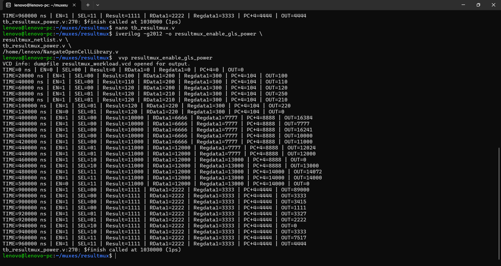
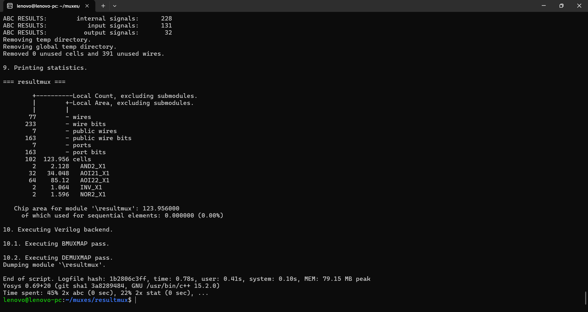
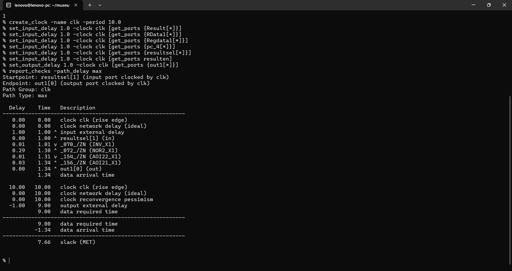
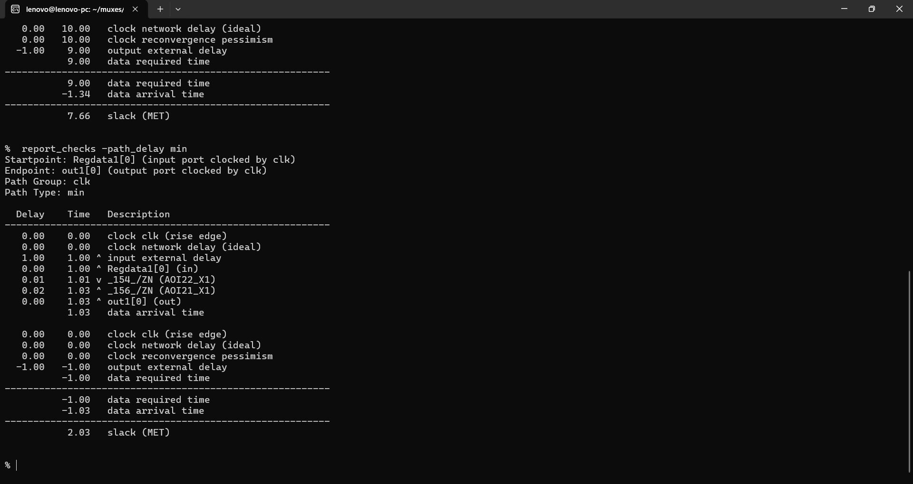
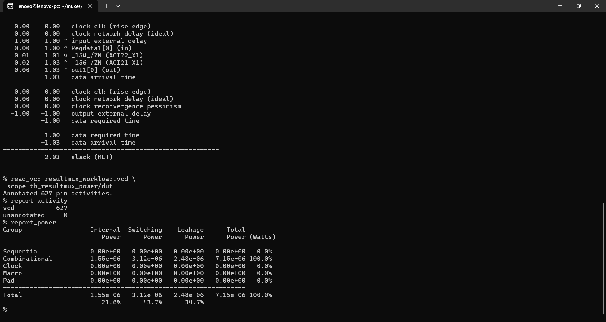

# ResultMUX — PPA Analysis with Enable-Based Isolation


## Overview

The **ResultMUX** is a combinational selection block in the custom 32-bit processor datapath. It selects which value is forwarded toward the register-file write-back path from several processor results, including the ALU result, memory read data, register data and PC-related data.

Two implementations were evaluated:

- **Baseline ResultMUX** — normal result-selection logic.
- **Enable ResultMUX** — adds `resulten`-based output isolation so that the block can be disabled when its result is not required.

The objective was not only to verify functional correctness, but also to evaluate the implementation from **area, timing and activity-based power** perspectives after synthesis and gate-level simulation.

The power workload deliberately contains long `resulten = 0` intervals so that the isolation mechanism is exercised for a meaningful portion of the simulation.

---

# Headline Results

| Metric | Baseline | Enable | Change |
|---|---:|---:|---:|
| **Cell count** | 147 | **102** | **−30.61%** |
| **Area** | 149.226 µm² | **123.956 µm²** | **−16.93%** |
| Internal Power | 1.92 µW | **1.55 µW** | **−19.27%** |
| Switching Power | 3.39 µW | **3.12 µW** | **−7.96%** |
| Leakage Power | 3.27 µW | **2.48 µW** | **−24.16%** |
| **Total Power** | 8.57 µW | **7.15 µW** | **−16.57%** |
| Worst Delay | 1.35 ns | **1.34 ns** | **−0.74%** |
| Setup Slack @ 10 ns | 7.65 ns | **7.66 ns** | **+0.01 ns** |
| Minimum Slack | 2.02 ns | **2.03 ns** | **+0.01 ns** |

### Key result

The enable implementation reduced estimated total power from:

**8.57 µW → 7.15 µW**

representing a:

**16.57% reduction in total power**

while maintaining timing closure at the 10 ns clock constraint.

---

# 1. ResultMUX Functionality

The ResultMUX sits in the processor's write-back datapath and selects the value that is ultimately forwarded to the destination register.

Typical sources include:

- ALU/computation result
- Data-memory read data
- Register-file data
- PC + 4
- Other processor-generated result paths

The `resultsel` control determines which source is selected.

The enable version additionally uses `resulten` to isolate the output when the block is not required.

Conceptually:

```text
                    +----------------+
Result ------------>|                |
RData1 ------------>|                |
Regdata1 ---------->|   ResultMUX     |----> out1
pc_4 -------------->|                |
resultsel --------->|   Selection     |
resulten ---------->|   + Isolation   |
                    +----------------+
```

When `resulten = 0`, the output is isolated rather than continuously propagating the selected datapath value.

This is particularly useful in a processor because not every instruction requires the write-back result path to be active.

---

# 2. Power-Aware Architecture

The enable version introduces a result-isolation control:

```text
resulten = 0  → ResultMUX disabled / output isolated
resulten = 1  → ResultMUX active
```

The testbench intentionally uses long disabled intervals and then reactivates the block for representative processor-like workloads.

This is important because an enable mechanism should be evaluated under a workload where the block is actually allowed to remain inactive. If the block is enabled for almost every cycle, the power-saving mechanism has little opportunity to demonstrate its purpose.

---

# 3. Verification and Workload

The gate-level workload exercises:

- Different `resultsel` selections
- Changing ALU/result values
- Changing memory-result values
- Changing register data
- Changing PC + 4 values
- High-activity input patterns
- Long disabled intervals in the enable implementation
- Reactivation after disabled periods
- Final representative active operation

The simulation prints the selected output so that the functional behavior can be inspected directly.

### Enable workload

The enable simulation includes representative active and inactive regions:

```text
EN = 1 → normal ResultMUX operation
EN = 0 → output isolation
EN = 1 → operation resumes
```

The supplied gate-level simulation confirms the output behavior across these workload phases.

---

# 4. Functional Simulation

The gate-level simulation was performed using the synthesized netlist and Nangate standard-cell models.



The simulation output shows the values of:

- `resulten`
- `resultsel`
- `Result`
- `RData1`
- `Regdata1`
- `PC + 4`
- `OUT`

This makes it possible to verify that the selected result reaches the output correctly during active operation and that the output is isolated during disabled operation.

---

# 5. Synthesis and Area



### Enable implementation

The synthesized enable version contains:

- **102 cells**
- **123.956 µm² total area**
- **0% sequential area**

The baseline contains:

- **147 cells**
- **149.226 µm² total area**
- **0% sequential area**

The enable implementation therefore has:

\[
\frac{149.226-123.956}{149.226}\times100
=16.93\%
\]

**lower synthesized area**.

## Why is the enable version smaller?

At first this may appear counterintuitive because `resulten` is an additional control signal.

However, synthesis does not simply take the baseline circuit and append one extra gate. The synthesis tool can completely restructure the Boolean network during optimization and technology mapping.

The mapped implementations are visibly different.

The baseline uses a larger combination of NAND, NOR, inverter and OAI structures, while the enable version maps primarily into AOI and MUX structures.

Therefore, the observed area reduction is a property of the **optimized Boolean network and the selected Nangate standard-cell library**, rather than a universal rule that adding an enable signal reduces area.

The result was manually re-synthesized and reproduced, so the area value is treated as a valid result for this flow.

### Important qualification

This should not be interpreted as:

> "Adding an enable always reduces hardware area."

Instead:

> "For this ResultMUX RTL and the selected Nangate library, synthesis produced a smaller mapped implementation when the enable/isolation logic was included."

---

# 6. Static Timing Analysis

The design was analyzed using OpenSTA with a **10 ns clock constraint**, corresponding to 100 MHz.





### Enable implementation

- Worst delay: **1.34 ns**
- Setup slack: **7.66 ns**
- Minimum slack: **2.03 ns**
- Timing status: **MET**

### Baseline

- Worst delay: **1.35 ns**
- Setup slack: **7.65 ns**
- Minimum slack: **2.02 ns**
- Timing status: **MET**

The enable implementation therefore did not introduce a meaningful timing penalty in this experiment.

---

# 7. Activity-Based Power Analysis

Power was estimated using gate-level simulation activity captured in a VCD and annotated into OpenSTA.



## Baseline

| Power Component | Power |
|---|---:|
| Internal | 1.92 µW |
| Switching | 3.39 µW |
| Leakage | 3.27 µW |
| **Total** | **8.57 µW** |

## Enable

| Power Component | Power |
|---|---:|
| Internal | 1.55 µW |
| Switching | 3.12 µW |
| Leakage | 2.48 µW |
| **Total** | **7.15 µW** |

The VCD activity annotation completed successfully for both implementations with zero unannotated pins in the reported OpenSTA runs.

---

# 8. Why Power Reduced

The power reduction comes from two related effects.

## 8.1 Output isolation reduces unnecessary activity

During the long `resulten = 0` periods, the ResultMUX output is isolated even though the upstream processor signals may continue changing.

This prevents unnecessary result-path activity from propagating through the block.

This primarily supports reduction in dynamic/internal activity.

## 8.2 Synthesis produced a different logic implementation

The enable version is not simply the baseline implementation plus an enable gate.

The synthesis tool mapped the enable RTL into a substantially different Boolean network:

- Baseline: **147 cells**
- Enable: **102 cells**

This also changes the physical characteristics represented by the standard-cell power model.

Consequently, the lower leakage power:

**3.27 µW → 2.48 µW**

should **not** be attributed solely to the enable disabling activity.

The leakage reduction is also influenced by the fact that the enable implementation uses a **different and smaller mapped logic structure**.

This distinction is important when interpreting the result.

---

# 9. PPA Interpretation

The overall result is favorable:

### Performance

The worst delay changes only from:

**1.35 ns → 1.34 ns**

so the enable implementation maintains essentially the same timing performance.

### Power

Total power changes from:

**8.57 µW → 7.15 µW**

giving:

**16.57% reduction**

The largest relative component changes are:

- Internal power: **−19.27%**
- Switching power: **−7.96%**
- Leakage power: **−24.16%**

### Area

Area changes from:

**149.226 µm² → 123.956 µm²**

giving:

**16.93% reduction**

The area reduction is a synthesis/mapping result specific to this RTL and library.

---

# 10. Industry Relevance

A ResultMUX-like block is common in processor datapaths because multiple sources often compete for a single write-back path.

In a CPU, different instruction classes can require different result sources. For example, an arithmetic instruction may require the ALU result, a load instruction may require data-memory output, and a control-flow instruction may require a PC-derived value.

Keeping all of these paths active unnecessarily can increase switching activity.

An enable or isolation mechanism can therefore be useful when a datapath block is not required for a particular operating condition.

## Processor and SoC datapaths

In larger processor designs, similar concepts are used around:

- execution-unit inputs and outputs
- write-back networks
- operand-selection paths
- arithmetic datapaths
- memory interfaces
- pipeline stages
- control-dependent datapath blocks

The important architectural idea is to prevent activity from propagating into logic that does not contribute to the current operation.

## Low-power processor design

This becomes particularly useful in processors with instructions that use different portions of the datapath.

For example, if a particular instruction does not require a write-back result, the corresponding result-selection network can potentially be isolated.

At a larger scale, this concept contributes to **dynamic power management and clock/data-path gating strategies** used in low-power CPUs, embedded processors and SoCs.

## Embedded and edge systems

Power efficiency is especially important in:

- battery-powered embedded systems
- IoT processors
- wearable devices
- edge-AI processors
- automotive electronics
- mobile SoCs

In these systems, small reductions in frequently exercised datapath blocks can contribute to overall energy efficiency when the technique is applied consistently across the architecture.

## Why block-level analysis matters

A single ResultMUX does not determine the power consumption of a complete processor.

However, block-level PPA analysis provides a way to identify where isolation is worthwhile before integrating the technique throughout a larger design.

The practical engineering question is not simply:

> "Does an enable reduce power?"

It is:

> "Does the reduction in unnecessary activity justify the additional control logic and implementation complexity for this particular workload and technology?"

This experiment provides evidence that, for this ResultMUX implementation and workload, the answer is favorable.

---

# 11. Advantages

### Power reduction

The enable implementation reduces total estimated power by **16.57%** under the evaluated workload.

### Timing preserved

Timing closure remains comfortably satisfied at the 10 ns constraint.

### Smaller mapped implementation

The synthesized enable implementation uses fewer cells and lower mapped area in this experiment.

### Functional isolation

The block can explicitly remain inactive when its result is not required.

### Processor-level scalability

The same principle can be applied to other datapath blocks where inactive operation occurs for meaningful periods.

---

# 12. Limitations and Engineering Considerations

The results are based on:

- RTL synthesis using the Nangate Open Cell Library
- Gate-level simulation
- VCD activity annotation
- OpenSTA power estimation
- A specific processor-oriented workload
- A 10 ns timing constraint

The measured power is therefore **not a silicon measurement**.

The area result is also library- and synthesis-flow-specific.

Most importantly, the lower leakage power should not be described as being caused entirely by isolation. The enable version synthesized to a different and smaller Boolean implementation, which contributes to the leakage difference.

Likewise, power savings depend on how often the block can actually remain disabled. If `resulten` remains high almost continuously, the benefit can become much smaller.

---

# 13. Reproducibility

### Gate-level simulation

```bash
iverilog -g2012 -o resultmux_enable_gls_power \
resultmux_netlist.v \
tb_resultmux_power.v \
/home/lenovo/NangateOpenCellLibrary.v

vvp resultmux_enable_gls_power
```

Baseline:

```bash
iverilog -g2012 -o resultmux_baseline_gls_power \
resultmux_baseline_netlist.v \
tb_resultmux_baseline_power.v \
/home/lenovo/NangateOpenCellLibrary.v

vvp resultmux_baseline_gls_power
```

### OpenSTA

Load the appropriate netlist and Nangate library:

```tcl
read_liberty /home/lenovo/nangate.lib
read_verilog resultmux_netlist.v
link_design resultmux
```

Apply the 10 ns timing constraint:

```tcl
create_clock -name clk -period 10.0

set_input_delay 1.0 -clock clk [get_ports {Result[*]}]
set_input_delay 1.0 -clock clk [get_ports {RData1[*]}]
set_input_delay 1.0 -clock clk [get_ports {Regdata1[*]}]
set_input_delay 1.0 -clock clk [get_ports {pc_4[*]}]
set_input_delay 1.0 -clock clk [get_ports {resultsel[*]}]
set_input_delay 1.0 -clock clk [get_ports resulten]

set_output_delay 1.0 -clock clk [get_ports {out1[*]}]
```

Timing:

```tcl
report_checks -path_delay max
report_checks -path_delay min
```

Power:

```tcl
read_vcd resultmux_workload.vcd \
-scope tb_resultmux_power/dut

report_activity
report_power
```

For the baseline, omit the `resulten` constraint and use:

```tcl
read_vcd resultmux_baseline_workload.vcd \
-scope tb_resultmux_baseline_power/dut
```

---

# 14. Repository Contents

```text
ResultMUX_PPA_Analysis/
│
├── README.md
│
└── results/
    │
    ├── enable/
    │   ├── 01_functional_simulation.png
    │   ├── 02_synthesis_area.png
    │   ├── 03_sta_max.png
    │   ├── 04_sta_min.png
    │   └── 05_power.png
    │
    └── comparison/
        └── 01_ppa_comparison.png
```

---

# Final Assessment

The ResultMUX experiment demonstrates a useful **enable-based datapath isolation strategy**.

For the evaluated implementation and workload:

- **Area:** −16.93%
- **Total power:** −16.57%
- **Internal power:** −19.27%
- **Switching power:** −7.96%
- **Leakage power:** −24.16%
- **Worst delay:** 1.34 ns
- **Timing:** MET at 10 ns

The most important engineering observation is that the improvement is produced by **both isolation behavior and synthesis remapping**. The enable signal provides an opportunity to suppress unnecessary activity, while synthesis transforms the Boolean network into a smaller mapped implementation. Therefore, the leakage and area improvements should be interpreted as properties of the **complete synthesized enable implementation**, rather than attributing every improvement solely to power gating/isolation.

The experiment demonstrates why power-aware RTL must ultimately be evaluated after synthesis, timing analysis and realistic activity annotation rather than judged only from the RTL structure.
