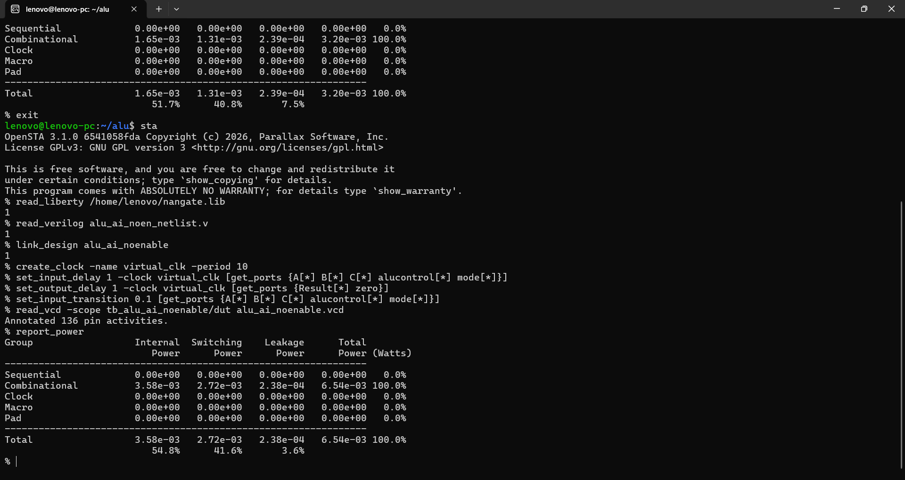
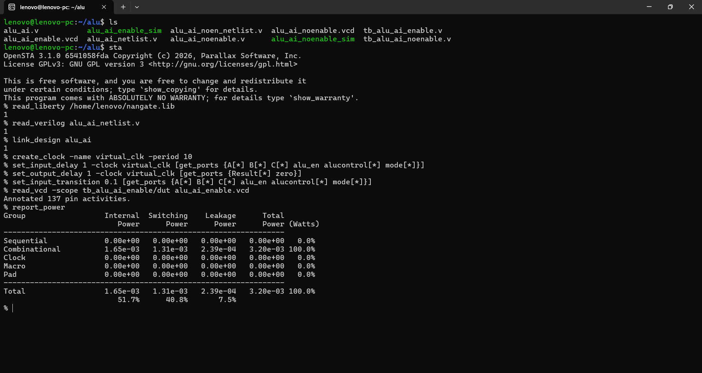
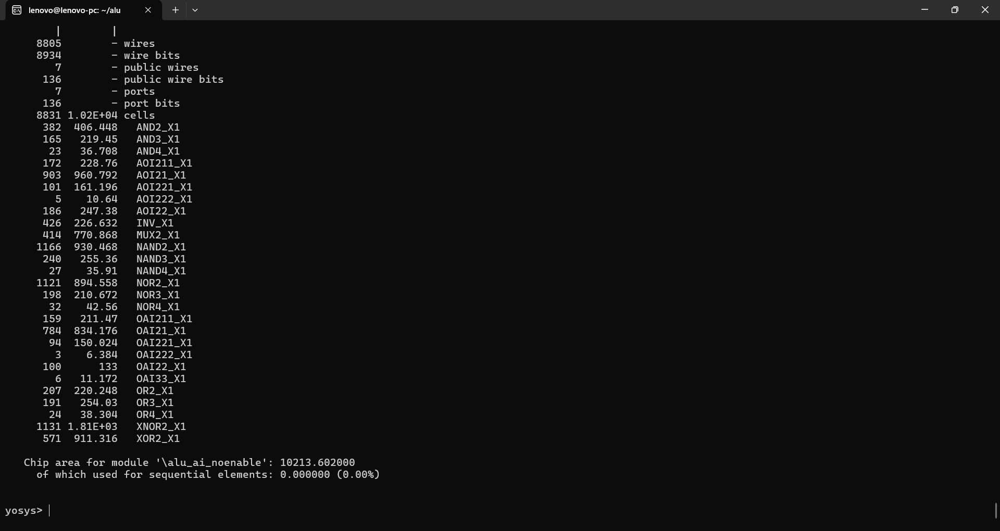
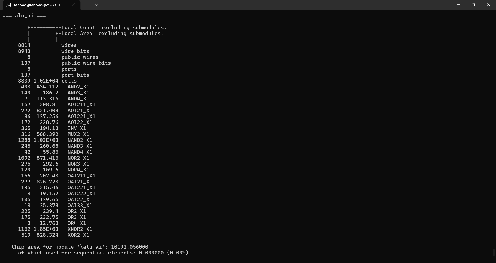
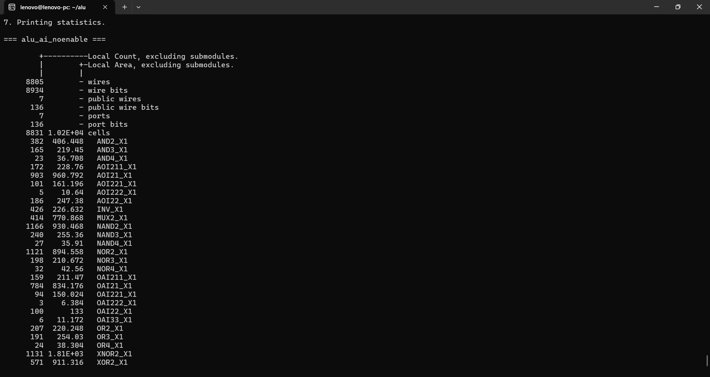
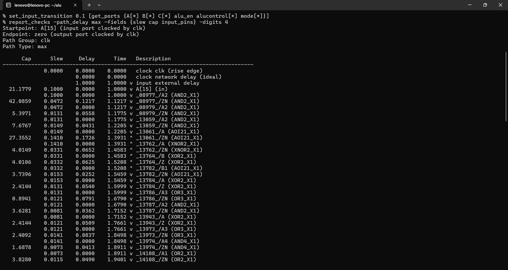
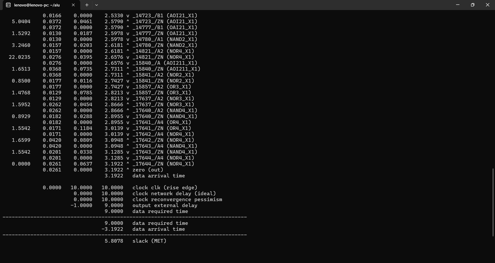
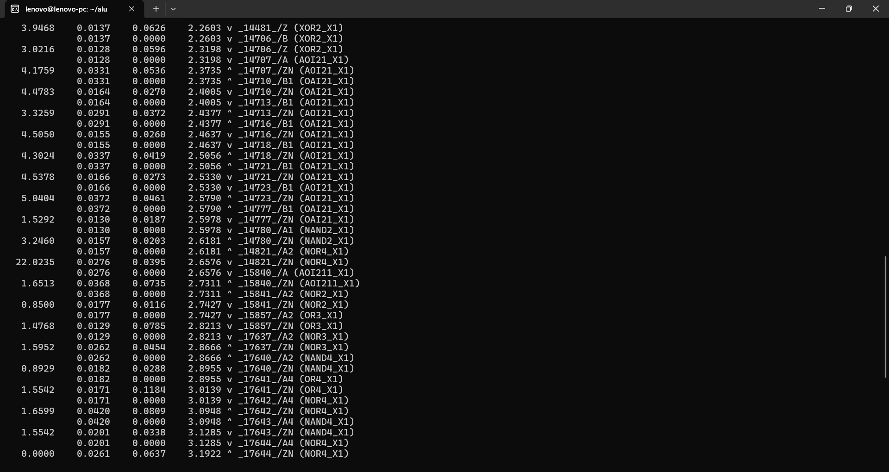
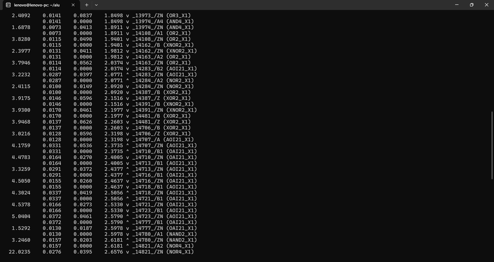

# Power-Efficient RISC-V ALU with Custom AI ISA Extensions

## Overview

This project implements and analyzes a **power-efficient RISC-V-oriented Arithmetic Logic Unit (ALU)** with support for **custom AI ISA extensions**.

The design is evaluated through an open-source ASIC-oriented flow and compares two implementations:

- **Baseline ALU** – implementation without enable-based activity reduction.
- **Optimized ALU** – implementation using enable/control logic to reduce unnecessary switching activity.

The design was simulated, synthesized, and analyzed for **power, area, and timing**.

---

# Project Objective

The objective of this project is to explore how RTL-level architectural optimization and custom AI-oriented operations can improve computational efficiency while reducing unnecessary switching activity.

The project includes:

- RTL design using Verilog
- RISC-V-oriented ALU operation support
- Custom AI ISA extension support
- Functional simulation
- VCD generation for switching activity
- Logic synthesis using Yosys
- Area analysis
- Static Timing Analysis using OpenSTA
- VCD-based power analysis
- Comparison between baseline and optimized implementations

---

# Custom AI ISA Extensions

Modern AI and machine-learning workloads often require repetitive arithmetic and data-processing operations. Custom AI ISA extensions can allow frequently used operations to be implemented directly in hardware instead of requiring multiple general-purpose instructions.

## Benefits of Custom AI Instructions

### 1. Reduced Instruction Count

A custom AI instruction can combine operations that would otherwise require multiple standard instructions.

This can reduce:

- Instruction fetches
- Instruction decoding
- Register accesses
- Intermediate operations

As a result, an AI-oriented workload can potentially execute with fewer instructions.

### 2. Improved Performance

Dedicated instructions can complete specialized operations more efficiently than executing the same functionality through a sequence of general-purpose instructions.

This can improve:

- Execution efficiency
- Computational throughput
- Performance for targeted AI workloads

### 3. Improved Energy Efficiency

Reducing the number of instructions and unnecessary intermediate operations can reduce switching activity across parts of the processor.

Potential benefits include:

- Fewer instruction executions
- Reduced unnecessary datapath activity
- Reduced switching in control and arithmetic logic
- Better energy efficiency for targeted operations

### 4. Hardware Acceleration for Targeted Operations

Custom instructions allow the processor datapath to be optimized for specific computational patterns.

Instead of relying entirely on software sequences, selected operations can be supported directly by dedicated RTL logic.

### 5. Architectural Flexibility

Custom ISA extensions allow a designer to adapt a processor or ALU to application-specific requirements.

This approach is particularly useful for:

- AI accelerators
- Edge computing
- Embedded systems
- Application-specific processors

> **Note:** The exact performance and energy benefits of custom AI instructions depend on the specific instructions implemented and the workload being executed.

---

# Power-Efficient RTL Optimization

The optimized ALU implementation uses enable/control logic to reduce unnecessary switching activity when computation is not required.

This provides an RTL-level approach to improving power efficiency without requiring a significant increase in synthesized area.

---

# Power Analysis

Power analysis was performed using **OpenSTA** with switching activity annotated from generated VCD files.

## Baseline ALU

**Total Power: 6.54 × 10⁻³ W (6.54 mW)**

### Power Breakdown

| Power Component | Power (W) | Percentage |
|---|---:|---:|
| Internal Power | 3.58 × 10⁻³ | 54.8% |
| Switching Power | 2.72 × 10⁻³ | 41.6% |
| Leakage Power | 2.38 × 10⁻⁴ | 3.6% |
| **Total Power** | **6.54 × 10⁻³** | **100%** |



---

## Optimized ALU

**Total Power: 3.20 × 10⁻³ W (3.20 mW)**

### Power Breakdown

| Power Component | Power (W) | Percentage |
|---|---:|---:|
| Internal Power | 1.65 × 10⁻³ | 51.7% |
| Switching Power | 1.31 × 10⁻³ | 40.8% |
| Leakage Power | 2.39 × 10⁻⁴ | 7.5% |
| **Total Power** | **3.20 × 10⁻³** | **100%** |



---

## Power Comparison

| Design | Total Power |
|---|---:|
| Baseline ALU | 6.54 mW |
| Optimized ALU | 3.20 mW |

### Observed Result

Under the analyzed simulation activity and applied constraints, the optimized implementation reduced the reported total power from **6.54 mW to 3.20 mW**.

This corresponds to an observed reduction of approximately **51%**.

> The reported power values depend on the applied standard-cell library, timing constraints, and switching activity extracted from the VCD simulation.

---

# Area Analysis

Area analysis was performed using **Yosys synthesis statistics**.

## Baseline ALU Area

**Chip Area: 10213.602**



---

## Optimized ALU Area

**Chip Area: 10192.056**



---

## Area Comparison

| Design | Chip Area |
|---|---:|
| Baseline ALU | 10213.602 |
| Optimized ALU | 10192.056 |

| Comparison Metric | Result |
|---|---:|
| Area Reduction | Approximately 0.21% |
| Area Overhead | None observed in this synthesis result |

The optimized implementation maintains nearly the same synthesized area while showing a small area reduction.

---

# Timing Analysis

Static Timing Analysis was performed using **OpenSTA**.

## Timing Results

| Design | Slack | Status |
|---|---:|---|
| Baseline ALU | **+5.8338 ns** | **MET** |
| Optimized ALU | **+5.8078 ns** | **MET** |

Both implementations show positive timing slack, indicating that the analyzed timing paths meet the applied timing requirement.

### Baseline ALU Timing

**Slack: +5.8338 ns (MET)**

### Optimized ALU Timing

**Slack: +5.8078 ns (MET)**



---

# Detailed OpenSTA Timing Screenshots

The following screenshots show the timing constraints and detailed timing-path information used during the OpenSTA analysis.

## Timing Constraints and Path Setup



## Detailed Timing Path – Part 1



## Detailed Timing Path – Part 2



## Detailed Timing Path – Part 3



---

# Design Flow

```text
RTL Design (Verilog)
        |
        v
Functional Simulation
        |
        v
VCD Generation
        |
        v
Yosys Synthesis
        |
        +--> Area Analysis
        |
        v
OpenSTA
        |
        +--> Static Timing Analysis
        |
        +--> VCD-Based Power Analysis
        |
        v
Results Comparison
```

---

# Tools Used

- **Verilog** – RTL Design
- **Yosys** – Logic Synthesis and Area Analysis
- **OpenSTA** – Static Timing and Power Analysis
- **VCD** – Switching Activity Annotation
- **Standard Cell Liberty Library** – Timing and power characterization

---

# Key Results

| Metric | Baseline ALU | Optimized ALU | Observation |
|---|---:|---:|---|
| Total Power | 6.54 mW | 3.20 mW | Approximately 51% observed reduction |
| Chip Area | 10213.602 | 10192.056 | Approximately 0.21% reduction |
| Timing Slack | +5.8338 ns | +5.8078 ns | Both designs meet timing |
| Sequential Elements | — | 0.00% reported area | Combinational ALU implementation |

- Approximately **51% observed reduction in reported total power** under the analyzed activity and constraints
- **Positive timing slack for both implementations**
- Baseline timing slack: **+5.8338 ns**
- Optimized timing slack: **+5.8078 ns**
- Synthesized area maintained at approximately **10.2k area units**
- Small area reduction in the optimized implementation
- Custom AI ISA extension concept integrated into the ALU architecture
- Complete open-source ASIC-oriented design flow

---

# Conclusion

This project demonstrates a **power-efficient RISC-V-oriented ALU architecture with custom AI ISA extensions** and RTL-level switching activity optimization.

Custom AI instructions can improve efficiency for targeted computational workloads by reducing instruction overhead and enabling specialized hardware operations. In addition, the enable-based RTL optimization reduced unnecessary switching activity.

Under the analyzed simulation activity and applied constraints, the optimized implementation reduced the reported total power from **6.54 mW to 3.20 mW**, while maintaining nearly the same synthesized area and meeting the applied timing requirement.

The project demonstrates the following ASIC-oriented design flow:

```text
RTL → Simulation → VCD → Synthesis → STA → Power Analysis
```
