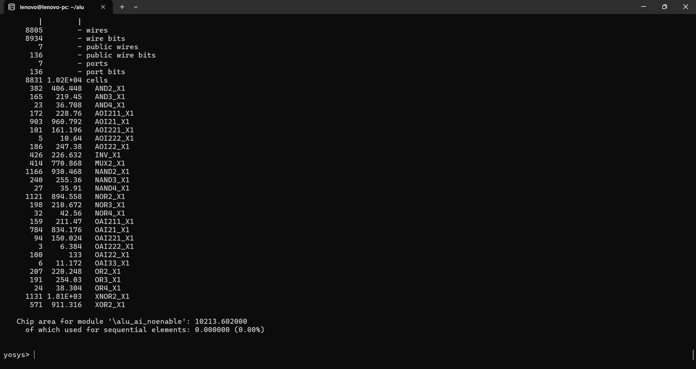
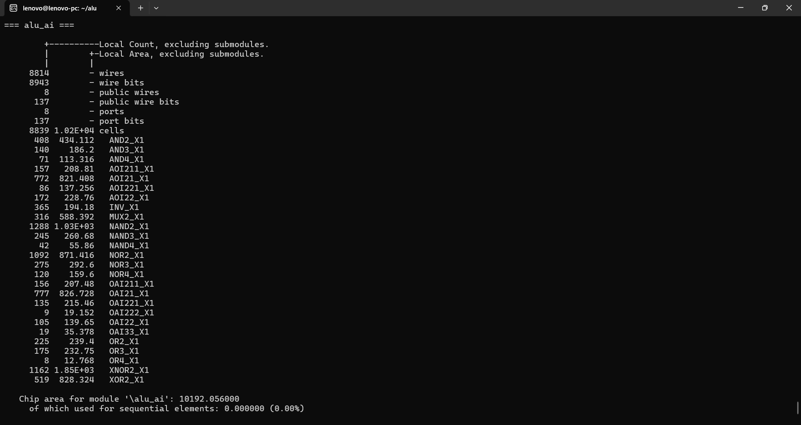
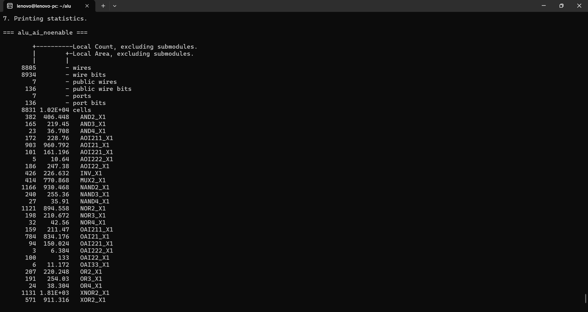
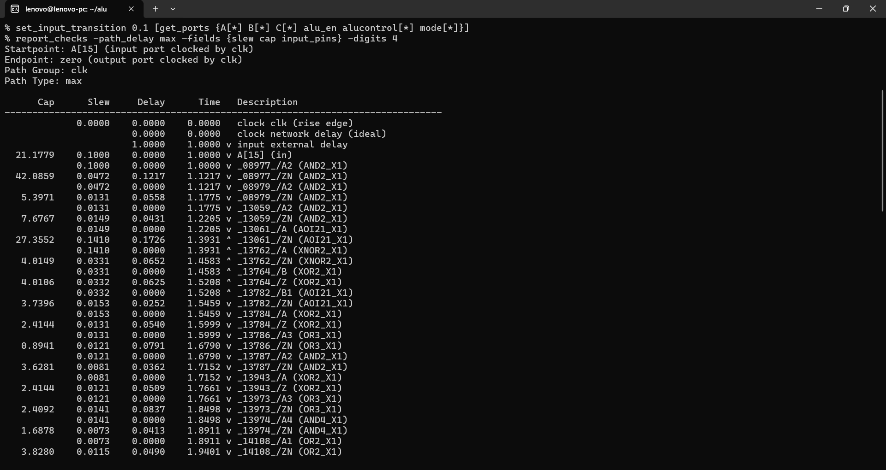
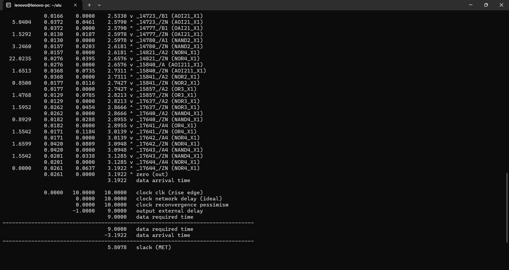
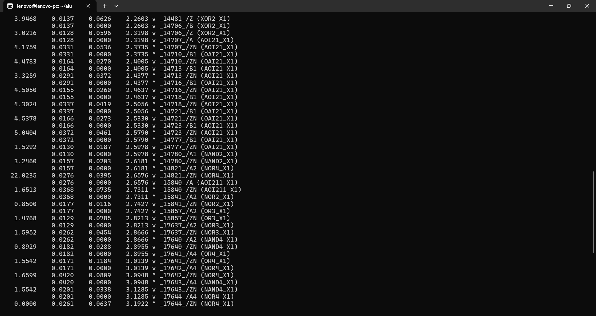
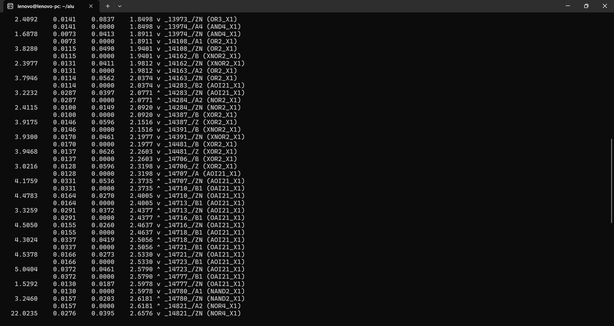
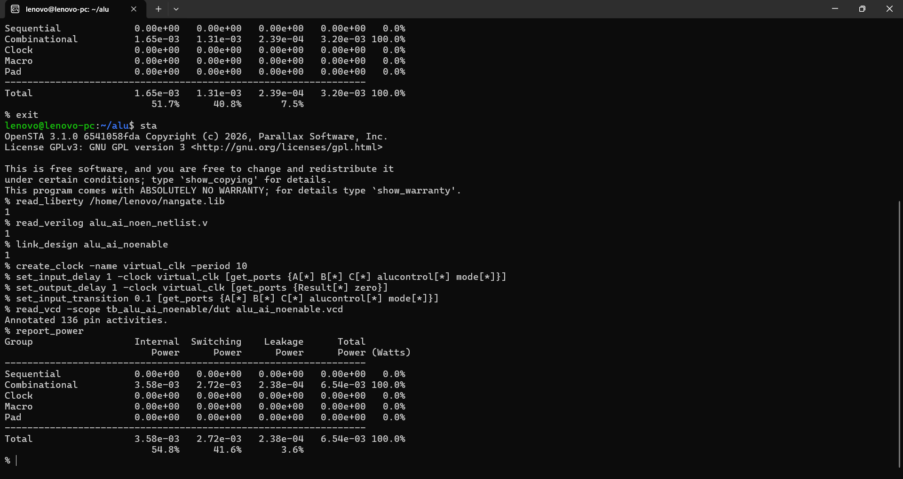
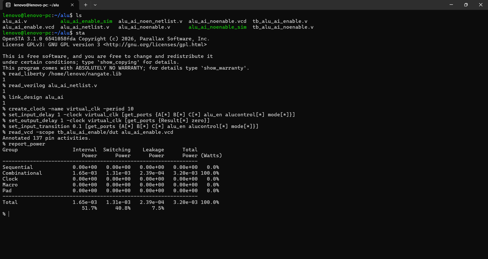

# Power-Efficient 32-bit ALU with Custom AI/DSP Extensions

## Overview

This project implements a synthesizable **32-bit RISC-V-oriented ALU** with custom arithmetic, logical, comparison, multiply/accumulate, and AI/DSP-style operations.

The ALU was evaluated in two implementations:

- **Baseline ALU:** no operand isolation
- **Optimized ALU:** operand isolation using `alu_en`

The same functional workload and the same analysis constraints were used for the comparison.

> **Primary result:** the optimized ALU reduced reported **total power by 51.07%**, from **6.54 mW to 3.20 mW**, while reducing **switching power by 51.84%**, with essentially unchanged synthesized area.

---

## 1. What the ALU Does

The ALU is a multi-mode 32-bit datapath supporting:

- R4 three-input operations
- R3 two-input operations
- R2 single-input operations
- I-type/address operations
- Custom AI/DSP operations

The four operating modes are:

| `mode` | Operation class |
|---|---|
| `00` | R4 / three-input |
| `01` | R3 / two-input + AI |
| `10` | R2 / single-input + AI |
| `11` | I-type / address (`A op C`) |

The current optimized standalone ALU uses a single `alu_en` signal to isolate all three data operands:

```verilog
assign SrcA = alu_en ? A : 32'b0;
assign SrcB = alu_en ? B : 32'b0;
assign SrcC = alu_en ? C : 32'b0;
```

This means that when the ALU is not required, changing operand inputs do not propagate into the arithmetic datapath.

> **Important scope:** this standalone ALU result represents **operand isolation using `alu_en`**. It is distinct from the later processor-level ALU implementation, where the integrated processor additionally uses `ALUEnable`, operand-specific enables, and control-signal isolation.

---

## 2. Supported Operations

### R4 — Three-Input Operations

```text
ADD        A + B + C
SUB        A - B - C
OR         A | B | C
AND        A & B & C
NAND       ~(A & B & C)
NOR        ~(A | B | C)
XOR        A ^ B ^ C
XNOR       ~(A ^ B ^ C)
XOR-AND    (A & B) ^ C
NOT-AND-XOR ~((A & B) ^ C)
NOT-OR-AND  ~(A | B) & C
AND-NOT2    A & ~B & ~C
INC         A + B + C + 3
DEC         A + B + C - 3
MAX         signed maximum of A, B, C
MIN         signed minimum of A, B, C
MAC         (A * B) + C
MSC         (A * B) - C
```

### R3 — Two-Input Operations

```text
ADD
SUB
OR
AND
NAND
NOR
XOR
XNOR
AND-NOT
OR-NOT
INC
DEC
SLL
SLT
SRL
SRA
SGT
MAX
MIN
MUL
```

### AI/DSP Operations

The ALU also includes custom AI-oriented operations:

**VADD8**

Performs four independent 8-bit lane additions:

```text
[A31:24] + [B31:24]
[A23:16] + [B23:16]
[A15:8]  + [B15:8]
[A7:0]   + [B7:0]
```

**VMAX8**

Performs four independent signed INT8 maximum operations.

**SDOTP4**

Computes a signed 4-lane INT8 dot product:

```text
A0×B0 + A1×B1 + A2×B2 + A3×B3
```

**VRELU8**

Applies ReLU independently to four signed 8-bit lanes:

```text
negative lane → 0
non-negative lane → unchanged
```

### R2 Operations

```text
NEG
ABS
NOT
INC
DEC
VRELU8
```

### I-Type Operations

```text
ADD
SUB
OR
AND
XOR
SLL
SRL
SRA
```

---

# 3. Power Optimization

The optimized implementation adds operand isolation before the ALU datapath.

### Baseline

```text
A ───────────────→ ALU
B ───────────────→ ALU
C ───────────────→ ALU
```

### Optimized

```text
A ──→ isolation ──→ ALU
B ──→ isolation ──→ ALU
C ──→ isolation ──→ ALU
             ↑
           alu_en
```

When `alu_en = 0`, `SrcA`, `SrcB`, and `SrcC` are forced to zero.

The optimization is intended to reduce unnecessary internal transitions and switching activity when the ALU is idle.

---

# 4. Verification

A self-checking testbench was used to exercise:

- Scalar arithmetic
- Logical operations
- Multiply
- MAC
- I-type arithmetic
- VADD8
- VMAX8
- SDOTP4
- VRELU8
- Disabled periods with changing inputs

During disabled periods, the testbench changes the input operands while `alu_en = 0`, allowing the isolation effect to be observed in the VCD power analysis.

The optimized testbench generates:

```text
alu_ai_enable.vcd
```

The baseline testbench generates:

```text
alu_ai_noenable.vcd
```

---

# 5. Synthesis / Area

Both designs were synthesized with the Nangate standard-cell library.

| Metric | Baseline | Optimized |
|---|---:|---:|
| Chip Area | **10,213.602** | **10,192.056** |
| Sequential Area | 0 | 0 |
| Area Difference | — | **-21.546** |
| Area Change | — | **0.21%** |

The optimized ALU does **not** introduce an area overhead in this synthesis result. Instead, it is approximately **0.21% smaller**.

### Baseline Area



### Optimized Area



---

# 6. Static Timing Analysis

OpenSTA was used with a 10 ns virtual clock and the applied input/output timing constraints.

The key maximum-path results were:

| Design | Worst Slack | Status |
|---|---:|---|
| Baseline | **+5.8338 ns** | MET |
| Optimized | **+5.8078 ns** | MET |

Difference:

```text
5.8078 - 5.8338 = -0.0260 ns
```

The optimized version therefore has only **0.026 ns lower maximum-path slack**, which is approximately **0.45%** of the baseline slack.

Both designs comfortably meet the 10 ns timing requirement.

### Timing Analysis



### Timing Constraints



### Detailed Timing Path







---

# 7. Gate-Level Power Analysis

Power was evaluated with OpenSTA using switching activity from the corresponding VCD.

## Baseline ALU

| Power Component | Power |
|---|---:|
| Internal | **3.58 mW** |
| Switching | **2.72 mW** |
| Leakage | **0.238 mW** |
| **Total** | **6.54 mW** |



## Optimized ALU

| Power Component | Power |
|---|---:|
| Internal | **1.65 mW** |
| Switching | **1.31 mW** |
| Leakage | **0.239 mW** |
| **Total** | **3.20 mW** |



---

# 8. Power Comparison

| Metric | Baseline | Optimized | Change |
|---|---:|---:|---:|
| **Total Power** | **6.54 mW** | **3.20 mW** | **51.07% reduction** |
| **Switching Power** | **2.72 mW** | **1.31 mW** | **51.84% reduction** |
| Internal Power | 3.58 mW | 1.65 mW | **53.91% reduction** |
| Leakage Power | 0.238 mW | 0.239 mW | ~0.42% increase |

### Primary Observation

The most important result is the reduction in **dynamic power**.

```text
Switching Power:
2.72 mW → 1.31 mW
```

This is a reduction of approximately:

# **51.84%**

The total estimated power changes from:

```text
6.54 mW → 3.20 mW
```

for an observed reduction of approximately:

# **51.07%**

The near-constant leakage confirms that the large power improvement is dominated by reductions in internal and switching activity rather than leakage changes.

---

# 9. PPA Summary

| Metric | Baseline | Optimized | Result |
|---|---:|---:|---|
| **Area** | 10,213.602 | 10,192.056 | **0.21% lower** |
| **Total Power** | 6.54 mW | 3.20 mW | **51.07% lower** |
| **Switching Power** | 2.72 mW | 1.31 mW | **51.84% lower** |
| Internal Power | 3.58 mW | 1.65 mW | **53.91% lower** |
| Leakage Power | 0.238 mW | 0.239 mW | ~0.42% higher |
| Max Slack | 5.8338 ns | 5.8078 ns | **0.026 ns lower** |
| Timing | MET | MET | Clean |

---

# 10. Why the Result Matters

The goal of the optimization is not merely to reduce gate count. The ALU contains substantial arithmetic and AI/DSP logic, including multiplication and multiple lane-wise operations. When the ALU is not being used, allowing operand transitions to propagate through this combinational datapath can cause unnecessary internal switching.

Operand isolation changes this behavior by holding the ALU's internal operand inputs at constants during disabled periods.

The measured result demonstrates:

**~51.84% lower switching power**

while maintaining:

**~10.2k synthesized area**

and essentially unchanged timing.

This is a useful example of a practical RTL-level low-power technique.

---

# 11. ASIC-Oriented Flow

```text
                Verilog RTL
                    │
                    ▼
            Functional Simulation
                    │
                    ▼
                  VCD
                    │
                    ▼
              Yosys Synthesis
                    │
           ┌────────┴────────┐
           ▼                 ▼
         Area              Netlist
                               │
                               ▼
                            OpenSTA
                         ┌─────┴─────┐
                         ▼           ▼
                       STA         Power
```

### Tools

- Verilog
- Icarus Verilog
- GTKWave
- Yosys
- OpenSTA
- Nangate standard-cell library
- VCD-based activity annotation

---

# 12. Relationship to the Full Processor

This standalone ALU is a major datapath block of the larger **32-bit custom-ISA processor**.

At processor level, the ALU supports the custom instruction classes and AI/DSP extensions that are integrated into the processor's decoder and register-file architecture.

The standalone study demonstrates the effectiveness of operand isolation at the arithmetic block level; the complete processor study extends the same low-power design philosophy across multiple datapath and control blocks.

---

# 13. Final Takeaway

The optimized ALU demonstrates that **operand isolation can substantially reduce dynamic power without requiring a significant area penalty**.

Under the evaluated workload and standard-cell conditions:

> **51.84% reduction in switching power**
>
> **51.07% reduction in total estimated power**
>
> **0.21% reduction in synthesized area**
>
> **0.026 ns reduction in reported maximum-path slack**
>
> **Both implementations meet timing**

The result is especially relevant to the broader processor project because **switching-power reduction is the primary objective of the low-power RTL architecture**.
