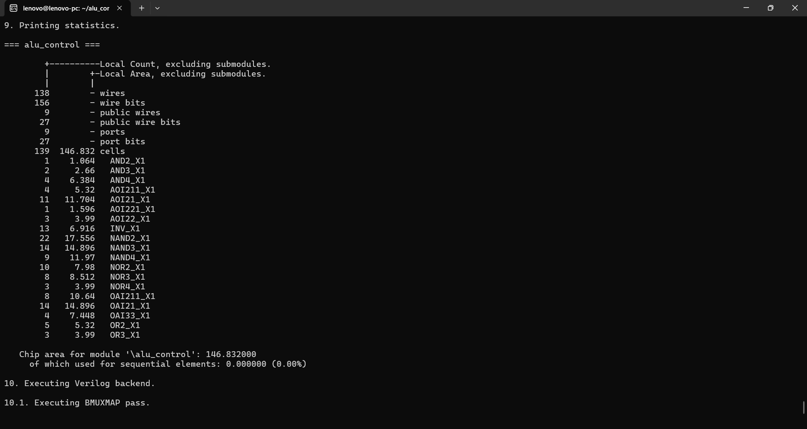
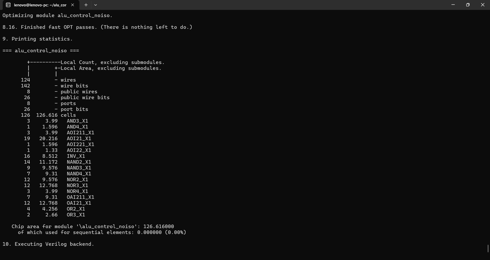
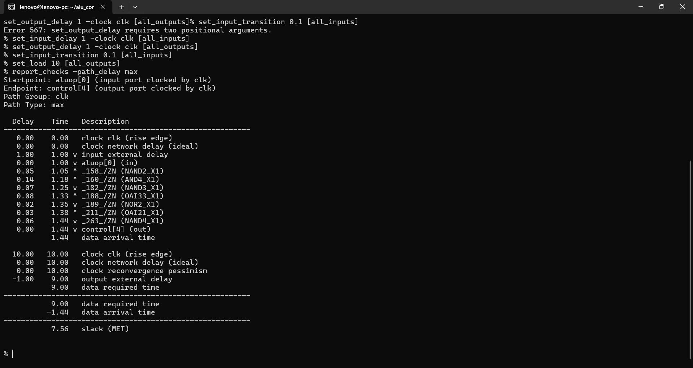
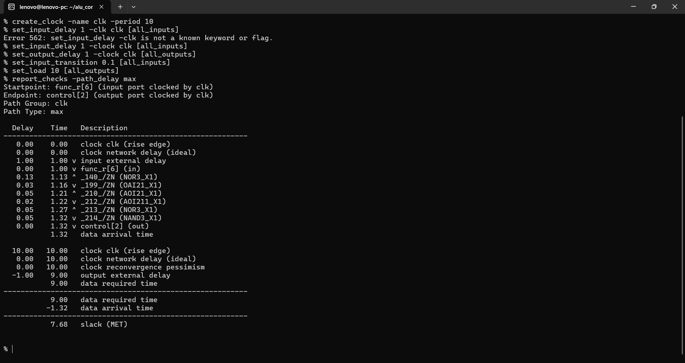
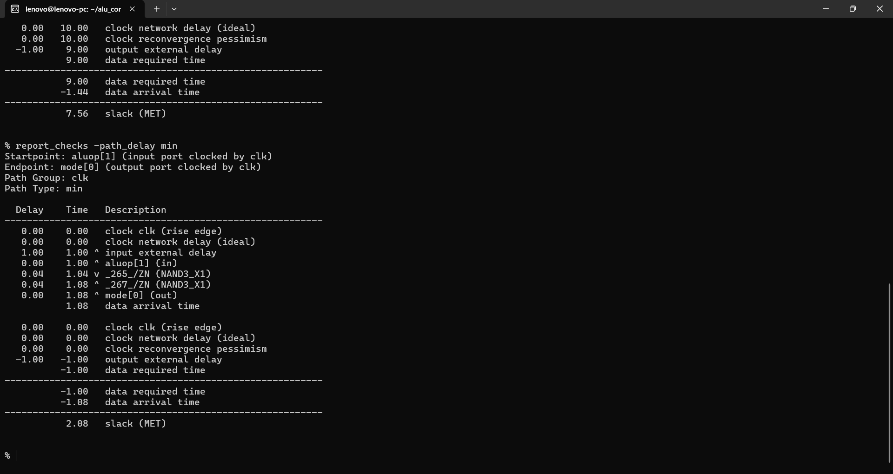
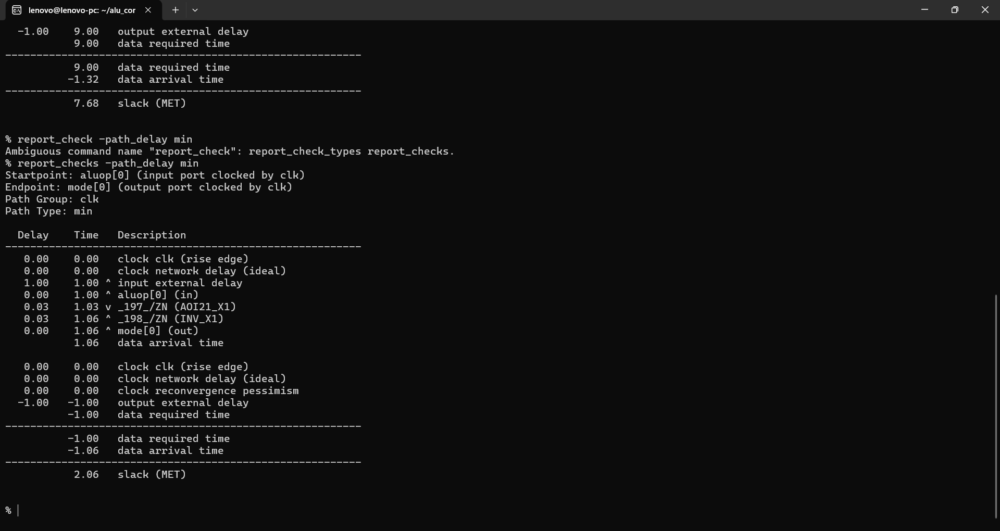
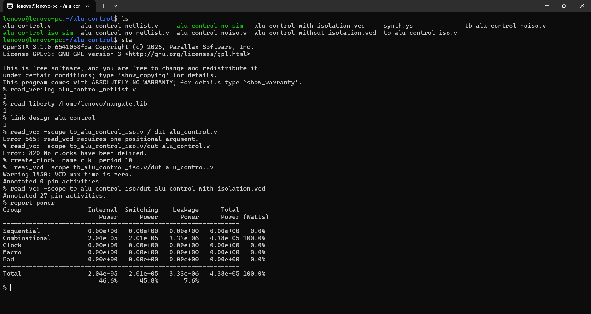
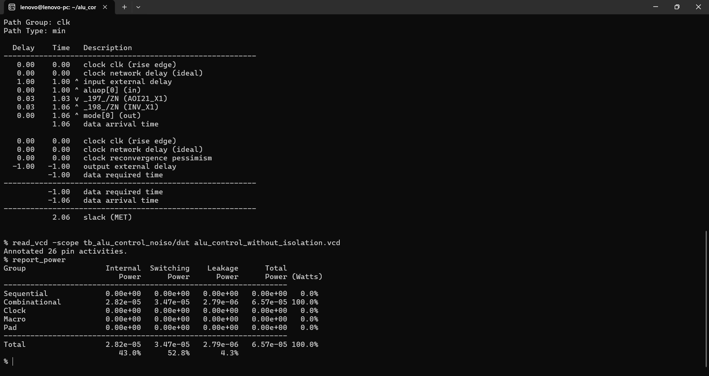

# Power-Aware ALU Control Unit

A synthesizable, combinational **ALU Control Unit** for a custom 32-bit processor. The block decodes the instruction-class control (`ALUOp`) together with the appropriate function field and generates the ALU operation, operand enables, and ALU operating mode.

This repository contains **two RTL implementations** of the same ALU Control function:

1. **With input/control isolation** using `ALUEnable`
2. **Without input/control isolation**

Both implementations were evaluated using synthesis, static timing analysis (STA), and VCD-based power analysis. The functional workload was kept the same for the power comparison.

---

## 1. Architecture

The ALU Control receives instruction-class information from the main decoder and generates:

- `mode[1:0]`
- `control[4:0]`
- `alu_enA`
- `alu_enB`
- `alu_enC`

The isolated version additionally receives:

- `ALUEnable`

### ALUOp Encoding

| `ALUOp` | Instruction class | `mode` |
|---|---|---|
| `0001` | Load / Store address generation | `11` |
| `0010` | R4 | `00` |
| `0011` | R4 MOV | `11` |
| `0100` | R3I | `00` |
| `0101` | R3 | `01` |
| `0110` | R2 | `10` |
| `0111` | R2 MOV | `11` |
| `1000` | I-type | `11` |

---

## 2. Function / ALU Control Mapping

### R4

| Function | Internal `control` |
|---|---|
| ADD | `00000` |
| SUB | `00001` |
| OR | `00010` |
| AND | `00011` |
| NAND | `00100` |
| NOR | `00101` |
| XOR | `00110` |
| XNOR | `00111` |
| XOR-AND | `10110` |
| NOT-AND-XOR | `10101` |
| NOT-OR-AND | `11001` |
| AND-NOT2 | `11010` |
| INC | `01001` |
| DEC | `01010` |
| MAX | `01100` |
| MIN | `01101` |
| MAC | `01110` |
| MSC | `01111` |

> In the R4 ALU implementation, the `INC`/`DEC` function IDs map to the implemented three-input forms `A+B+C+3` and `A+B+C-3`.

### R3 + AI Extensions

| Function | Internal `control` |
|---|---|
| ADD | `00000` |
| SUB | `00001` |
| OR | `00010` |
| AND | `00011` |
| NAND | `00100` |
| NOR | `00101` |
| XOR | `00110` |
| XNOR | `00111` |
| INC | `01001` |
| DEC | `01010` |
| SLL | `10000` |
| SLT | `10001` |
| SRL | `10010` |
| SRA | `10011` |
| SGT | `10100` |
| MAX | `01100` |
| MIN | `01101` |
| MUL | `11111` |
| VADD8 | `10111` |
| VMAX8 | `11000` |
| SDOTP4 | `11101` |

### R2 + AI Extension

| Function | Internal `control` |
|---|---|
| NEG | `00000` |
| ABS | `00001` |
| NOT | `01000` |
| INC | `01001` |
| DEC | `01010` |
| VRELU8 | `10110` |

### I-type

| Function | Internal `control` |
|---|---|
| ADD | `00000` |
| SUB | `00001` |
| OR | `00010` |
| AND | `00011` |
| XOR | `00110` |
| SLL | `10000` |
| SRL | `10010` |
| SRA | `10011` |

The design reserves:

```verilog
5'b11110   // RESERVED / INVALID
```

while:

```verilog
5'b11111   // valid MUL control
```

This prevents invalid function values from accidentally decoding as multiplication.

---

# 3. Power-Aware Isolation

The **with-isolation** implementation uses `ALUEnable` to isolate:

- `aluop`
- `func_r`
- `func_i`

when the ALU subsystem is inactive.

The **without-isolation** implementation removes `ALUEnable` completely and feeds:

```text
aluop
func_r
func_i
```

directly into the decode logic.

This creates a controlled A/B comparison:

```text
                    Same functional workload
                             │
              ┌──────────────┴──────────────┐
              │                             │
       With isolation                Without isolation
       ALUEnable present             ALUEnable removed
              │                             │
              └──────────────┬──────────────┘
                             │
                    Compare PPA results
```

---

# 4. Verification

Separate self-checking Verilog testbenches are included for the two implementations.

### With isolation

`alu_control_with_isolation_tb.v`

### Without isolation

`alu_control_without_isolation_tb.v`

Both testbenches use the same functional vectors and the same deterministic pseudo-random workload. The isolated version additionally drives `ALUEnable`; during inactive periods the shared control inputs continue changing so the isolation effect can be observed in the power analysis.

VCD files generated by the two testbenches are:

```text
alu_control_with_isolation.vcd
alu_control_without_isolation.vcd
```

---

# 5. Synthesis and PPA Comparison

Both implementations were synthesized using the Nangate standard-cell library flow.

## Area

| Metric | With Isolation | Without Isolation |
|---|---:|---:|
| Cells | 139 | 126 |
| Area | **146.832** | **126.616** |
| Sequential cells | 0 | 0 |
| Wires | 138 | 124 |
| Wire bits | 156 | 142 |
| Ports | 9 | 8 |
| Port bits | 27 | 26 |

The isolation implementation adds approximately **15.97% area** relative to the no-isolation implementation.

### With Isolation



### Without Isolation



---

# 6. Static Timing Analysis

STA was performed using a 10 ns virtual clock with input/output delay, input transition, and output load constraints.

```tcl
create_clock -name clk -period 10

set_input_delay 1 -clock clk [all_inputs]
set_output_delay 1 -clock clk [all_outputs]

set_input_transition 0.1 [all_inputs]
set_load 10 [all_outputs]
```

> The ALU Control is a purely combinational block, so the clock is used as a virtual timing reference for input-to-output paths.

## Maximum-delay results

| Metric | With Isolation | Without Isolation |
|---|---:|---:|
| Worst max slack | **7.56 ns** | **7.68 ns** |
| Timing status | MET | MET |

### With Isolation

Worst reported path:

```text
Startpoint : aluop[0]
Endpoint   : control[4]
Slack      : 7.56 ns
```



### Without Isolation

Worst reported path:

```text
Startpoint : func_r[6]
Endpoint   : control[2]
Slack      : 7.68 ns
```



## Minimum-delay results

| Metric | With Isolation | Without Isolation |
|---|---:|---:|
| Worst min slack | **2.08 ns** | **2.06 ns** |
| Timing status | MET | MET |

### With Isolation

Worst reported path:

```text
Startpoint : aluop[1]
Endpoint   : mode[0]
Slack      : 2.08 ns
```



### Without Isolation

Worst reported path:

```text
Startpoint : aluop[0]
Endpoint   : mode[0]
Slack      : 2.06 ns
```



### Timing observation

The two implementations have very similar timing under the evaluated constraints. Both meet the 10 ns timing target with substantial positive slack.

---

# 7. Power Comparison

Power was estimated using OpenSTA with VCD activity from the corresponding testbench.

The same workload was applied to the two versions so that the comparison focuses on the effect of isolation.

## Results

| Power component | With Isolation | Without Isolation | Change |
|---|---:|---:|---:|
| Internal | 20.4 µW | 28.2 µW | **27.7% reduction** |
| Switching | 20.1 µW | 34.7 µW | **42.1% reduction** |
| Leakage | 3.33 µW | 2.79 µW | **19.4% increase** |
| **Total** | **43.8 µW** | **65.7 µW** | **33.3% reduction** |

### Headline result

> **Input/control isolation reduced total estimated ALU Control power from 65.7 µW to 43.8 µW, a 33.3% reduction under the evaluated workload and analysis conditions.**

The strongest improvement is in switching power, which decreased by approximately **42.1%**.

The isolation implementation also introduces additional cells, so leakage power increased in this experiment. This is an explicit area/leakage versus dynamic-power trade-off.

### With Isolation



### Without Isolation



---

# 8. PPA Summary

| Metric | With Isolation | Without Isolation |
|---|---:|---:|
| Area | 146.832 | 126.616 |
| Max slack | 7.56 ns | 7.68 ns |
| Min slack | 2.08 ns | 2.06 ns |
| Total power | 43.8 µW | 65.7 µW |
| Switching power | 20.1 µW | 34.7 µW |

### Design trade-off

The isolated implementation:

- increases area by approximately **15.97%**
- keeps timing clean
- reduces switching power by approximately **42.1%**
- reduces total estimated power by approximately **33.3%**

This is a block-level example of **power-aware RTL optimization with quantified PPA trade-offs**.

---

# 9. Source Files

### RTL

- [ALU Control — With Isolation](alu_control_with_isolation.v)
- [ALU Control — Without Isolation](alu_control_without_isolation.v)

### Testbenches

- [Testbench — With Isolation](alu_control_with_isolation_tb.v)
- [Testbench — Without Isolation](alu_control_without_isolation_tb.v)

---

# 10. Tools / Flow

- Verilog RTL
- Icarus Verilog — functional simulation
- GTKWave — waveform inspection
- Yosys — synthesis
- OpenSTA — static timing analysis and power estimation
- Nangate standard-cell library
- VCD-based switching activity annotation

---

# 11. Project Context

This ALU Control Unit is part of a larger custom 32-bit processor project containing a custom instruction set, RTL datapath, ALU, register file, immediate generation, memory interface, and power-aware optimization experiments.

The goal of this block-level study is not only to implement correct instruction decoding, but also to quantify the implementation impact of adding control/input isolation before integrating the optimized block into the complete processor.
