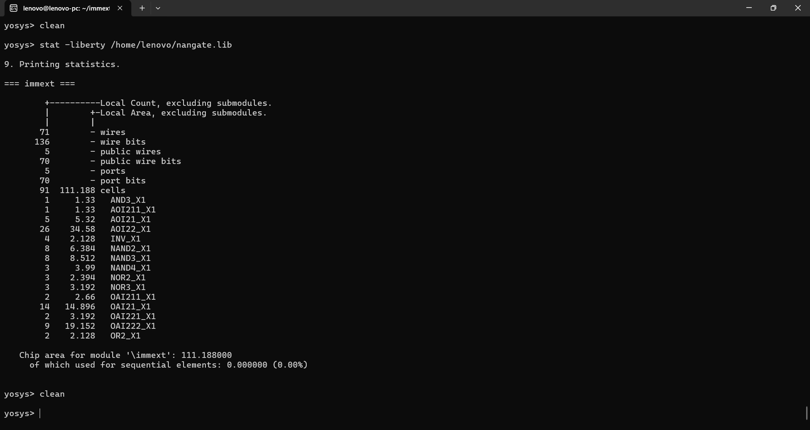
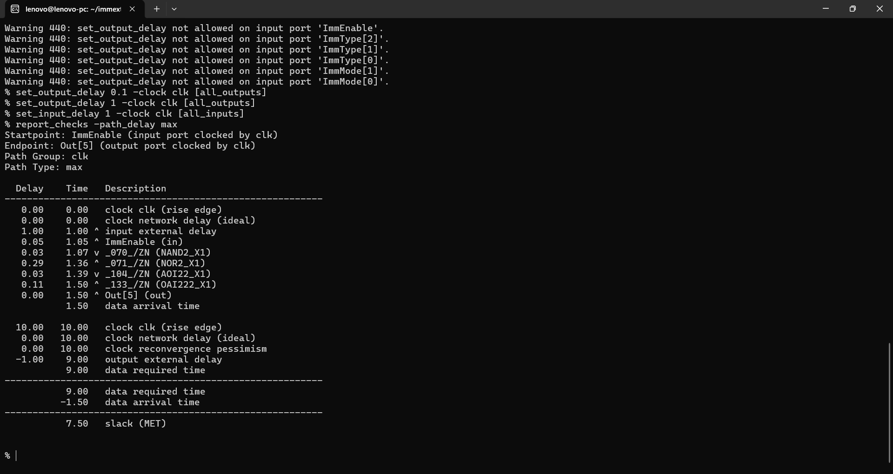
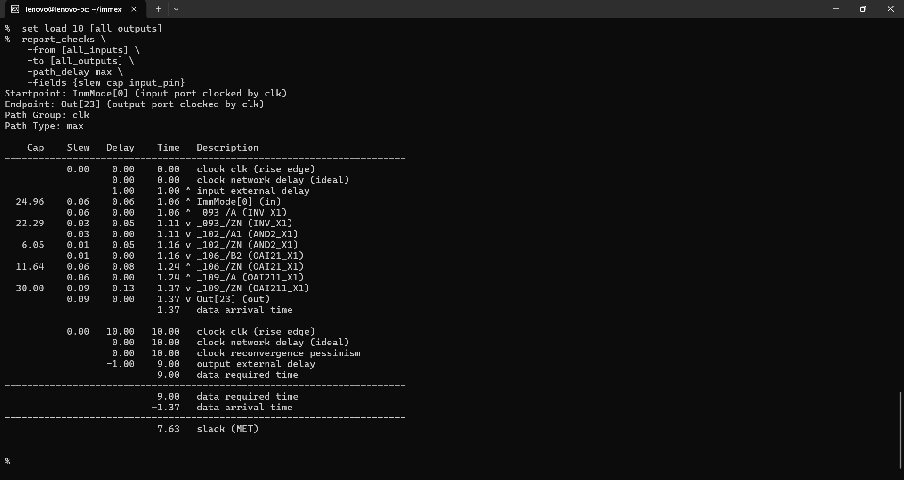
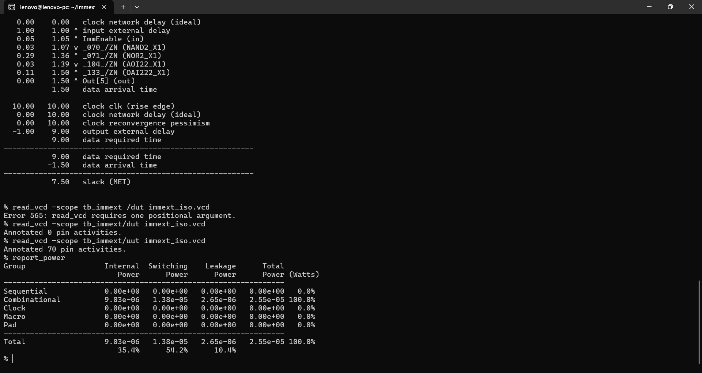
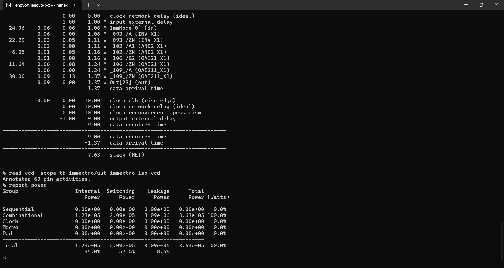

# Power-Aware Immediate Generator (Custom ISA)

A power-aware **Immediate Generation (IMMEXT)** unit for a custom 32-bit ISA, implemented in synthesizable Verilog and evaluated using **Yosys** and **OpenSTA** with the Nangate 45nm standard-cell library.

The design compares two implementations:

1. **With input isolation** using `ImmEnable`, `ImmType`, and `ImmMode`
2. **Without isolation** as the baseline

The objective is to reduce unnecessary switching activity in the combinational immediate-generation logic when an immediate is not required.

---

## 1. Custom ISA Immediate Formats

The immediate generator follows the custom ISA field layout:

```text
I-Type : FUNC[31:27] | IMM[26:15] | RS1[14:10] | RD[9:5] | OPCODE[4:0]
S-Type : FUNC[31:27] | IMM[26:15] | RS1[14:10] | RD[9:5] | OPCODE[4:0]
B-Type : FUNC[31:27] | IMM[26:15] | RS1[14:10] | RD[9:5] | OPCODE[4:0]
J-Type : IMM[31:10]  | RD[9:5]     | OPCODE[4:0]
```

The immediate generator uses:

```text
ImmType
000 = NONE
001 = I-Type
010 = S-Type
011 = B-Type
100 = J-Type
```

and:

```text
ImmMode
00 = Sign extension
01 = Zero extension
10 = Shifted sign extension
11 = Custom pattern
```

## 2. Integration in the Custom Processor

The `immext` block is used as the **immediate-generation unit in the custom 32-bit processor datapath**.

The processor decoder decodes the instruction opcode and generates the immediate-control signals:

```text
Instruction
     │
     ▼
  Decoder
     │
     ├── ImmEnable
     ├── ImmType
     └── ImmMode
             │
             ▼
        ┌─────────┐
        │  IMMEXT │
        └────┬────┘
             │
             ▼
        Immediate
             │
             ├──► ALU operand path
             ├──► Address generation
             └──► Branch / jump target calculation
```

The immediate generator itself does **not need to decode the raw opcode again**. This keeps instruction decoding centralized in the decoder and makes the immediate unit modular within the processor datapath.

For the current custom ISA:

- **I-Type, S-Type and B-Type** use `instruction[26:15]` as a 12-bit immediate field.
- **J-Type** uses `instruction[31:10]` as a 22-bit immediate field.
- `ImmType` selects the immediate format.
- `ImmMode` selects the extension/transformation mode.
- `ImmEnable` controls whether the immediate-generation datapath is active.

---

## 3. Power Optimization Technique

The isolated implementation introduces:

```verilog
assign instruction_iso = ImmEnable ? instruction : 32'b0;
assign ImmType_iso     = ImmEnable ? ImmType     : 3'b000;
assign ImmMode_iso     = ImmEnable ? ImmMode     : 2'b00;
```

When `ImmEnable = 0`, the immediate-generation logic receives constant values instead of continuously changing instruction/control inputs.

This is intended to reduce unnecessary combinational switching.

The baseline implementation performs the same immediate-generation function without the isolation logic.

## 3.1 Useful Design Attributes

Key attributes of the `immext` unit:

- **Synthesizable Verilog RTL** suitable for integration into the processor datapath.
- **Purely combinational implementation** with no sequential storage, making it suitable for direct timing and power analysis.
- **Parameterized output width** through the `Width` parameter.
- **Modular control interface** using `ImmEnable`, `ImmType`, and `ImmMode`.
- **Custom-ISA aware**: immediate extraction matches the processor's I/S/B/J instruction formats rather than relying on a fixed ISA encoding.
- **Power-aware design** through input/control isolation when an immediate is not required.
- **Reusable architecture**: the same immediate-generation block can serve ALU-immediate instructions, memory/address operations, branches, and jumps.
- **Implementation-oriented evaluation**: synthesis area, STA delay/slack, and VCD-based power are measured at the standard-cell level.

---

## 4. Implementation Flow

### RTL Simulation

The two implementations were tested separately using Icarus Verilog with equivalent workloads.

### Synthesis

Yosys synthesis was performed using the Nangate standard-cell library.

### Static Timing Analysis

OpenSTA was used with:

```tcl
create_clock -name clk -period 10

set_input_delay 1 -clock clk [all_inputs]
set_output_delay 1 -clock clk [all_outputs]

set_driving_cell -lib_cell INV_X1 [all_inputs]
set_load 10 [all_outputs]
```

The 10 ns clock is used as a virtual timing reference for the combinational block.

### Power Analysis

OpenSTA `read_vcd` was used to annotate switching activity from the simulation VCDs, followed by `report_power`.

The workloads were kept equivalent between the isolated and non-isolated implementations.

---

## 5. Synthesis Results

| Metric | With Isolation | Without Isolation |
|---|---:|---:|
| Standard cells | **91** | 117 |
| Area | **111.188** | 127.946 |
| Sequential area | 0 | 0 |

The isolated implementation synthesized to fewer cells and lower reported area for this specific RTL/library/optimization flow.

### Area change

Area reduction:

```text
(127.946 - 111.188) / 127.946 × 100
≈ 13.1%
```

So the isolated implementation has approximately **13.1% lower synthesized area** in this experiment.

---

## 6. Static Timing Results

### With Isolation

```text
Worst path:
ImmEnable → Out[5]

Data arrival time = 1.50 ns
Data required time = 9.00 ns
Worst-path combinational delay = 0.50 ns
Slack = 7.50 ns
```

### Without Isolation

```text
Worst path:
ImmMode[0] → Out[23]

Data arrival time = 1.37 ns
Data required time = 9.00 ns
Worst-path combinational delay = 0.37 ns
Slack = 7.63 ns
```

### Timing comparison

| Metric | With Isolation | Without Isolation |
|---|---:|---:|
| Worst-path delay | 0.50 ns | **0.37 ns** |
| Slack | 7.50 ns | **7.63 ns** |
| Timing status | MET | MET |

The isolation logic adds approximately **0.13 ns** to the reported worst-path delay, while both implementations meet the 10 ns timing budget under the stated STA constraints.

---

## 7. Power Results

### With Isolation

```text
Internal power   = 9.03 µW
Switching power  = 13.8 µW
Leakage power    = 2.65 µW
Total power      = 25.5 µW
```

Breakdown:

```text
Internal   = 35.4%
Switching  = 54.2%
Leakage    = 10.4%
```

### Without Isolation

```text
Internal power   = 12.3 µW
Switching power  = 20.9 µW
Leakage power    = 3.09 µW
Total power      = 36.3 µW
```

Breakdown:

```text
Internal   = 34.0%
Switching  = 57.5%
Leakage    = 8.5%
```

### Power comparison

| Metric | With Isolation | Without Isolation |
|---|---:|---:|
| Internal power | **9.03 µW** | 12.3 µW |
| Switching power | **13.8 µW** | 20.9 µW |
| Leakage power | **2.65 µW** | 3.09 µW |
| **Total power** | **25.5 µW** | 36.3 µW |

Total-power reduction:

```text
(36.3 - 25.5) / 36.3 × 100
≈ 29.8%
```

So, under the applied VCD workload, the isolated implementation shows approximately **29.8% lower total reported power**.

The switching component shows approximately **33.9% lower power**:

```text
(20.9 - 13.8) / 20.9 × 100
≈ 33.9%
```

---

## 8. Overall Comparison

| Metric | With Isolation | Without Isolation |
|---|---:|---:|
| Area | **111.188** | 127.946 |
| Cell count | **91** | 117 |
| Worst delay | 0.50 ns | **0.37 ns** |
| Slack | 7.50 ns | **7.63 ns** |
| Total power | **25.5 µW** | 36.3 µW |

### Result

For this implementation and workload, adding input/control isolation to the immediate generator resulted in:

- **~29.8% lower total reported power**
- **~33.9% lower switching power**
- **~13.1% lower synthesized area**
- **0.13 ns additional worst-path delay**

Both implementations meet the defined timing budget.

---

## 9. Result Screenshots

### Area — With Isolation



> The uploaded area captures contain the same `111.188` isolated synthesis report; one duplicate capture is retained in the `results/` folder for completeness.

### STA — With Isolation



### STA — Without Isolation



### Power — With Isolation



### Power — Without Isolation



---

## 10. Tools Used

- Verilog HDL
- Icarus Verilog
- Yosys
- OpenSTA
- Nangate standard-cell library
- GTKWave

## 11. Project Structure

```text
immext_power_optimization/
├── immext.v
├── immext_noiso.v
├── tb_immext.v
├── tb_immext_noiso.v
├── results/
│   ├── area_with_isolation.png
│   ├── area_synthesis_duplicate_capture.png
│   ├── sta_with_isolation.png
│   ├── sta_without_isolation.png
│   ├── power_with_isolation.png
│   └── power_without_isolation.png
└── README.md
```

> **Note:** Power numbers are specific to the synthesized implementation, standard-cell library, timing assumptions, and VCD workload used in this experiment.
