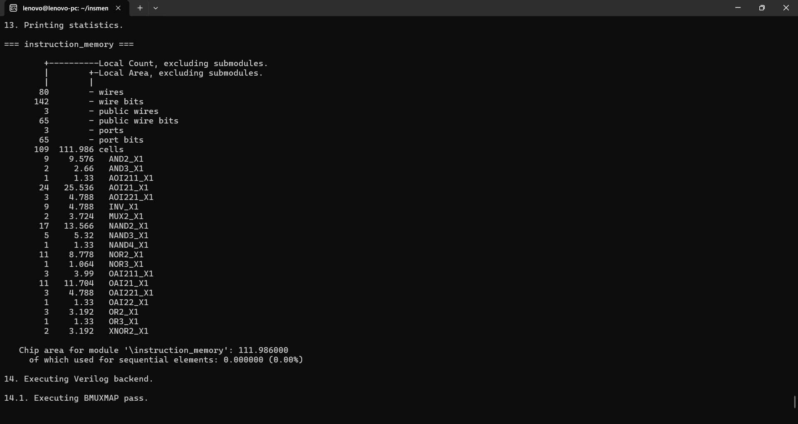
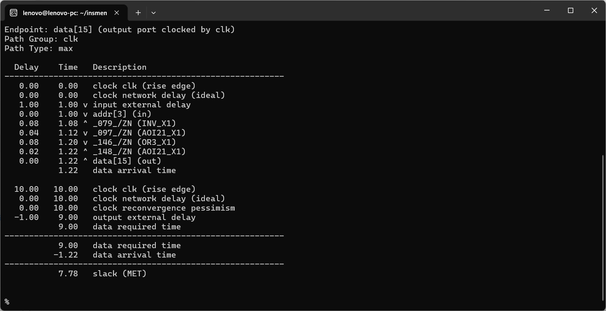
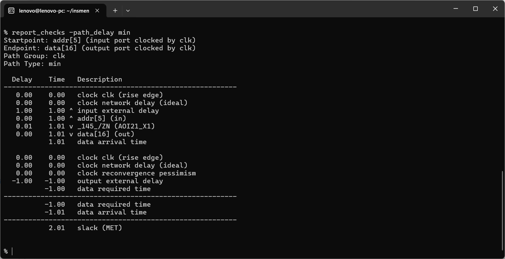

# 128×32 Instruction Memory — RTL, Synthesis & Static Timing Analysis

This project implements a **128-word × 32-bit instruction memory** for a custom 32-bit single-cycle RISC-V processor.

The memory uses an **asynchronous read interface** so that the instruction addressed by the current program counter is available combinationally in the same processor cycle. The memory contents are initialized from `program.hex` using Verilog `$readmemh`.

> **Important implementation note:** the synthesis results in this repository are **not the physical PPA of a 128×32 ROM macro**. The Nangate standard-cell flow used here does not provide a dedicated ROM or compiled-memory macro. Because this RTL has fixed initialized contents and no runtime write interface, Yosys optimized the initialized contents into ordinary combinational standard-cell logic. Therefore, the reported **111.986 area** is the area of that synthesized logic implementation, not the silicon area of a physical ROM macro.

---

## 1. RTL Implementation

```verilog
module instruction_memory #(
    parameter width = 32
)(
    input ren,
    input [width-1:0] addr,
    output wire [width-1:0] data
);

    reg [width-1:0] mem [0:127];

    initial begin
        $readmemh("program.hex", mem);
    end

    assign data = ren ? mem[addr[8:2]] : {width{1'b0}};

endmodule
```

### Interface

| Signal | Width | Function |
|---|---:|---|
| `addr` | 32 bits | Byte address supplied by the PC |
| `ren` | 1 bit | Enables the instruction read |
| `data` | 32 bits | Instruction output |

There is **no clock port** and **no runtime write port** in this implementation.

### Memory organization

- Depth: **128 words**
- Word width: **32 bits**
- Total capacity: **4096 bits = 512 bytes**
- Word index: `addr[8:2]`
- Addressable instruction words: **128**
- Read type: **asynchronous / combinational**
- Initialization: `$readmemh("program.hex", mem)`
- Runtime write interface: **none**
- Output when `ren = 0`: `32'b0`

Using `addr[8:2]` means addresses are treated as byte addresses while the memory is indexed by 32-bit words.

---

## 2. Why Asynchronous Read?

The processor is a **single-cycle** design, so the instruction needs to be available during the same cycle in which the current PC value is used for instruction fetch.

The intended fetch path is:

```text
PC register
    │
    ▼
Instruction Memory
    │
    ▼
32-bit instruction
    │
    ▼
Decoder / Register File / Datapath
```

A synchronous-read instruction memory would introduce a registered read output and therefore add a cycle of instruction-fetch latency, which would change the current single-cycle microarchitecture.

---

## 3. Program Initialization

The instruction contents are loaded with:

```verilog
$readmemh("program.hex", mem);
```

`program.hex` contains one 32-bit hexadecimal word per line. `$readmemh` initializes the memory at simulation time; it is **not a processor runtime write operation**.

The exact synthesized combinational logic can depend on the contents of `program.hex`, because Yosys can propagate and optimize constant initialized values.

---

# 4. Yosys Synthesis Results

The RTL was synthesized and mapped to the available Nangate standard-cell library.

### Yosys summary

| Metric | Result |
|---|---:|
| Memory organization | **128 × 32** |
| Wires | **80** |
| Wire bits | **142** |
| Public wires | **3** |
| Public wire bits | **65** |
| Ports | **3** |
| Port bits | **65** |
| Total mapped cells | **109** |
| Sequential area | **0.000** |
| Sequential area percentage | **0.00%** |
| Synthesized chip area | **111.986** |

### Mapped standard-cell breakdown

| Cell | Count |
|---|---:|
| `AND2_X1` | 9 |
| `AND3_X1` | 2 |
| `AOI211_X1` | 1 |
| `AOI21_X1` | 24 |
| `AOI221_X1` | 3 |
| `INV_X1` | 9 |
| `MUX2_X1` | 2 |
| `NAND2_X1` | 17 |
| `NAND3_X1` | 5 |
| `NAND4_X1` | 1 |
| `NOR2_X1` | 11 |
| `NOR3_X1` | 1 |
| `OAI211_X1` | 3 |
| `OAI21_X1` | 11 |
| `OAI221_X1` | 3 |
| `OAI22_X1` | 1 |
| `OR2_X1` | 3 |
| `OR3_X1` | 1 |
| `XNOR2_X1` | 2 |

## 5. What the Yosys Result Actually Represents

Yosys does **not** report this as a physical memory macro in the current flow.

There are several reasons:

1. The available Nangate standard-cell library does not contain a dedicated 128×32 ROM macro.
2. The RTL has a fixed initialization from `program.hex`.
3. There is no runtime write interface that requires storage to remain writable.
4. Yosys can therefore constant-propagate and optimize the initialized contents and map the resulting Boolean logic into ordinary standard cells.

As a result:

- **111.986** is a valid area figure for the synthesized **standard-cell logic implementation** produced by this particular flow and program image.
- It is **not** the physical area of a fabricated 128×32 ROM macro.
- The exact cell count, area, and timing can change when `program.hex` contents change.
- A real ASIC implementation using a ROM/compiler macro should use that macro's characterized **area, timing, power, and physical views** instead.

This distinction is important when reporting the result in a project portfolio or resume.

### Yosys screenshot



The screenshot shows the mapped cell counts, total cell count, synthesized area, and zero sequential area reported by Yosys.

---

# 6. Static Timing Analysis with OpenSTA

Because the instruction memory has **no clock pin and no sequential elements**, a real RTL clock cannot be attached to this standalone block.

For standalone I/O timing characterization, a **virtual clock** was therefore used:

```tcl
create_clock -name clk -period 10

set_input_delay -max 1 -clock clk [get_ports {addr[*] ren}]
set_input_delay -min 0 -clock clk [get_ports {addr[*] ren}]

set_output_delay -max 1 -clock clk [get_ports {data[*]}]
set_output_delay -min 0 -clock clk [get_ports {data[*]}]

set_input_transition 0.1 [get_ports {addr[*] ren}]
```

The virtual period is:

```text
10 ns = 100 MHz
```

This is an **I/O timing characterization** of the standalone combinational instruction-memory block. It is not a full processor timing result.

---

# 7. Maximum-Delay / Setup-Style Result

Command:

```tcl
report_checks -path_delay max
```

### Worst reported path

```text
Startpoint: addr[3]
Endpoint:   data[15]
Path Type:  max
```

| Metric | Result |
|---|---:|
| Input external delay | 1.00 ns |
| Internal combinational delay | ~0.22 ns |
| Data arrival time | **1.22 ns** |
| Data required time | **9.00 ns** |
| Slack | **+7.78 ns (MET)** |

The reported combinational path was:

```text
addr[3]
  ↓
INV_X1
  ↓
AOI21_X1
  ↓
OR3_X1
  ↓
AOI21_X1
  ↓
data[15]
```

The 9.00 ns required time comes from the 10 ns virtual clock period minus the 1 ns output delay:

```text
10 ns - 1 ns = 9 ns
```

The reported arrival time is:

```text
1 ns input delay + ~0.22 ns logic delay = 1.22 ns
```

Therefore:

```text
9.00 ns - 1.22 ns = +7.78 ns
```

The result is **timing met** under the specified standalone I/O constraint.

### Maximum-delay screenshot



---

# 8. Minimum-Delay Result

Command:

```tcl
report_checks -path_delay min
```

### Worst reported path

```text
Startpoint: addr[5]
Endpoint:   data[16]
Path Type:  min
```

| Metric | Result |
|---|---:|
| Input external delay | 1.00 ns |
| Minimum internal logic delay | ~0.01 ns |
| Data arrival time | **1.01 ns** |
| Data required time | **-1.00 ns** |
| Slack | **+2.01 ns (MET)** |

The reported minimum path was approximately:

```text
addr[5]
  ↓
AOI21_X1
  ↓
data[16]
```

The positive slack means the minimum-delay constraint is met under the specified virtual-clock I/O constraints.

### Important interpretation

Because this instruction memory contains **no flip-flops**, this result is **not a conventional register-to-register hold check**.

It is better described as a:

> **minimum combinational input-to-output propagation-delay check**

for the standalone block.

### Minimum-delay screenshot



---

# 9. Overall Standalone Results

| Category | Result |
|---|---:|
| Memory size | **128 × 32 bits** |
| Capacity | **512 bytes** |
| Read style | **Asynchronous** |
| Yosys mapped cells | **109** |
| Yosys synthesized area | **111.986** |
| Sequential area | **0** |
| Virtual clock period | **10 ns / 100 MHz** |
| Worst max-path arrival | **1.22 ns** |
| Max-path slack | **+7.78 ns** |
| Worst min-path arrival | **1.01 ns** |
| Min-path slack | **+2.01 ns** |

Under the specified standalone I/O timing assumptions, both the maximum-delay and minimum-delay checks are reported as **MET**.

---

# 10. Limitations and Correct Interpretation

These numbers should be interpreted as **pre-layout, standard-cell-based standalone characterization** rather than final ASIC memory PPA.

### Yosys limitation

The synthesized **111.986 area** is the area of the Boolean standard-cell implementation generated for the initialized program image. It should not be quoted as the area of a real 128×32 ROM macro.

### Program-image dependency

Because the instruction memory contents come from `program.hex`, synthesis results can change with different program contents.

### STA limitation

The timing analysis uses a **virtual ideal clock** because the standalone instruction-memory block has no clock input. Clock tree delay, placement, routing parasitics, IR effects, and other post-layout effects are not included.

### Full-core timing

The most important timing result for the processor will come from integrating this block into the complete single-cycle RISC-V core.

For example, the actual critical path could involve:

```text
PC register
   ↓
Instruction memory
   ↓
Decoder
   ↓
Register file
   ↓
ALU / branch logic / data memory
   ↓
Writeback
   ↓
Register file
```

Therefore, the standalone instruction-memory slack does **not** by itself establish the maximum operating frequency of the whole processor.

---

# 11. Tool Flow

- **Yosys** — RTL synthesis and standard-cell mapping
- **OpenSTA** — static timing analysis
- **Nangate standard-cell library** — technology library used for the reported synthesis and STA
- **Verilog/SystemVerilog RTL** — instruction-memory implementation

The reported results are **pre-layout** and use an **ideal/virtual clock** for standalone timing characterization.
