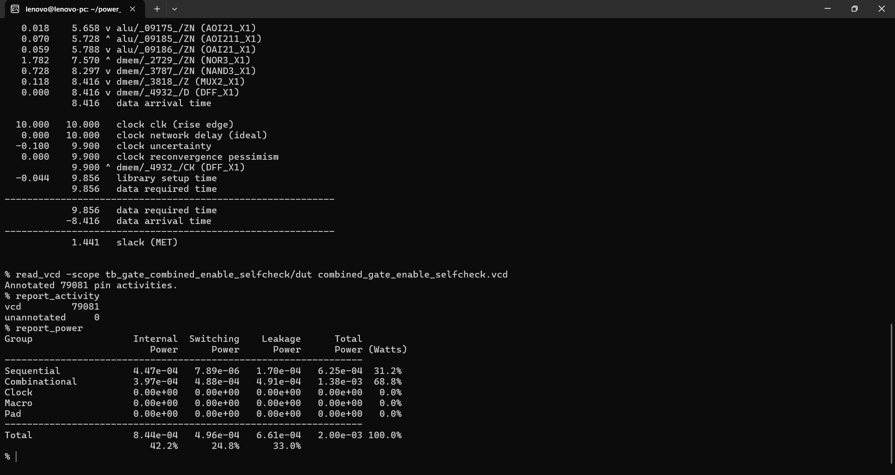
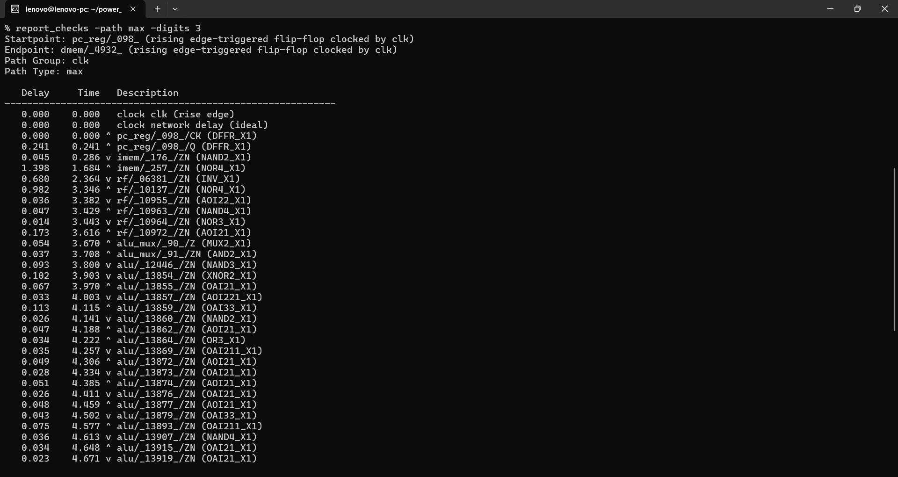
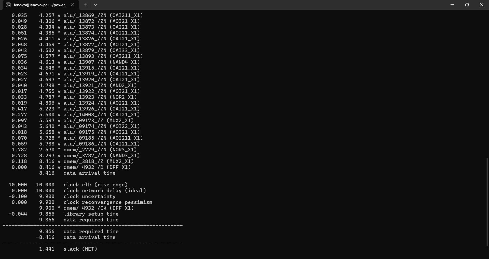
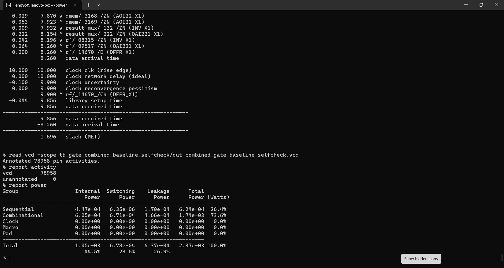
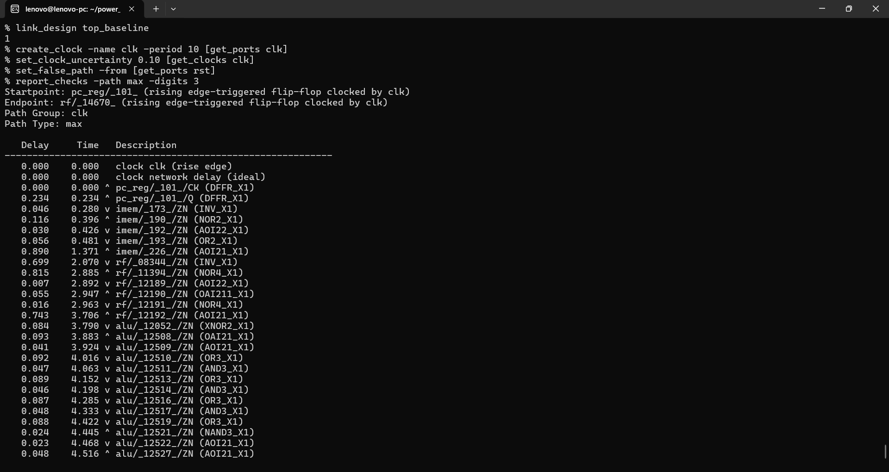

# Power-Aware RTL Processor: With-Enable vs No-Enable

## Overview

This experiment compares two implementations of the same 32-bit single-cycle custom RISC-like processor:

- **Baseline / No Enable:** operand and unit activity is not isolated.
- **With Enable:** RTL isolation/enables are used to reduce unnecessary switching in inactive datapath logic.

Both implementations were synthesized to the same **NanGate Open Cell Library** and evaluated with the **same clock constraints and the same mixed instruction workload**.

The comparison is based on:

1. Gate-level functional simulation
2. Synthesized area
3. Static timing analysis (STA)
4. Gate-level VCD power analysis

The gate-level simulations passed for both implementations before power analysis.

---

## Same Mixed Workload

The same `program.hex` was used for both designs.

The mixed workload exercises multiple datapath/control units rather than stressing only the R4 ALU. The verified instruction sequence includes:

`R4 ADD → R4 MAC → R3 VADD8 → R3 MUL → R3 SDOTP4 → R3I ADD → R2 NEG → R2 MOV → I ADDI → SW → LW → R3 VMAX8 → BEQ → JAL → JALR`

The control-flow sequence returns to the beginning of the mixed-workload block through JALR, and the simulation continues afterward to provide a power-analysis window.

This same workload is important because it makes the enable/no-enable comparison a controlled processor-level experiment.

---

## Gate-Level Functional Validation

### With Enable

The synthesized NanGate-mapped netlist passed the combined mixed-workload self-check:

- R4 ADD
- R4 MAC
- R3 VADD8
- R3 MUL
- R3 SDOTP4
- R3I ADD
- R2 NEG
- R2 MOV
- I ADDI
- SW
- LW
- R3 VMAX8
- BEQ
- JAL
- JALR
- JALR loop return

All checked results matched their expected values.

### No Enable

The baseline/no-enable synthesized gate-level netlist also passed the same mixed-workload self-check.

---

# Results

## 1. Area

| Metric | No Enable | With Enable | Change |
|---|---:|---:|---:|
| **Top-level area** | **31,692.038 µm²** | **33,253.458 µm²** | **+4.93%** |
| Sequential area | 10,078.208 µm² | 10,078.208 µm² | ~0% |
| Total cells | 20,712 | 20,842 | +130 |

The enable implementation increases area because isolation/enabling adds control and gating logic.

The area overhead is:

**1561.420 µm² (4.93%)**

---

## 2. Static Timing Analysis

Both designs were analyzed with:

- Clock period: **10 ns**
- Clock uncertainty: **0.10 ns**
- Library setup time used in the reported path: **0.044 ns**

### Timing comparison

| Metric | No Enable | With Enable |
|---|---:|---:|
| Critical path delay | **8.260 ns** | **8.416 ns** |
| Slack | **1.596 ns** | **1.441 ns** |
| Timing status | **MET** | **MET** |

The enable implementation increases the reported critical-path delay by:

**0.156 ns (1.89%)**

Slack decreases by:

**0.155 ns**

The timing impact is therefore relatively small in absolute terms, and both implementations still meet the 10 ns timing target.

### Estimated maximum frequency from the reported STA path

Using:

**Minimum clock period = data arrival + clock uncertainty + setup**

the corresponding estimated maximum frequencies are:

- **No Enable:** 118.99 MHz
- **With Enable:** 116.82 MHz

Therefore, for the **with-enable implementation**, the analyzed critical path corresponds to an estimated maximum clock frequency of approximately **116.8 MHz** under the same STA assumptions.

A **100 MHz clock** remains within the reported timing margin.

> The maximum-frequency values above are derived from the reported critical-path delay, 0.10 ns clock uncertainty, and 0.044 ns setup time. They are an STA-based estimate for this synthesized implementation/corner, not a silicon measurement.

---

## 3. Gate-Level Power Analysis

The most important result of this experiment is the reduction in **combinational power**, which is where operand/activity isolation is expected to have the largest effect.

### Total power

| Metric | No Enable | With Enable | Change |
|---|---:|---:|---:|
| **Total power** | **2.37 mW** | **2.00 mW** | **-15.61%** |
| Internal power | 1.05 mW | 0.844 mW | -19.62% |
| Switching power | 0.678 mW | 0.496 mW | -26.84% |
| Leakage power | 0.637 mW | 0.661 mW | +3.77% |

The total power reduction is approximately:

**15.61%**

---

## 4. Combinational Power — Main Observation

### Combinational power

| Metric | No Enable | With Enable | Reduction |
|---|---:|---:|---:|
| **Combinational total** | **1.74 mW** | **1.38 mW** | **20.69%** |
| Combinational internal | 0.605 mW | 0.397 mW | 34.38% |
| Combinational switching | 0.671 mW | 0.488 mW | 27.27% |
| Combinational leakage | 0.466 mW | 0.491 mW | +5.36% |

### Key result

**Combinational power falls from 1.74 mW to 1.38 mW, a reduction of approximately 20.69%.**

The strongest effect appears in the dynamic components of combinational power:

- **Combinational internal power:** down by approximately 34.38%
- **Combinational switching power:** down by approximately 27.27%

This supports the purpose of the enable/isolation logic: inactive datapath portions can avoid unnecessary internal activity and switching.

Leakage is slightly higher in the enable implementation because the additional isolation/control cells also contribute leakage.

---

## 5. Overall Area / Power / Timing Trade-off

| Parameter | No Enable | With Enable |
|---|---:|---:|
| **Area** | 31,692.038 µm² | 33,253.458 µm² |
| **Area change** | — | **+4.93%** |
| **Total power** | 2.37 mW | **2.00 mW** |
| **Total power change** | — | **-15.61%** |
| **Combinational power** | 1.74 mW | **1.38 mW** |
| **Combinational power change** | — | **-20.69%** |
| **Critical delay** | 8.260 ns | 8.416 ns |
| **Delay change** | — | **+1.89%** |
| **Slack** | 1.596 ns | 1.441 ns |
| **Estimated Fmax** | ~119.0 MHz | **~116.8 MHz** |

### Interpretation

The enable/isolation implementation trades a **4.93% area increase** and a small **0.156 ns increase in critical-path delay** for a **15.61% reduction in total power** under the same mixed workload.

Most importantly, the reduction is concentrated in the **combinational power**, which decreases by approximately **20.69%**. The dynamic combinational components also show clear reductions:

- Internal combinational power: **~34.38% lower**
- Switching combinational power: **~27.27% lower**

The timing impact is modest in absolute terms: the critical path moves from **8.260 ns to 8.416 ns**, and both designs still meet the 10 ns clock requirement.

---

## Power Analysis Coverage

### No Enable

- Annotated VCD pin activities: **78,958**
- Unannotated: **0**
- Total power: **2.37 mW**

### With Enable

- Annotated VCD pin activities: **79,081**
- Unannotated: **0**
- Total power: **2.00 mW**

The zero-unannotated result for both runs means the reported gate-level power analysis used complete VCD activity annotation for the analyzed design.

---

## Screenshots

### With Enable — Power

### With Enable — STA

### No Enable — Power

### No Enable — STA

---

## Conclusion

This processor-level experiment demonstrates a clear **power-vs-area/timing trade-off** for RTL activity isolation:

- The **with-enable implementation is larger** by approximately **4.93%**.
- The **total gate-level power decreases by approximately 15.61%**.
- **Combinational power decreases by approximately 20.69%**, which is the main benefit observed in this mixed workload.
- Combinational internal and switching power both decrease substantially.
- The critical-path delay increases by only **0.156 ns (1.89%)**.
- Both designs meet the **10 ns / 100 MHz** timing target.
- Based on the reported STA path and the same uncertainty/setup assumptions, the with-enable implementation has an estimated maximum frequency of approximately **116.8 MHz**.

The comparison is controlled by using the **same processor architecture, same technology library, same clock constraints, same program, and same mixed instruction workload** for both implementations.
