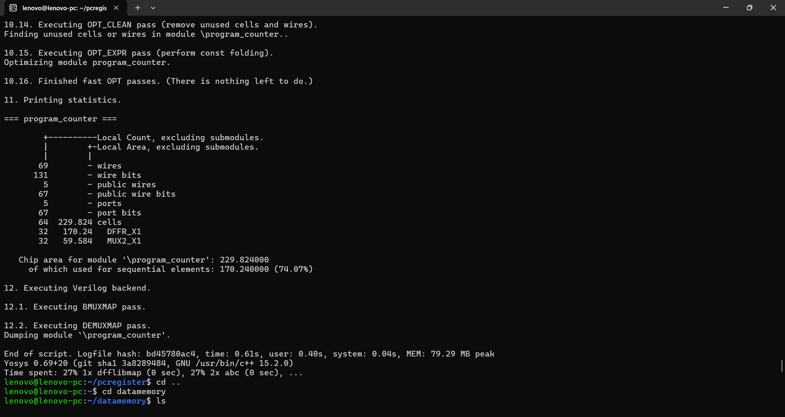
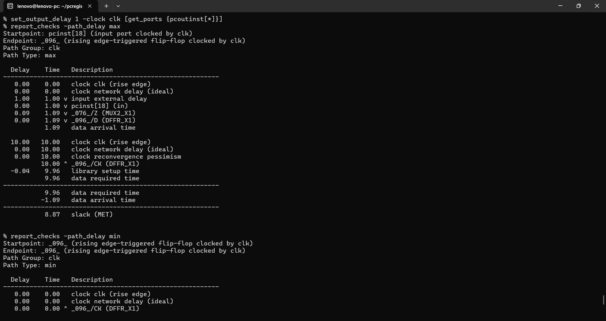
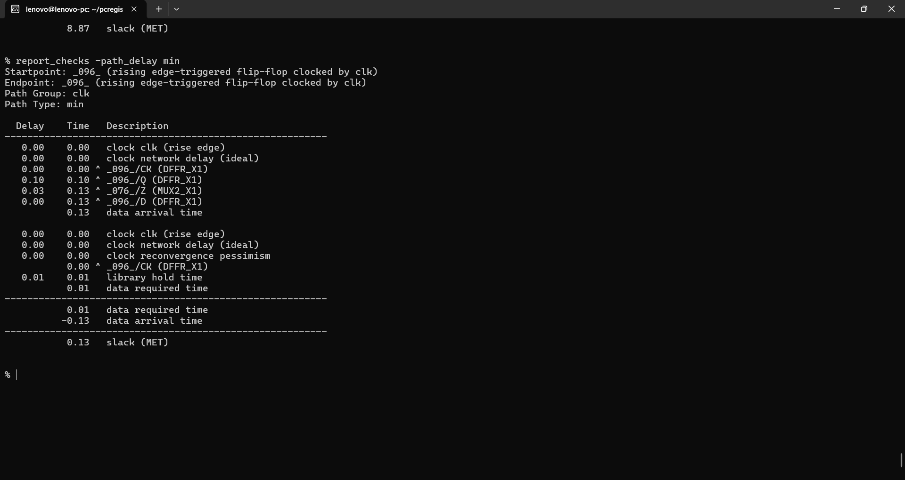
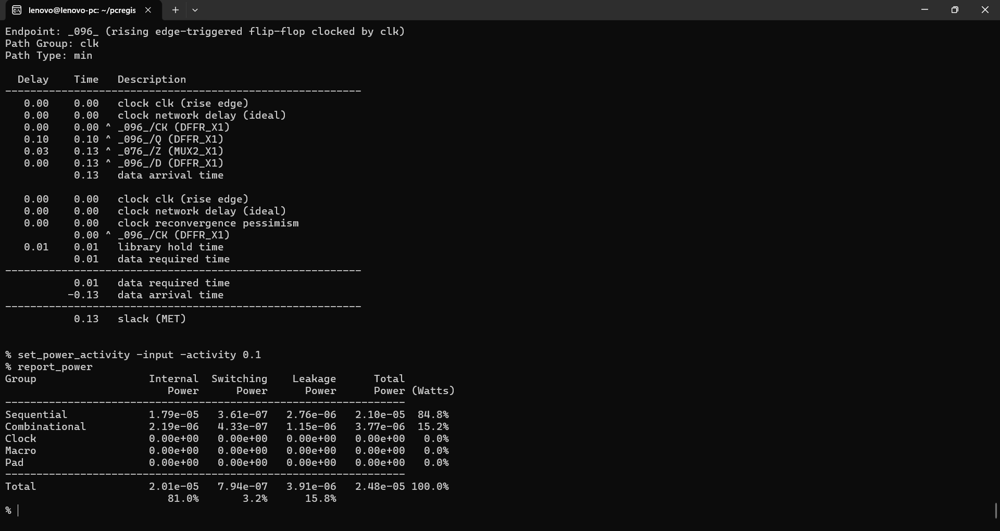

# Program Counter — RTL, Synthesis, STA & Power

## Overview

This project implements the **32-bit program counter** used in the RISC-V processor.

### RTL

```verilog
module program_counter(
    input        clk,
    input        rst_pc,
    input        pcen,
    input  [31:0] pcinst,
    output reg [31:0] pcoutinst
);

    always @(posedge clk or negedge rst_pc) begin
        if (!rst_pc)
            pcoutinst <= 32'd0;
        else if (pcen)
            pcoutinst <= pcinst;
    end

endmodule
```

The PC is a 32-bit rising-edge-triggered register with an active-low asynchronous reset and clock enable.

---

## Synthesis / Area

Technology mapping was performed using the **Nangate 45 nm Open Cell Library**.

### Yosys result

```text
Total cells:        64
DFFR_X1:            32
MUX2_X1:            32

Chip area:          229.824
Sequential area:    170.240
Sequential area:    74.07%
```

The asynchronous reset maps the 32 PC bits to `DFFR_X1` cells. The `pcen` enable is implemented using 32 `MUX2_X1` cells.

### Area screenshot



---

## Static Timing Analysis

OpenSTA analysis used:

```tcl
read_liberty /home/lenovo/nangate.lib
read_verilog program_counter_netlist.v
link_design program_counter

create_clock -name clk -period 10 [get_ports clk]

set_input_delay 1 -clock clk [get_ports {pcinst[*] pcen}]
set_input_transition 0.1 [get_ports {pcinst[*] pcen}]
set_output_delay 1 -clock clk [get_ports {pcoutinst[*]}]
```

The clock period is **10 ns**, corresponding to a **100 MHz target**. The clock network is treated as ideal for this pre-CTS analysis.

### Setup / max-delay

Worst reported path:

```text
Startpoint: pcinst[18]
Endpoint:   _096_ (DFFR_X1)

Input external delay:   1.00 ns
MUX2_X1 delay:          0.09 ns
Data arrival time:      1.09 ns

Clock period:          10.00 ns
Library setup time:     0.04 ns
Data required time:     9.96 ns

Setup slack:           +8.87 ns
```

**Setup timing: MET**

Path:

```text
pcinst[18] → MUX2_X1 → DFFR_X1
```



### Hold / min-delay

Worst reported path:

```text
Startpoint: _096_ (DFFR_X1)
Endpoint:   _096_ (DFFR_X1)

CLK-to-Q:              0.10 ns
MUX2_X1 delay:         0.03 ns
Data arrival time:     0.13 ns

Library hold time:     0.01 ns
Data required time:    0.01 ns

Hold slack:            +0.13 ns
```

**Hold timing: MET**

Path:

```text
DFFR_X1 Q → MUX2_X1 → DFFR_X1 D
```



---

## Power Analysis

Power was estimated with OpenSTA using:

```tcl
set_power_activity -input -activity 0.1
report_power
```

### Power result

```text
Sequential:
  Internal power   = 1.79e-05 W
  Switching power  = 3.61e-07 W
  Leakage power    = 2.76e-06 W
  Total power      = 2.10e-05 W  (84.8%)

Combinational:
  Internal power   = 2.19e-06 W
  Switching power  = 4.33e-07 W
  Leakage power    = 1.15e-06 W
  Total power      = 3.77e-06 W  (15.2%)

Total:
  Internal power   = 2.01e-05 W
  Switching power  = 7.94e-07 W
  Leakage power    = 3.91e-06 W
  Total power      = 2.48e-05 W
                  = 24.8 µW

Power breakdown:
  Internal   = 81.0%
  Switching  = 3.2%
  Leakage   = 15.8%
```

### Power screenshot



This is an activity-based estimate under the stated input activity assumption. It is useful for comparative RTL/PPA analysis, not signoff-quality power.

---

## Summary

| Metric | Result |
|---|---:|
| Width | 32 bits |
| Clock period | 10 ns |
| Target frequency | 100 MHz |
| DFFR_X1 | 32 |
| MUX2_X1 | 32 |
| Total cells | 64 |
| Area | **229.824** |
| Sequential area | **170.240 (74.07%)** |
| Setup slack | **+8.87 ns** |
| Hold slack | **+0.13 ns** |
| Total estimated power | **24.8 µW** |
| Sequential power | **21.0 µW** |
| Combinational power | **3.77 µW** |

---

## Technology / Library Note

These results were generated using the **Nangate 45 nm Open Cell Library**, so area, timing, and power are specific to this library and the current synthesis/STA assumptions.

The clock network is modeled as ideal in this pre-CTS analysis. Clock-tree insertion delay, skew, routing parasitics, and signoff effects are not included.

---

## Role in the RISC-V Processor

In the full processor, the PC participates in paths such as:

```text
Current PC
   |
instruction / control / branch logic
   |
next-PC selection MUX
   |
PC register
```

The standalone PC meets the 100 MHz target with substantial setup margin. The final processor operating frequency must still be determined from full-core synthesis and STA because the integrated next-PC and datapath paths can be longer than the standalone PC block.
